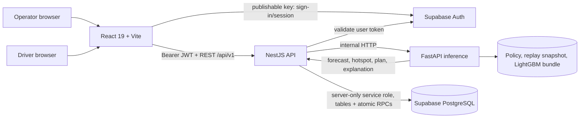
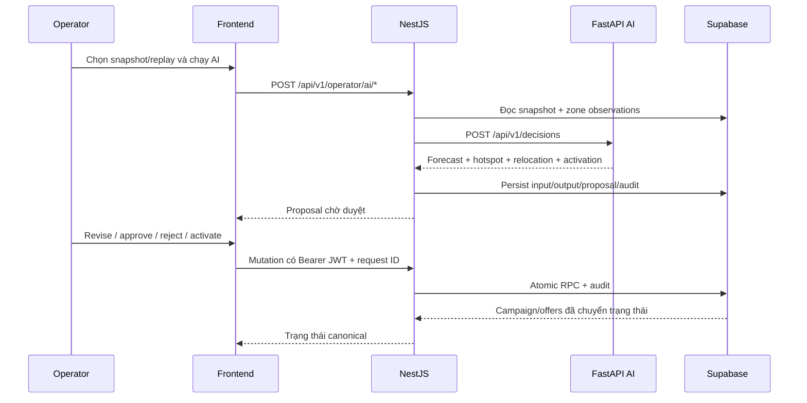
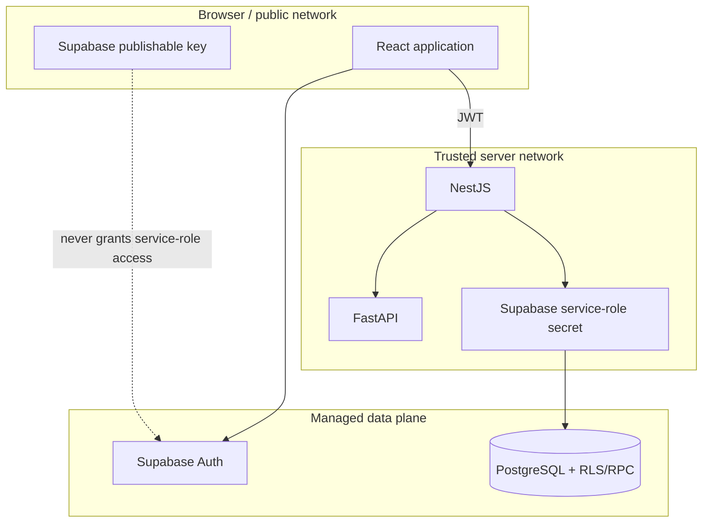

# Kiến trúc GSM-14 NovaFour

## Tổng quan

## Repository layout

```text
apps/
├── frontend/              React/Vite browser application
├── backend/               NestJS API and Supabase migrations
└── ai/                    FastAPI inference and ML pipeline
legacy/ai20k-template/     Archived starter scaffold, not product runtime
docs/                      Architecture, runbooks, and checklists
scripts/                   Repository-level automation
```

NovaFour là hệ thống decision-support có human-in-the-loop cho bài toán cân bằng cung–cầu tài xế theo 30 zone. FastAPI tạo forecast/hotspot/relocation plan từ snapshot hoặc replay đã xác minh; NestJS giữ ranh giới nghiệp vụ, auth, audit và persistence; React cung cấp Operator Console và Driver App; Supabase/PostgreSQL là system of record.



## Thành phần và trách nhiệm

| Thành phần | Công nghệ | Trách nhiệm chính |
|---|---|---|
| `apps/frontend/` | React 19, Vite, TanStack Query, Mapbox | Operator map/plans/campaigns/reports/history; Driver offer flow; Supabase sign-in bằng publishable key |
| `apps/backend/` | NestJS 11, Supabase JS | API contract, JWT/role guard, validation, rate limiting, audit, lifecycle reconciliation và persistence |
| `apps/ai/` | FastAPI, pandas, LightGBM, scipy | Replay snapshot, forecast 5/15/30 phút, hotspot, greedy relocation, activation recommendation và explanation |
| Supabase | PostgreSQL, Auth, RLS/RPC | System of record cho snapshot, forecast, proposal, campaign, offer, driver state và append-only audit |

Thư mục `legacy/ai20k-template/` là scaffold Python cũ được giữ độc lập; nó không nằm trên đường chạy production của NovaFour.

## Luồng quyết định



Khi tài xế accept/decline offer, Driver App chỉ gọi NestJS. Backend thực hiện mutation atomic, ghi audit và lifecycle reconciler đóng campaign/expire offer theo thời gian hoặc budget. Frontend không ghi trực tiếp business table.

## Dữ liệu và provenance

- Replay dùng bucket 5 phút đã checksum; backend lưu provenance của snapshot và model input.
- Model bundle gồm manifest và đúng 18 artifact LightGBM (demand/supply × horizon 5/15/30 × quantile p10/p50/p90). `/health` của AI xác minh manifest, checksum và khả năng load model.
- Live snapshot không đủ lịch sử có thể dùng baseline được gắn nhãn rõ. Replay có provenance không được âm thầm hạ xuống baseline.
- Mọi output lưu `model_version`, horizon, forecast time, regime và raw model output để audit/reproduce.
- KPI business và activation trong repo là simulation proxy; nguồn accept-rate phải được phân biệt với phản hồi người thật trong demo.

## Trust boundary và bảo mật



- Mọi biến `VITE_*` là public. `SUPABASE_SERVICE_ROLE_KEY` không được đặt trong frontend, image layer hoặc Git.
- NestJS dùng Helmet, allowlist CORS, DTO validation, request ID, structured error boundary, auth/role guard và rate limit cho mutation nhạy cảm.
- Privileged business transition đi qua RPC được grant cho `service_role`; browser không nhận quyền này.
- Throttler hiện lưu trong process, nên production chỉ chạy một API replica cho tới khi có shared storage.

## Health và deployment

| Probe | Ý nghĩa |
|---|---|
| AI `GET /health` | Policy + model bundle + replay feature sẵn sàng; trả `503` khi degraded |
| Backend `GET /api/v1/health/live` | Process NestJS đang sống |
| Backend `GET /api/v1/health/ready` | Kết nối và query Supabase thành công |
| Backend `GET /api/v1/health/metrics` | Uptime và process memory tối thiểu |
| Frontend `GET /` | Vite local server trả HTTP thành công |

`docker-compose.yml` là topology local: AI phải healthy trước backend, backend phải ready trước frontend; host ports chỉ bind `127.0.0.1`. Production dùng immutable backend/AI image, runtime secret injection, migration theo thứ tự và monitoring theo [docs/PRODUCTION_RUNBOOK.md](docs/PRODUCTION_RUNBOOK.md). Compose hiện dùng Vite development server nên không phải production manifest.

## Quyết định kiến trúc chính

| Quyết định | Lý do |
|---|---|
| NestJS là API boundary duy nhất cho business mutation | Tập trung auth, validation, audit và transaction semantics |
| FastAPI tách khỏi NestJS | Cô lập dependency khoa học dữ liệu và giữ inference contract rõ ràng |
| Supabase/PostgreSQL là system of record | Auth managed, Postgres transaction/RPC và audit query |
| Human approval trước activation | Không tự động biến output model thành tác động vận hành |
| Baseline có nhãn thay vì fallback im lặng | Giữ tính trung thực của provenance và KPI |
| Polling cho Driver App demo | Giảm độ phức tạp; phù hợp phạm vi mô phỏng hiện tại |
