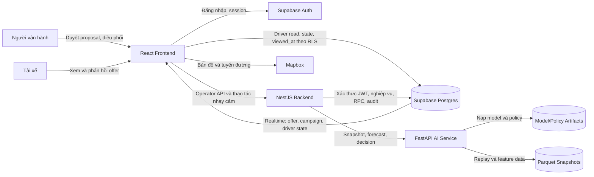
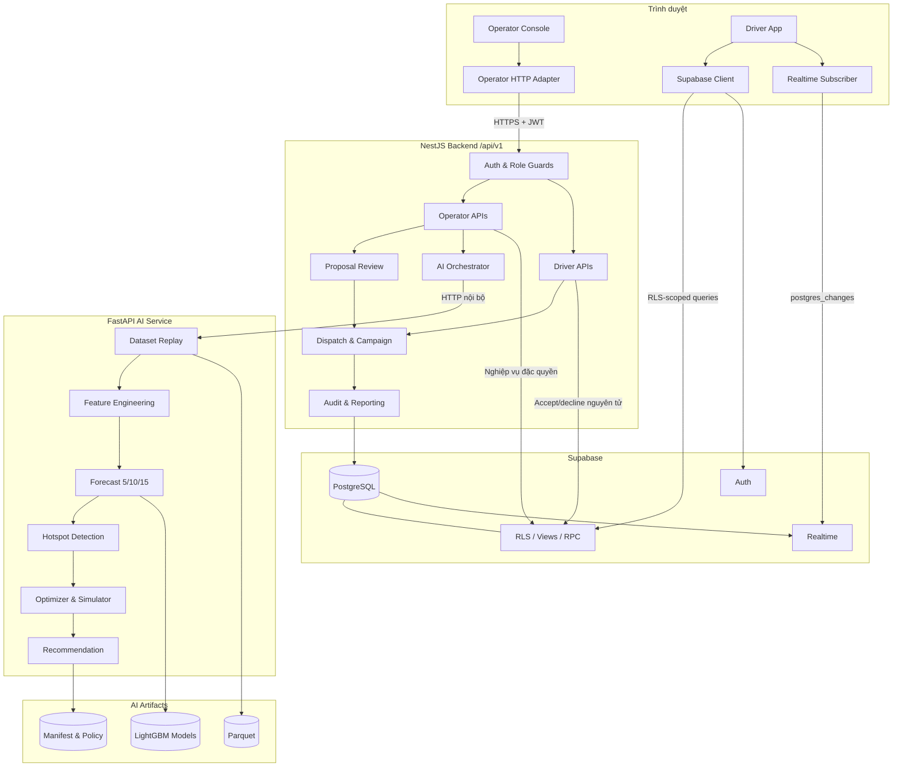
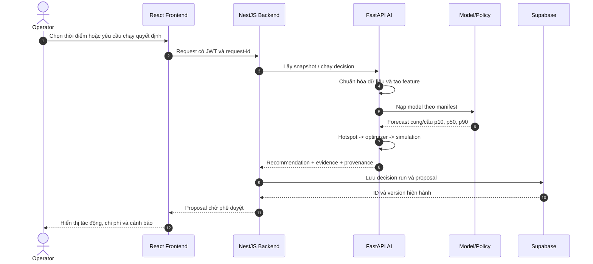
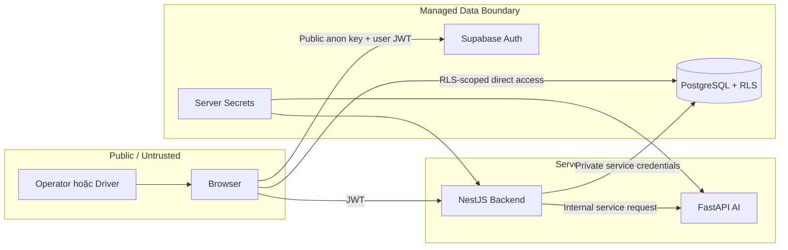
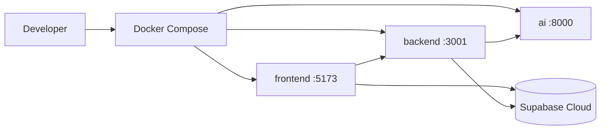
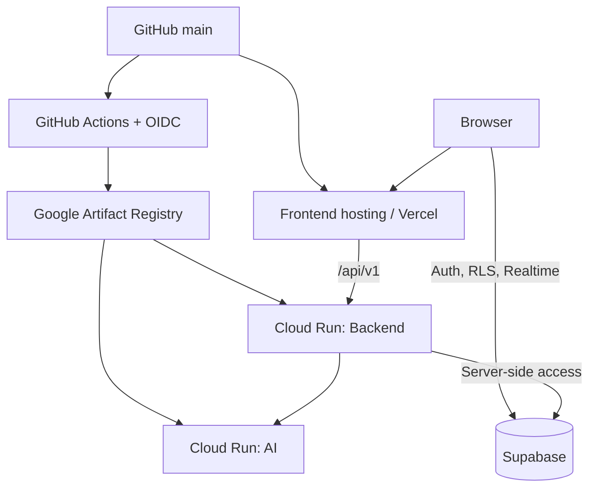

# Kiến trúc hệ thống NOVAFOUR AI Operations

> Trạng thái: tài liệu kiến trúc hiện hành (source of truth)
>
> Cập nhật gần nhất: 16/08/2026
>
> Phạm vi: runtime, luồng dữ liệu, ranh giới tin cậy và triển khai

Tài liệu này mô tả kiến trúc đang được triển khai trong repository. Bản thiết kế
cũ tại [`docs/design/ARCHITECTURE.md`](docs/design/ARCHITECTURE.md) chỉ được giữ
lại làm lịch sử và không dùng để kết luận hành vi runtime hiện tại.

## 1. Mục tiêu kiến trúc

Hệ thống hỗ trợ vận hành điều phối tài xế theo chu kỳ ngắn:

1. Tái hiện hoặc thu thập trạng thái cung/cầu theo vùng.
2. Dự báo cung/cầu tại các horizon 5, 10 và 15 phút.
3. Sinh proposal điều phối có bằng chứng, chi phí và mức tin cậy.
4. Yêu cầu người vận hành phê duyệt trước khi thực thi.
5. Phát hành offer hoặc campaign, nhận phản hồi tài xế và lưu audit trail.

Nguyên tắc cốt lõi là **AI đề xuất, con người quyết định**. Việc phê duyệt
proposal không tự động đồng nghĩa với phát hành offer; các thao tác có tác động
thật vẫn có cổng xác nhận riêng.

## 2. Sơ đồ bối cảnh hệ thống



### Quy tắc truy cập

- Operator Console gọi NestJS cho dữ liệu và mutation nghiệp vụ.
- Driver App đọc offer/campaign/state trực tiếp từ Supabase dưới RLS để có độ
  trễ thấp và dùng Supabase Realtime để nhận thay đổi.
- Driver App chỉ ghi trực tiếp các trạng thái giới hạn như `viewed_at` và
  `driver_states`. Accept/decline offer phải đi qua NestJS để kiểm tra điều kiện
  và cập nhật nguyên tử.
- NestJS dùng thông tin xác thực server-side cho nghiệp vụ đặc quyền; không đưa
  service-role key xuống trình duyệt.
- FastAPI không được trình duyệt gọi trực tiếp trong luồng nghiệp vụ chuẩn.

## 3. Các thành phần chính

| Lớp | Thành phần | Trách nhiệm |
| --- | --- | --- |
| Giao diện | React/Vite Frontend | Operator Console, Driver App, xác thực, bản đồ, trạng thái truy vấn |
| API nghiệp vụ | NestJS Backend | Auth guard, validation, proposal review, dispatch, campaign, offer, audit và báo cáo |
| AI | FastAPI AI Service | Snapshot replay, feature engineering, forecast, hotspot, tối ưu, simulation và recommendation |
| Dữ liệu giao dịch | Supabase PostgreSQL | Bảng nghiệp vụ, view, RPC, RLS và Realtime |
| Xác thực | Supabase Auth | Đăng nhập, session và JWT cho frontend/backend |
| Dữ liệu AI | Parquet snapshots | Dữ liệu replay/feature dùng cho đánh giá và mô phỏng |
| Model | LightGBM + manifest/policy | Artifact dự báo đã được quản lý phiên bản |
| Bản đồ | Mapbox | Nền bản đồ, geocoding hoặc tuyến đường phía client |

## 4. Sơ đồ component



## 5. Luồng dữ liệu AI và proposal



### Provenance bắt buộc

Mỗi kết quả AI cần truy vết được tối thiểu:

- `request_id` hoặc correlation ID;
- thời điểm snapshot và nguồn dữ liệu;
- phiên bản model manifest và policy;
- horizon đang dùng: 5, 10 hoặc 15 phút;
- quantile dự báo và các giả định simulation;
- decision/proposal ID được lưu trong database.

Manifest hiện hành phải ánh xạ 18 artifact hoạt động: demand/supply × 3 horizon
(5/10/15) × 3 quantile (p10/p50/p90). Artifact cũ không được manifest tham
chiếu không được xem là một phần của runtime.

## 6. Luồng phê duyệt, dispatch và offer

```mermaid
sequenceDiagram
    autonumber
    actor O as Operator
    participant F as Operator Console
    participant B as NestJS Backend
    participant D as Supabase
    participant R as Supabase Realtime
    participant A as Driver App
    actor T as Tài xế

    O->>F: Mở proposal đang chờ
    F->>B: GET proposal/version hiện hành
    B-->>F: Evidence + version + trạng thái
    O->>F: Phê duyệt proposal (Gate 1)
    F->>B: Approve + expected version
    B->>D: Kiểm tra trạng thái/version và ghi audit
    alt Dữ liệu đã thay đổi hoặc đã xử lý
        D-->>B: Conflict
        B-->>F: 409 + request-id, yêu cầu tải lại
    else Phê duyệt hợp lệ
        D-->>B: Proposal approved
        B-->>F: Approved, chưa tự động phát hành
        alt Dispatch trực tiếp
            O->>F: Xác nhận phát hành offer
            F->>B: Dispatch command
        else Kích hoạt campaign
            O->>F: Xác nhận activation (Gate 2)
            F->>B: Activate campaign
        end
        B->>D: Transaction/RPC tạo campaign và offer
        D-->>R: Phát sự kiện thay đổi
        R-->>A: Offer/campaign mới
        A-->>T: Hiển thị offer
        T->>A: Accept hoặc decline
        A->>B: Driver API mutation
        B->>D: Kiểm tra quyền, expiry, version; cập nhật nguyên tử
        D-->>R: Trạng thái offer/campaign mới
        R-->>F: Làm mới dashboard vận hành
    end
```

Thông báo “Dữ liệu đã thay đổi hoặc thao tác đã được thực hiện trước đó” là cơ
chế optimistic concurrency/idempotency. Client cần tải lại proposal mới nhất;
không được lặp mutation bằng version cũ.

## 7. Quyền sở hữu dữ liệu

| Dữ liệu | Nguồn ghi chính | Đường đọc chính | Ghi chú |
| --- | --- | --- | --- |
| User/session | Supabase Auth | Frontend, NestJS Auth Guard | JWT được kiểm tra ở backend |
| Snapshot/feature replay | Pipeline AI, file Parquet | FastAPI | Không phải nguồn giao dịch trực tiếp |
| Forecast/decision run | NestJS sau khi gọi AI | Operator API | Kèm provenance |
| Proposal/review/audit | NestJS | Operator API | Có version và audit trail |
| Campaign/offer | NestJS transaction/RPC | Operator API và Driver App | Realtime thông báo thay đổi |
| Driver offer response | NestJS Driver API | Operator/Driver | Accept/decline phải nguyên tử |
| Driver state/viewed state | Driver App dưới RLS | Driver App, backend | Chỉ cho phép phạm vi của tài xế |

## 8. Ranh giới tin cậy và bảo mật



Các kiểm soát bắt buộc:

- Không commit `.env`, Supabase service-role key hoặc secret deploy.
- Backend bật Helmet, validation, request ID, structured logging và exception
  filter toàn cục.
- RLS là lớp bảo vệ bắt buộc cho mọi truy cập Supabase trực tiếp từ Driver App.
- CORS chỉ cho phép origin được cấu hình.
- Mutation nhạy cảm cần role guard, validation, kiểm tra version/idempotency và
  audit log.

## 9. Kiến trúc triển khai

### Local development



AI phải healthy trước khi Backend khởi động; Backend phải ready trước Frontend.

### Production



Backend và AI được build/deploy độc lập để scale và rollback riêng. Frontend là
static SPA và cần cấu hình rewrite để route client không trả về 404.

## 10. Health, observability và vận hành

| Thành phần | Kiểm tra | Mục đích |
| --- | --- | --- |
| Frontend | Trang tải được và gọi API thành công | Xác nhận artifact và cấu hình runtime |
| Backend | `/api/v1/health` | Liveness/readiness API |
| AI | `/health` | Liveness của inference service |
| Supabase | Query/RPC có kiểm soát | Kiểm tra kết nối và migration |

Mọi lỗi hiển thị cho người dùng cần giữ `request_id`. Log backend/AI phải đủ để
liên kết request, decision run, proposal và mutation phát hành offer.

## 11. Quyết định và giới hạn hiện tại

- Horizon hoạt động là 5/10/15 phút; dữ liệu hoặc model 30 phút chỉ là artifact
  cũ nếu không nằm trong manifest hiện hành.
- Driver App dùng kiến trúc lai: direct Supabase cho read/realtime và NestJS cho
  mutation nhạy cảm. Thay đổi đường truy cập này phải đi kèm rà soát RLS.
- Replay/simulation phục vụ đánh giá và demo; không được diễn giải như dữ liệu
  thời gian thực nếu nguồn đầu vào là snapshot lịch sử.
- Rate limiting theo process không đồng bộ giữa nhiều instance; khi cần giới hạn
  toàn cụm nên chuyển state sang kho dùng chung.
- FastAPI có thể hỗ trợ static mount trong một số chế độ, nhưng topology chuẩn
  của repository triển khai Frontend, Backend và AI thành các service riêng.

## 12. Tài liệu liên quan

- [README và hướng dẫn thiết lập](README.md)
- [Bằng chứng kiểm thử thủ công](eval/manual_test_cases.md)
- [Thiết kế lịch sử — không phải runtime source of truth](docs/design/ARCHITECTURE.md)
