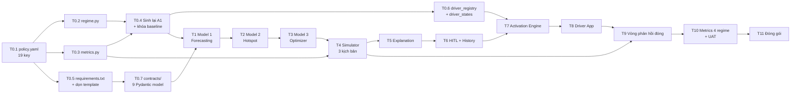

# IMPLEMENTATION_PLAN.md — GSM-14 · NovaFour

> Neo: [SPEC §7](docs/SPEC-GSM14-NovaFour-Unified.md) (kế hoạch 6 tuần/11 sprint, 27/07 – 31/08/2026), §5.x acceptance criteria, §7.1 đánh đổi phạm vi.
> Mọi Acceptance Criteria dưới đây **lấy thẳng từ acceptance của §5.x** hoặc là một lệnh chạy được. Không có AC dạng "hoạt động tốt".

**Mục lục:** [§0 Thực trạng](#0-thực-trạng-vs-kế-hoạch--đọc-trước) · [§1 DoD chung](#1-definition-of-done-áp-cho-mọi-task) · [§2 DAG](#2-đồ-thị-phụ-thuộc) · [§3 T0 chặn](#3-t0--task-chặn-làm-trước-hết) · [§4 T1–T11](#4-t1t11--task-chính) · [§5 Lịch nén](#5-lịch-nén-đề-xuất) · [§6 Rủi ro lịch](#6-rủi-ro-lịch-trình--phương-án-cắt)

---

## 0. Thực trạng vs kế hoạch — đọc trước

Hôm nay **08/08/2026 = cuối W2**, đúng mốc **I-08** (§7: khóa contract + KPI + baseline).

| §7 nói phải xong cuối W2 | Thực tế trên đĩa |
|---|---|
| `config/policy.yaml` (chốt từ **W1**) | ❌ **Không tồn tại** |
| Contract §4.1–4.4 chốt (W1) | ⚠️ Chốt trong tài liệu, **chưa có một Pydantic model nào** |
| Mock forecast + mock plan (W1) | ❌ Không có |
| Khung UI heatmap (W1) | ❌ Không có |
| LightGBM demand + supply + quantile p10/p50/p90 | ❌ Không có |
| Model 2 hotspot + hysteresis | ❌ Không có |
| `src/simulation/metrics.py` | ❌ **Không tồn tại** |
| Baseline no-action khóa + `BASELINE_FREEZE.md` | ⚠️ Có `no_action_summary.json` **không đạt chuẩn §5.14.1** (thiếu `unmet_demand`/`avg_wait_proxy`/`est_cancel_rate`, thiếu Parquet chi tiết, thiếu file freeze, regime tagging dùng `rain > 0` thay vì `≥ 0.5`) |
| Contract §4.7–4.9 + 10 key policy activation + `driver_registry.json` (🔴 W2, "không được để sang W3") | ❌ Không có |
| `src/` | 🔴 **100% boilerplate template** — `example_node.py`, `example_tool.py`, `ChatRequest/ChatResponse`, LangGraph chat demo |

**Kết luận thẳng:** khối lượng W1+W2 chưa có code. Kế hoạch dưới đây là **lịch nén W1+W2 vào ~1 tuần**, không phải lịch tiếp tục từ W3. Ba phương án cắt phạm vi ở [§6](#6-rủi-ro-lịch-trình--phương-án-cắt) cần PM quyết **trước khi bắt đầu T1**, không phải khi đã trễ.

---

## 1. Definition of Done (áp cho **mọi** task)

Task chỉ được đánh dấu xong khi **tất cả** thỏa:

| # | Điều kiện | Kiểm bằng |
|---|---|---|
| 1 | `ruff check src/ tests/` xanh | Lệnh chạy được, exit 0 |
| 2 | `ruff format --check src/ tests/` xanh | exit 0 |
| 3 | Có test mới cho code mới; `pytest tests/ -v` xanh | exit 0 |
| 4 | Test **không gọi API thật** — dùng fixture `mock_llm` | CI chạy `APP_ENV=test`, `OPENAI_API_KEY=test-key` |
| 5 | **Không sửa field cũ** của contract §4.1–4.9; chỉ thêm field **optional** | Diff review + test contract |
| 6 | **Mọi ngưỡng đọc từ `policy.yaml`** qua `src/common/policy.py` | Test tĩnh: grep `yaml.safe_load` ngoài `policy.py` → 0 kết quả |
| 7 | Module chưa xong có **mock trả đúng contract** (C-06) | Test contract chạy trên cả mock lẫn bản thật |
| 8 | Mọi run gắn `model_version`; không dùng random không seed | Test tĩnh: grep `random.` / `np.random` không có seed |
| 9 | Metric mới tách theo **4 regime** | Output có khóa `normal/peak/rain/rain_peak` |
| 10 | Quyết định mới ghi vào History (append-only) | Test: đếm bản ghi trước/sau |

---

## 2. Đồ thị phụ thuộc



**Đường găng:** `T0.1 → T0.3 → T0.4 → T1 → T2 → T3 → T4 → T6 → T7 → T8 → T9 → T10`. Cắt bất cứ đâu trên đường này đều lùi ngày demo M6.

**Chạy song song được:** T0.5 (dọn template) độc lập với T0.1–T0.4; T0.6 chạy song song T1–T2; frontend skeleton (phần T8) khởi động ngay sau T0.7 vì contract đã đủ để dựng màn hình bằng mock.

---

## 3. T0 — task chặn, làm trước hết

### T0.1 — Tạo `config/policy.yaml` 19 key

| | |
|---|---|
| **Phụ thuộc** | — (gốc của mọi thứ) |
| **File** | `config/policy.yaml` (mới), `src/common/policy.py` (mới) |
| **Đặc tả** | [DATA_CONTRACT.md §5](DATA_CONTRACT.md#5-configpolicyyaml--19-key) — nguyên văn, giữ nesting `rules.<key>.value` |

**Acceptance Criteria:**
1. `python -c "import yaml,json; d=yaml.safe_load(open('config/policy.yaml',encoding='utf-8')); print(len(d['rules']))"` in ra **19**.
2. `python compute_baseline_no_action.py` **không crash ở dòng `load_policy()`** (vẫn có thể lỗi ở D1 parquet — đã ghi nhận là nợ dữ liệu).
3. `src/common/policy.py` **crash lúc boot** khi thiếu bất kỳ 1 trong 19 key; message nêu **tên key**. Test: xóa 1 key → `pytest` bắt được `ConfigError` với tên key đúng.
4. Test tĩnh: `grep -rn "yaml.safe_load" src/ | grep -v "common/policy.py"` → **0 kết quả**.
5. `avg_vehicle_speed_kmh` có `verified: true`; **18 key còn lại** có `assumption: "ASSUMPTION-nn"` trỏ đúng vào register.

---

### T0.2 — `src/common/regime.py`, ngưỡng mưa 0.5

| | |
|---|---|
| **Phụ thuộc** | T0.1 |
| **File** | `src/common/regime.py`, `tests/test_common/test_regime.py` |
| **Đặc tả** | Quyết định A-05; `derived.rain_threshold_mm_h = 0.5`, `heavy_rain_mm_h = 5.0` |

**Acceptance Criteria:**
1. Một hàm duy nhất `tag_regime(rain_mm_h, peak_flag) -> Literal["normal","peak","rain","rain_peak"]`.
2. Test 4 nhãn tại biên: `(0.49, 0) → normal`, `(0.5, 0) → rain`, `(0.49, 1) → peak`, `(0.5, 1) → rain_peak`.
3. Test tĩnh: `grep -rn "rain_mm_h > 0\|peak_flag == 1" src/ | grep -v "common/regime.py"` → **0 kết quả** (không ai tự gắn nhãn regime nơi khác).
4. `compute_baseline_no_action.py` bỏ hàm `regime()` inline, import từ `src.common.regime`.

---

### T0.3 — `src/simulation/metrics.py` — lõi metric dùng chung

| | |
|---|---|
| **Phụ thuộc** | T0.1 |
| **File** | `src/simulation/metrics.py` (~40 dòng), `tests/test_simulation/test_metrics.py`, `tests/test_architecture.py` |
| **Đặc tả** | §5.5 công thức + §5.14.1 năm quy ước |

**Bốn công thức (§5.5) — cài đúng một lần, ở đây:**
```
unmet_demand    = Σ_zone max(0, demand − supply)
ratio           = demand / max(supply, 1)
avg_wait_proxy  = 3.0 × ratio^1.5                          (phút)
est_cancel_rate = 1 / (1 + e^(−0.4 × (avg_wait_proxy − 8.0)))
```

**Năm quy ước tổng hợp (§5.14.1) — phải cài đúng, dễ sai:**
1. `supply = idle_supply`; ở baseline `enroute` **luôn bằng 0**.
2. `avg_wait_proxy` toàn hệ thống = **trung bình có trọng số theo `demand`**: `Σ(wait × demand) / Σ demand`.
3. `est_cancel_rate` toàn hệ thống = **trung bình có trọng số của cancel rate từng zone**, **KHÔNG** phải logistic của wait trung bình.
4. Zone có `demand = 0` **tự loại** nhờ trọng số 0 — không cần lọc riêng.
5. `unmet` **cộng dồn** 7 ngày; `wait`/`cancel` **lấy trung bình**; tất cả tách theo 4 regime.

**Acceptance Criteria:**
1. Test tĩnh `test_metrics_khong_nhiem_tham_so`: `metrics.py` **không** chứa `policy`, `yaml`, `forecasting`, `lgbm` (case-insensitive).
2. Test số học tay: với 2 zone `(demand=10, supply=4)` và `(demand=0, supply=5)` → `unmet = 6`; `ratio₁ = 2.5`; `wait₁ = 3.0 × 2.5^1.5 = 11.859`; hệ thống `wait = 11.859` (zone 2 trọng số 0); `cancel = 1/(1+e^(−0.4×3.859)) = 0.8244`. Sai số ≤ 1e-6.
3. Trung bình có trọng số ≠ logistic-của-trung-bình: có test **cố tình** dựng 2 zone chứng minh hai cách cho kết quả khác nhau, và khẳng định cách #3 là cách được cài.
4. `pytest tests/test_simulation/test_metrics.py -v` xanh.

---

### T0.4 — Sinh lại A1 + tính lại và **khóa** baseline

| | |
|---|---|
| **Phụ thuộc** | T0.2, T0.3 |
| **File** | `generate_snapshots.py`, `config/generator.yaml`, `data/snapshots/*.parquet`, `data/baseline/*`, `data/splits.yaml` |
| **Đặc tả** | §5.14.1, §5.14.3; nợ dữ liệu [D1–D5, D7, D11, D12](DATA_CONTRACT.md#9-nợ-dữ-liệu--12-điểm-lệch-giữa-tài-liệu-và-đĩa); nowcast A-06 |

**Gộp làm MỘT đợt** — §5.14.3 #2: sau khi khóa, mọi thay đổi quy ước tính đều là thay đổi contract và phải tính lại toàn bộ số đã công bố.

Nội dung một đợt: (a) xuất **Parquet** thay CSV [D1]; (b) thêm cột `enroute_arrivals` (khởi tạo `[]`) [D2]; (c) thêm nhiễu nowcast theo [DATA_CONTRACT.md §7](DATA_CONTRACT.md#7-tham-số-nowcast-rain_forecast_1530) [A-06]; (d) thêm biến thiên mưa theo zone [D4]; (e) thêm đường cong demand 24h [D7]; (f) đồng bộ `splits.yaml` với dải ngày thật + sinh `data/test_set/` [D5]; (g) sửa `rain_intensity_mm_h_range` khớp dữ liệu thật [D11]; (h) định nghĩa "sự kiện mưa cao điểm" = chuỗi step `rain_peak` liên tiếp, đếm lại [D12]; (i) quyết định D3 (mưa NASA thật vs synthetic thuần) — **cần PM chốt**, sửa tài liệu hoặc sửa code, không để cả hai.

**Acceptance Criteria:**
1. `data/snapshots/snapshot_{train,test}.parquet` tồn tại; `pd.read_parquet` đọc được; có cột `enroute_arrivals`.
2. `python compute_baseline_no_action.py` chạy **không sửa một dòng code nào** ngoài phần import `regime` ở T0.2.
3. `data/baseline/no_action_metrics.parquet` có cột: `zone_id, ts_bucket, unmet, ratio, avg_wait_proxy, est_cancel_rate, regime`.
4. `data/baseline/no_action_summary.json` có đủ **`unmet_demand`, `avg_wait_proxy`, `est_cancel_rate`** tách theo **4 regime** (bản hiện tại chỉ có `avg_gap` + `hotspot_rate` — không đạt).
5. `data/baseline/BASELINE_FREEZE.md` có: ngày khóa, người khóa, **commit hash của `metrics.py`**, seed (train 42 / test 2026 / nowcast 13), **SHA-256 của file Parquet**.
6. Test set 7 ngày chứa **≥ 2 sự kiện `rain_peak`** theo định nghĩa (h) — in ra số sự kiện, không phải số step.
7. Regime tagging dùng `src.common.regime`; phân bố 4 regime in ra và **`rain_peak` hotspot rate < 0.99** (bản hiện tại bão hòa ở 0.99986 → metric mất khả năng phân biệt).
8. `rain_forecast_15 != rain_mm_h` ở **≥ 90%** số dòng có mưa (chứng minh nowcast không còn hoàn hảo); và có **≥ 1** sự kiện bị `p_miss` bỏ sót trọn vẹn trong test set.

---

### T0.5 — `requirements.txt` + dọn boilerplate template

| | |
|---|---|
| **Phụ thuộc** | — |
| **File** | `requirements.txt`, `src/agents/**`, `src/services/llm.py`, `src/models/schemas.py`, `tests/test_agents/`, `docs/architecture_diagram.md` |

**Acceptance Criteria:**
1. Thêm: `pandas`, `numpy`, `pyarrow`, `pyyaml`, `lightgbm`, `scikit-learn`, `scipy`.
2. **Bỏ**: `langgraph`, `langchain`, `langchain-openai` (§6 NFR loại LangGraph khỏi luồng chính).
3. Xóa `src/agents/**`, `src/services/llm.py`, `tests/test_agents/`, `docs/architecture_diagram.md`; bỏ `ChatRequest`/`ChatResponse` khỏi `src/models/schemas.py`.
4. `grep -rn "langgraph\|langchain\|ChatRequest\|ChatResponse" src/ tests/ requirements.txt` → **0 kết quả**.
5. `uvicorn src.main:app` khởi động được; `GET /health` trả 200.
6. `pytest tests/ -v` xanh (test template đã xóa không được để lại import gãy).

---

### T0.6 — `config/driver_registry.json` + `data/driver_states/`

| | |
|---|---|
| **Phụ thuộc** | T0.4 (phải khớp `idle_supply` của A1 đã khóa) |
| **File** | `config/driver_registry.json`, `config/driver_response.yaml`, `data/driver_states/driver_states_{split}.parquet` |
| **Đặc tả** | §4.7, [DATA_CONTRACT.md §6](DATA_CONTRACT.md#6-config-khối-c) |

**Acceptance Criteria:**
1. 600 tài xế; `driver_id` khớp `^DRV-\d{4}$`, không trùng.
2. **`is_demo_account == true` cho 100%** — test khẳng định, không có ngoại lệ (C-03).
3. `display_name` khớp `^Tài xế \d+$` — test chặn tên người thật.
4. **Ràng buộc A6:** `COUNT(driver_states WHERE status=="online_idle" AND current_zone==z) == snapshot_A1[ts,z].idle_supply` — đúng **100% mọi `ts_bucket` × mọi zone**. Test in ra số dòng lệch; **phải bằng 0**.
5. `config/driver_response.yaml` có đủ 7 tham số + `seed: 7`; `clip: [0.05, 0.95]`.
6. **Hiệu chỉnh `base_rate` ↔ `assumed_accept_rate`:** với offer trung vị (33.000đ, 4.2km, không sắp hết ca), `p_accept` phải nằm trong `assumed_accept_rate ± 0.05`. Bộ tham số hiện đề xuất cho **0.404 vs 0.6 — LỆCH**, phải chỉnh một trong hai trước khi công bố bất kỳ số activation nào ([DATA_CONTRACT.md §6.2](DATA_CONTRACT.md#62-configdriver_responseyaml---chưa-có-task-t06)).

---

### T0.7 — `src/contracts/` — 9 Pydantic v2 model

| | |
|---|---|
| **Phụ thuộc** | T0.5 |
| **File** | `src/contracts/{snapshot,forecast,hotspot,plan,revision,history,driver,offer,response}.py` |
| **Đặc tả** | [DATA_CONTRACT.md §2](DATA_CONTRACT.md#2-message-contract--9-entity) |

**Acceptance Criteria:**
1. Đúng **9 file**, ánh xạ 1-1 với §4.1–4.9. Không thừa, không thiếu entity.
2. Mọi ví dụ JSON trong SPEC §4 **parse được** bằng model tương ứng — một test cho mỗi ví dụ.
3. Validator bắt được, mỗi cái một test: `zone_id ∉ [1,30]`; `horizon_min ∉ {15,30}`; `enroute_supply != Σ enroute_arrivals[].units`; `p10 > p50` hoặc `p50 > p90`; `note` rỗng khi `action=="reject"`; `driver_status_at_offer == "online_busy"`; `is_demo_account == false`; `distance_km > activation_radius_km`.
4. `zones` phải có **đúng 30 phần tử, `zone_id` phủ đủ 1–30, không trùng**.
5. Test contract chạy được trên **cả mock lẫn bản thật** (DoD #7).

---

## 4. T1–T11 — task chính

### T1 — Model 1: Forecasting (§5.2)

**Phụ thuộc:** T0.4, T0.7 · **File:** `src/forecasting/{features,baseline_hist_avg,lgbm_quantile,mock}.py`

**AC:**
1. Baseline historical average theo `zone × hour_of_day × day_of_week` — chạy được, là **mock của Model 1** để Khối B khởi động song song (§5.14.2).
2. LightGBM train **cả demand và supply**, mỗi cái 3 objective quantile p10/p50/p90 — **6 model**.
3. `p10 ≤ p50 ≤ p90` cho **100%** dòng dự báo (kiểm quantile crossing sau train, không chỉ tin vào lý thuyết).
4. **MAPE < 15%** ở horizon 15 phút trên test set đã khóa; báo cáo tách **4 regime**, `rain_peak` không được giấu trong số tổng.
5. **Thắng baseline historical average ≥ 20%** (MAPE) — trên chính test set đã khóa ở T0.4.
6. Backtest walk-forward theo `splits.yaml` đã đồng bộ; ablation `rain × peak` báo cáo được.
7. Output khớp §4.2, `confidence = null`, `model_version` không rỗng.
8. Model lỗi → fallback `baseline_hist_avg`, thêm `FORECAST_FALLBACK` vào `warnings[]` (§5.9).

### T2 — Model 2: Hotspot Detection (§5.3)

**Phụ thuộc:** T1 · **File:** `src/hotspot/{detector,hysteresis}.py`

**AC:**
1. Công thức đúng §4.3: `(predicted_supply < min_supply_per_zone) OR (gap / predicted_demand ≥ 0.3)`.
2. Hysteresis: vào cần **2 step liên tiếp**, ra cần **3 step liên tiếp**; test chuỗi giả lập nhấp nháy → số lần đổi trạng thái giảm.
3. **Hotspot recall ≥ 80%** so với ground truth A4 (§1.7); báo cáo tách 4 regime.
4. Ba chế độ gap chạy được và cho kết quả **khác nhau** trên `rain_peak`: thường / `p90_p50` / `p90_p10`.
5. `idle_supply_current` lấy từ **snapshot**, không phải dự báo — test khẳng định.
6. `conservative_gap_mode` echo ra output; đọc từ policy, không hard-code.

### T3 — Model 3: Relocation Optimizer (§5.4)

**Phụ thuộc:** T2 · **File:** `src/optimizer/{greedy,constraints}.py`, `src/common/haversine.py`

**AC:**
1. Greedy theo severity giảm dần. **Không** OR-Tools, **không** min-cost flow (§7.1 #1).
2. **Benchmark ≤ 5 giây** cho 30 zone (§5.4, §6) — có test đo thời gian.
3. Không vi phạm **bất kỳ** ràng buộc nào: `budget_cap`, `max_distance`, `min_supply_per_zone`, `max_supply_move_pct`, cooldown. Test property-based trên ≥ 100 snapshot ngẫu nhiên có seed.
4. `residual_gap` = phần gap **không phủ được**, tính đúng, là input Khối C.
5. Haversine tính **on-the-fly** từ `zone_registry.json`; **không** precompute ma trận 30×30 (quyết định Data/BA 2026-08-04).
6. `eta_steps = ceil(travel_time / 5 phút)`, **tối thiểu 1**; travel time × 1.3 (mưa vừa) / × 1.5 (mưa to).
7. `avg_vehicle_speed_kmh` đọc từ policy — **cùng một giá trị** với Generator và Activation Engine. Test tĩnh: giá trị tốc độ chỉ xuất hiện ở `policy.py`.
8. Không nghiệm → plan rỗng + `residual_gap` = toàn bộ gap + `NO_SOLUTION` (§5.9), **không** ném exception.

### T4 — Simulator Before/After, 3 kịch bản (§5.5)

**Phụ thuộc:** T0.3, T3 · **File:** `src/simulation/simulator.py`

**AC:**
1. **Test tĩnh `test_simulator_imports_metrics`**: `simulator.py` chứa `from src.simulation.metrics import` hoặc `from .metrics import`.
2. **Test tĩnh `test_simulator_khong_cai_lai_cong_thuc`**: `simulator.py` **không** chứa `3.0 *`, `** 1.5`, `-0.4 *`, `8.0)`.
3. **INV-1:** `simulate(moves=[], include_activation=False)` khớp baseline đã khóa ở T0.4, sai số ≤ 1e-6. **Chạy trong CI từ W3**.
4. **INV-2:** tổng cung toàn hệ thống ở `plan_only` **bằng** `no_action` (relocation chỉ dời, không tạo xe).
5. **INV-3:** `enroute_supply == Σ enroute_arrivals[].units` ở **mọi** step.
6. Ba kịch bản chạy được: `no_action` / `plan_only` / `plan_activation`; output tách **4 regime**.
7. Deterministic: cùng seed + cùng plan → **cùng kết quả 100%**, chạy 10 lần.
8. Một kịch bản < 2 giây; re-simulate < 2 giây (§6).

### T5 — Explanation Engine Lớp 1 (§5.6)

**Phụ thuộc:** T4 · **File:** `src/explanation/{templates,validator}.py`

**AC:**
1. **100% con số** trong `explanation_text` khớp `explanation_data` — validator trích số bằng regex và đối chiếu; test trên ≥ 50 plan sinh ngẫu nhiên có seed.
2. Template thuần Python, **không LLM** (Lớp 2 ở phụ lục, cờ tắt).
3. `reason_text` của offer §4.8 cũng do Lớp 1 sinh — **cấm LLM** vì văn bản đi kèm cam kết tiền.
4. Render < 100 ms.
5. Nêu được: zone nào, thiếu bao nhiêu, chuyển từ đâu, chi phí, cải thiện dự kiến.

### T6 — HITL + History Store (§5.7, §5.8)

**Phụ thuộc:** T5 · **File:** `src/history/{store,queries}.py`, `src/api/routes_plan.py`

**AC:**
1. `PlanState` đúng đồ thị [AGENT_WORKFLOW.md §1.2](AGENT_WORKFLOW.md#12-planstate-57); chuyển ngoài đồ thị → `PLAN_STATE_INVALID` (409).
2. `revise` chạy lại **Simulator + Explanation**, **không** chạy lại forecast/hotspot.
3. `revised_moves` vẫn qua **toàn bộ** validator §5.4 → vi phạm trả `POLICY_VIOLATION` (422).
4. `reject` **bắt buộc `note`** không rỗng.
5. **Append-only ép ở tầng DB:** test cố `UPDATE history_record` và `DELETE` → cả hai bị trigger chặn.
6. **100% quyết định** (plan/revise/approve/reject **và phản hồi tài xế**) có bản ghi; test đếm trước/sau mỗi hành động.
7. Mỗi bản ghi có `decided_by`, `decided_at`, `model_version`; bản ghi activation có **`accept_rate_source`** — không có mặc định, thiếu là lỗi validation.
8. **Không có endpoint update/delete history** ở bất kỳ đâu — test quét route table.

### T7 — Activation Engine (Khối C, §5.11)

**Phụ thuộc:** T6, T0.6 · **File:** `src/activation/{engine,incentive,driver_sim}.py`

**AC:**
1. Sinh chiến dịch **< 2 giây** cho 30 zone.
2. **Không bao giờ vượt `incentive_budget_cap` kể cả khi 100% offer được nhận** — test cam kết xấu nhất, là AC quan trọng nhất của task này.
3. **Không** gửi offer cho `online_busy` — test khẳng định trên toàn tập ứng viên.
4. **Không** tạo hotspot mới ở zone nguồn khi rút `online_idle` (cùng chuẩn optimizer §5.4).
5. Xếp hạng đúng: **`offline` trước `online_idle`**, sau đó khoảng cách tăng dần — test thứ tự.
6. `driver_status_at_offer` **đóng băng tại thời điểm phát hành**; test: đổi trạng thái tài xế sau khi phát → accept vẫn dùng giá trị cũ.
7. `incentive_amount = min(base + per_km × d, max)` làm tròn 1.000đ; `expires_at = created_at + offer_ttl_minutes`.
8. Cùng seed → **cùng tập offer và cùng tập phản hồi mô phỏng, lặp lại 100%** (chạy 10 lần).
9. Với accept rate giả định đã chốt, kịch bản demo mưa cho **giảm residual gap ≥ 30%**.
10. Ba chế độ `human` / `simulated` / `mixed` chạy được.
11. `incentive_budget_cap` và `budget_cap` **độc lập, không bù trừ** (C-09) — test: cạn ngân sách thưởng **không** làm đổi `plan_totals.total_cost`.

### T8 — UI vận hành + Driver App (§5.12, §5.13)

**Phụ thuộc:** T7 · **File:** `frontend/` (Vite+React+TS), `src/api/routes_driver.py`

**AC:**
1. **Một SPA**, route `/` (Dispatcher) + `/driver`; build tĩnh → FastAPI `StaticFiles`; **một container, không CORS**.
2. Offer hiện trên Driver App **< 2 giây** kể từ khi phát hành — **polling 2 giây**, không WebSocket (§7.1 #3).
3. Từ chối **1 chạm**, lý do **không bắt buộc** (C-08).
4. **Không có** trường `accept_rate_of_driver`, `driver_rank`, `driver_score` ở bất kỳ response nào — test quét schema.
5. Chọn `driver_id` từ **dropdown demo**, không auth thật (§7.1 #4).
6. Offer hết hạn tự biến mất, **im lặng**, không thông báo trách móc.
7. UI vận hành: heatmap 30 zone, badge `STALE_DATA`, bảng so sánh **3 kịch bản**, khối "Huy động thêm" với `worst_case_incentive` và nhãn **"giả định mô phỏng"** cạnh `assumed_accept_rate`.
8. **Cổng người #2:** nút phát hành offer **tách rời** nút approve plan; test E2E: approve plan → **không** offer nào được tạo.

### T9 — Vòng phản hồi đóng (FR-13)

**Phụ thuộc:** T8, T4 · **File:** `src/activation/engine.py`, `src/replay/engine.py`, `src/simulation/simulator.py`

**AC:**
1. Accept → append `EnrouteArrival` vào zone đích với **`source: "activation"`**; `from_zone` = `current_zone` nếu `online_idle`, `home_zone` nếu `offline`.
2. `online_idle` → **trừ 1** ở zone nguồn. `offline` → **cung mới, không trừ ở đâu**. Test cả hai nhánh.
3. Sau `eta_steps`, `EnrouteArrival` chuyển thành `idle_supply`; `enroute_supply` giảm tương ứng — **INV-3 vẫn đúng** ở mọi step.
4. Re-simulate **< 2 giây**; `metrics_after_activation` được điền.
5. Bảng 3 kịch bản hiện đủ; **đóng góp Khối B và Khối C tách được** nhờ `source` — test: kịch bản chỉ có `relocation` vs chỉ có `activation`.
6. Demo 2 màn hình: cùng một `plan_id`, offer "bay" từ màn Dispatcher sang màn Driver, metrics đổi ngay sau khi bấm Nhận.
7. Accept sau khi gap đã bù đủ → **vẫn `Accepted`, vẫn trả thưởng**, cảnh báo `OVERBOOKING_SURPLUS` (§5.9 #11).
8. Nhiều accept cùng lúc → nhận theo `responded_at`, **không hủy ngược** offer đã gửi (§5.9 #12).

### T10 — Metrics 4 regime + độ nhạy + UAT (§5.14, §1.7)

**Phụ thuộc:** T9 · **File:** `eval/`, `src/api/routes_history.py`

**AC:**
1. Bảng metric đầy đủ **4 regime × 3 kịch bản**; `rain_peak` là cột chính, **không giấu trong số tổng**.
2. **Phân tích độ nhạy accept rate 3 mức 0.25 / 0.45 / 0.65** — bắt buộc theo C-07, **cấm** trình bày một con số duy nhất.
3. Mọi bảng kết quả có cột **`accept_rate_source`**; số mô phỏng và số người thật **không trộn chung một ô**.
4. Ablation `rain × peak` báo cáo được.
5. **UAT Dispatcher ≥ 4/5**; **≥ 3 tài xế** đánh giá clarity **≥ 4/5**; quyết định **≤ 20 giây** (đo `response_latency_sec` thật).
6. Mọi số KPI dán nhãn **"simulation proxy trên synthetic data"** (C-07).

### T11 — Đóng gói (§7 W6)

**Phụ thuộc:** T10 · **File:** `Dockerfile`, `docker-compose.yml`, `README.md`, `JOURNAL.md`, `WORKLOG.md`, `presentation/`

**AC:**
1. `docker compose up --build` chạy được; healthcheck `/health` xanh.
2. Kịch bản demo mưa 17:00–19:00 chạy **ổn định 5/5 lần** (§5.10), tính cả luồng activation.
3. Có **staging + phương án chạy local dự phòng**.
4. `README.md` thay bằng `README_boilerplate.md` (README hiện tại là của template, không phải của dự án).
5. `JOURNAL.md` + `WORKLOG.md` điền đủ — **deliverable bắt buộc #8/#9**, hiện vẫn là template rỗng.
6. `eval/` có evidence; `presentation/` có slide + video demo.
7. Tài liệu **giả định & giới hạn**: xuất [ASSUMPTION register](DATA_CONTRACT.md#8-assumption-register) kèm trạng thái cuối cùng của từng dòng.

---

## 5. Lịch nén đề xuất

| Ngày | Task | Ghi chú |
|---|---|---|
| 08–09/08 | T0.1, T0.2, T0.3, T0.5 | Chạy song song được; T0.5 độc lập hoàn toàn |
| 09–10/08 | T0.4 | Đường găng. Cần **PM chốt D3** trước khi bắt đầu |
| 10/08 | T0.6, T0.7 | T0.7 mở khóa frontend skeleton chạy song song |
| 10–12/08 | T1, T2 | |
| 12–14/08 | T3, T4 | T4 là chốt chặn chất lượng (INV-1/2/3 vào CI) |
| 14–16/08 | T5, T6 | |
| 16–19/08 | T7, T8 | |
| 19–22/08 | T9 | Điểm nhấn demo — **để trễ nhất giữa W4 theo §7.1** |
| 22–26/08 | T10 | UAT cần đặt lịch với người thật **từ sớm**, không đợi đến lúc này |
| 26–31/08 | T11 | M7 + M8 |

**Ba việc phải đặt lịch ngay, không phải khi đến task:** (a) PM chốt **D3** — chặn T0.4 là chặn toàn bộ đường găng; (b) Data/BA xác nhận **ASSUMPTION-01, -18, -25, -28..-34** — chặn khóa baseline; (c) mời **≥ 3 tài xế** cho UAT ở T10.

---

## 6. Rủi ro lịch trình + phương án cắt

| Rủi ro | Dấu hiệu sớm | Phương án |
|---|---|---|
| W1+W2 chưa có code, nén vào 1 tuần | Đã xảy ra | PM quyết cắt phạm vi **trước T1**, không phải khi đã trễ |
| T0.4 kẹt ở quyết định D3 | Chưa có câu trả lời sau 09/08 | Chọn tạm **giữ mưa NASA + sửa tài liệu** (rẻ hơn viết lại generator), ghi thành quyết định có ngày |
| **MAPE < 15% không đạt** | Nhiễu Gaussian `noise_std_pct=0.15` đặt sàn MAPE ≈ 12% [D8] | Hạ `noise_std_pct` hoặc đổi sang Poisson **ở T0.4** — sau khi khóa baseline thì không sửa được nữa |
| Vòng phản hồi đóng chưa chạy giữa W4 | T9 chưa E2E ngày 19/08 | §7.1: **hạ Driver App xuống chế độ trình diễn** — giữ UI + luồng offer, phản hồi chạy hoàn toàn bằng `driver_sim`, bỏ phần người thật. Giữ được kịch bản demo và KPI residual gap, **mất phần UAT tài xế**. Báo PM **trước** freeze scope cuối W4 |
| Không mời được ≥ 3 tài xế | Chưa có lịch trước 20/08 | Chạy UAT với người đóng vai, ghi rõ `accept_rate_source = simulated_model`, **không** báo cáo là số người thật |
| UAT Dispatcher < 4/5 | Feedback Demo 1 | §7 M5 dành riêng cho việc này — đừng để dồn sang W6 |

**Thứ tự cắt (§7.1, đã chốt — không cắt tùy hứng):** ① min-cost flow *(đã bỏ hẳn)* → ② Explanation Lớp 2 *(đã hạ xuống optional)* → ③ WebSocket *(đã bỏ)* → ④ auth thật *(đã bỏ)* → ⑤ **màn "Chuyến đã nhận" + "Lịch sử của tôi"** ← **đây là hạng mục duy nhất còn cắt được**. Sau đó chỉ còn phương án hạ Driver App xuống chế độ trình diễn.
