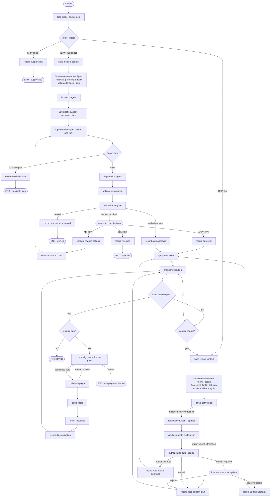
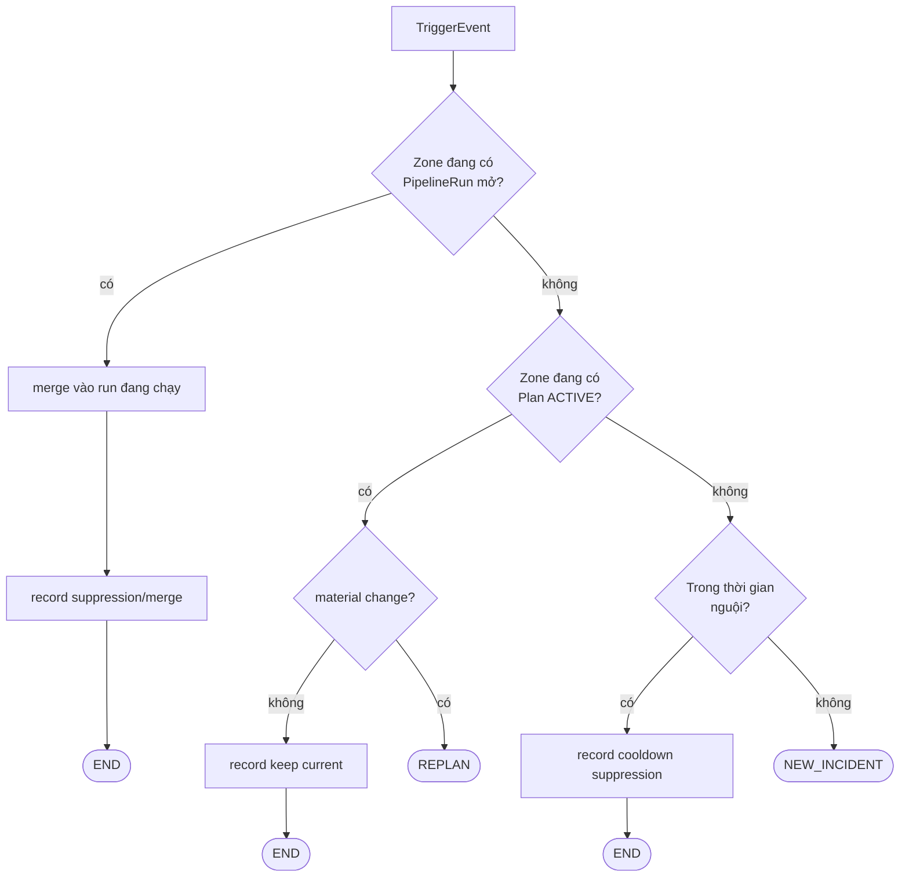
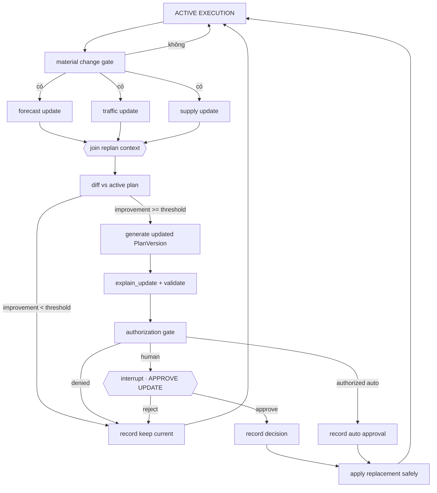

# Kiến trúc pipeline multi-agent
 
**Mã tài liệu:** AR-01 · **Phiên bản:** 0.3 (upgrade draft) · **Ngày:** 23/08/2026
**Điều phối:** LangGraph · **Mô hình:** lai — LLM chỉ ở khâu diễn giải và reasoning có kiểm soát
**Bổ sung cho:** `02-technical-spec.md §3` (danh sách agent & tool)
 
> Tài liệu này chỉ đặc tả **kiến trúc và luồng**. Contract dữ liệu ở `02`, nghiệp vụ ở `01`, giao diện ở `03`.
> Bản trình bày có sơ đồ vẽ sẵn: `05-agent-pipeline-architecture.html`.

> **Quyết định phiên bản nâng cấp:** giữ 5 agent hiển thị trên UI và 3 plan A/B/C; dùng LangGraph làm orchestration; migration dần từ MVP bằng adapter và feature flag. Ở runtime phase đầu, Forecast/Traffic/Supply được gộp thành một `Situation Assessment Agent`, chạy ba capability song song. Agent có thể được cấp quyền tự động, nhưng quyền bị giới hạn theo scope, ngân sách, điều kiện và thời hạn; mọi quyết định tự động phải audit được.

> **Tương thích MVP:** `docs/design/` vẫn là baseline đang chạy. Thành phần mới chỉ thay thế baseline khi feature flag tương ứng được bật và vượt qua contract, replay, safety và business-evaluation tests.
 
---
 
## 1. Nguyên tắc kiến trúc
 
Bốn nguyên tắc quyết định mọi lựa chọn còn lại trong tài liệu này.
 
**A1 — LLM đọc số, không sinh số.**
Mọi con số hiển thị trên giao diện (`45 vehicles`, `-3.5min`, `94%`, `Coverage 114`) đều do **code hoặc mô hình** tính ra. LLM chỉ nhận các con số đã tính rồi viết thành câu tiếng người (`Rain impact detected.`). Nếu LLM được phép sinh số, `AI Confidence` trở thành vô nghĩa và không ai kiểm chứng được kết quả.
 
**A2 — Tách vòng giám sát khỏi pipeline agent.**
Vòng giám sát chạy liên tục và rẻ (không LLM). Pipeline agent tốn kém, chỉ chạy khi vòng giám sát phát sự kiện. Nếu gộp hai thứ, chi phí LLM tỉ lệ thuận với số zone × số chu kỳ — không kiểm soát được.
 
**A3 — Chốt chặn thực thi là một node, không phải một lời nhắc.**
Trong LangGraph, đây là `authorization_gate`: đồ thị kiểm tra grant; nếu không có quyền tự động thì `interrupt()` dừng hẳn và đợi `PlanDecision`. Không phải một cờ boolean mà code có thể vô tình bỏ qua.
 
**A4 — Suy giảm có kiểm soát, phản ánh lên `ai_confidence`.**
Agent lỗi không làm sập pipeline; nó hạ độ tin cậy và hiện ⚠ lên giao diện. Giao diện đã có sẵn chỗ cho việc này (`Supply Agent` mang icon ⚠ ở `[V-5]` t9).
 
---
 
## 2. Bốn tầng
 
```
┌─ TẦNG 0 · VÒNG GIÁM SÁT ────────────────── chu kỳ cố định · không LLM ─┐
│  Nạp dữ liệu → tính ZoneState(t=0) → so ngưỡng → phát ZoneAlert        │
│  UI: chỉ báo "AI MONITORING"                                    [V-2]  │
└────────────────────────────┬───────────────────────────────────────────┘
                             │ chỉ khi vượt ngưỡng
┌─ TẦNG 1 · BỘ ĐỊNH TUYẾN KÍCH HOẠT ─────────────── không LLM ──────────┐
│  4 nguồn vào · debounce · dedup · chọn nhánh · kiểm quyền automation    │
│  → NEW_INCIDENT | REPLAN | SUPPRESS                                    │
└────────────────────────────┬───────────────────────────────────────────┘
                             │
┌─ TẦNG 2 · PIPELINE AGENT (LangGraph) ──── code + model · 1 chỗ gọi LLM ┐
│  Situation Assessment (forecast ∥ traffic ∥ supply) → dispatch →       │
│  generate → score → explain                                             │
│  UI: modal "Autonomous Resolution Pipeline"                     [V-5]  │
└────────────────────────────┬───────────────────────────────────────────┘
                             │ interrupt()
┌─ TẦNG 3 · CHỐT CHẶN CON NGƯỜI ───────────────────────────────────────┐
│  HUMAN APPROVE / MODIFY / REJECT hoặc AUTHORIZED AUTO-GATE              │
└────────────────────────────┬───────────────────────────────────────────┘
                             │ APPROVE
┌─ TẦNG 4 · THỰC THI & GIÁM SÁT ───────────────────────────────────────┐
│  dispatch() → ExecutionState → theo dõi                    [V-9][V-10] │
│  dữ liệu mới ──────────────────────────────► quay lại TẦNG 1 (REPLAN)  │
└────────────────────────────────────────────────────────────────────────┘
```
 
---
 
## 3. Đồ thị LangGraph
 
### 3.1 Sơ đồ


 
### 3.2. Tách agent hiển thị và agent runtime
 
`[V-5]` đánh số agent 1→5 như một chuỗi tuần tự, nhưng sơ đồ luồng dữ liệu trong cùng clip lại vẽ các agent **hội tụ** vào `Optimization Agent`. Hai cách đọc này mâu thuẫn nhau.
 
Giải quyết: **thứ tự 1→5 là thứ tự hiển thị, không phải số node LangGraph.**

Ở runtime phase đầu, ba capability có cùng quyền đọc, cùng context và chưa có chu kỳ vận hành độc lập được gộp vào `Situation Assessment Agent`. Agent này là **một node LangGraph**, còn ba capability được chạy đồng thời bên trong node bằng cơ chế concurrency của ứng dụng.

```text
SituationAssessmentAgent.run(context)
    ├─ Forecast capability  ─┐
    ├─ Traffic capability   ─┼─ chạy song song
    └─ Supply capability    ─┘
             ↓
    validate / fallback từng capability
             ↓
    join thành AssessmentContext
```

- `forecast`, `traffic`, `supply` không phụ thuộc nhau nên vẫn chạy song song; không bị chuyển thành chạy tuần tự khi gộp.
- `dispatch` chỉ nhận `AssessmentContext` sau khi ba capability đã trả kết quả hợp lệ hoặc fallback hợp lệ.
- UI vẫn hiển thị 3 thẻ Forecast/Traffic/Supply với trạng thái riêng `PENDING/RUNNING/DONE/WARNING/FAILED` từ `capability_statuses`.
- `Optimization Agent` vẫn tách riêng để sinh/chấm PLAN A/B/C; `Explanation Agent` vẫn là boundary duy nhất có thể gọi LLM.

Khi Traffic hoặc Supply có nguồn dữ liệu, SLA, scaling hoặc retry policy độc lập, capability tương ứng có thể tách thành node LangGraph riêng mà không đổi `AssessmentContext` contract.
 
---
 
## 4. Bảng node

| Node | Loại | Trách nhiệm | State đọc | State ghi | Tool chính |
|---|---|---|---|---|---|
| `load_context` | code | nạp trigger, incident, snapshot và policy version | `trigger`, `incident_id` | `context`, `trace_id` | `load_incident_context`, `get_snapshot` |
| `route_trigger` | code | dedup, cooldown, chọn NEW_INCIDENT/REPLAN/SUPPRESS | `trigger`, `incident`, `active_plan` | `route`, `dedup_result` | `check_open_run`, `check_cooldown` |
| `build_incident_context` | code | tạo context bất biến cho lần phân tích mới | `context`, `snapshot` | `analysis_context` | `build_feature_context` |
| `build_replan_context` | code | tạo context gắn với active execution/plan | `active_plan`, `execution`, `trigger` | `replan_context` | `load_execution_state`, `get_latest_snapshot` |
| `situation_assessment` | runtime agent | điều phối ba capability đọc-only, chạy song song và trả `AssessmentContext` thống nhất | `analysis_context`, `fleet_state`, `execution` | `assessment`, `capability_statuses`, `warnings` | `run_forecast`, `run_traffic`, `run_supply`, `join_assessment` |
| `run_forecast` | internal capability | dự báo demand và supply theo horizon | `analysis_context` | `assessment.forecast`, `capability_statuses.forecast` | `ForecastProvider.predict` |
| `run_traffic` | internal capability | tính ảnh hưởng thời tiết và ma trận ETA | `analysis_context`, `zone_geometry` | `assessment.traffic`, `capability_statuses.traffic` | `TrafficProvider.get_weather`, `get_travel_time_matrix` |
| `run_supply` | internal capability | kiểm kê nguồn xe và khả năng điều chuyển | `analysis_context`, `fleet_state`, `execution` | `assessment.supply`, `capability_statuses.supply` | `list_available_vehicles`, `get_supply_state` |
| `validate_fallback_*` | internal capability | kiểm contract, stale, provenance và fallback từng output | output capability tương ứng | output assessment đã chuẩn hóa, `warnings` | `validate_contract`, adapter fallback |
| `join_assessment` | internal capability | hợp nhất ba output, kiểm điều kiện tối thiểu | `forecast`, `traffic`, `supply` | `assessment` | `check_analysis_completeness` |
| `dispatch` | optimizer | sinh action ứng viên theo thiếu hụt và nguồn dư | `assessment`, `policy` | `candidate_actions`, `warnings` | `compute_relocation` |
| `generate_plans` | thuật toán | sinh PLAN_A/B/C theo strategy cố định | `candidate_actions`, `constraints` | `plan_set` | `compute_relocation` ×3 |
| `score_and_rank` | code | chấm điểm và chọn Recommended | `plan_set`, `metrics`, `weights` | `scores`, `recommended_plan_id` | `score_plan` |
| `quality_gate` | code | loại plan vi phạm constraint/KPI tối thiểu | `plan_set`, `scores`, `warnings` | `quality_result` | `validate_plan_quality` |
| `explain` | template/LLM | tạo lý do đọc được, không sinh số | `plan_set`, `scores`, `warnings` | `explanation` | `render_explanation`, `llm_explain` |
| `validate_explanation` | code | kiểm mọi số trong văn bản khớp source | `explanation`, `plan_set` | `explanation_valid` | `validate_explanation_numbers` |
| `authorization_gate` | policy/service | quyết định human gate hay auto gate | `plan`, `quality_result`, `grant`, `feature_flags` | `authorization_result` | `check_automation_grant`, `check_kill_switch` |
| `human_decision` | LangGraph interrupt | chờ APPROVE/MODIFY/REJECT | `plan_set`, `explanation` | `decision` | `record_plan_decision` |
| `revise_plan` | code | validate action sửa bởi người | `decision`, `plan_set`, `policy` | `revised_actions`, `warnings` | `validate_revised_actions` |
| `apply_relocation` | application service | thực thi relocation sau authorization | `approved_plan`, `authorization_result` | `execution`, `audit_event` | `execute_relocation` |
| `monitor` | event consumer | theo dõi tiến độ và deviation | `execution`, `latest_snapshot` | `execution`, `replan_trigger` | `get_execution_state`, `material_change_gate` |
| `diff_vs_active_plan` | code | so sánh candidate với active plan | `new_context`, `active_plan`, `execution` | `plan_diff`, `improvement_result` | `compare_plan_impact` |
| `campaign_gate` | policy/service | kiểm quyền phát hành incentive offer | `residual_gap`, `grant`, `feature_flags` | `campaign_authorization` | `check_campaign_authorization` |
| `build_campaign` | code | tạo campaign Pending/Running theo quyền | `approved_plan`, `residual_gap` | `campaign` | `build_campaign` |
| `issue_offers` | application service | phát hành offer tới ứng viên hợp lệ | `campaign`, `driver_state`, `incentive_policy` | `offers`, `audit_event` | `select_candidates`, `calculate_incentive`, `send_offer` |
| `driver_response` | API/simulator | nhận Nhận/Từ chối/Hết hạn | `offers`, `driver_state` | `responses`, `audit_event` | `record_driver_response`, `driver_sim.decide` |
| `re_simulate_activation` | simulator | cập nhật enroute arrivals và KPI | `approved_plan`, `responses`, `offers` | `metrics_after_activation` | `simulate_activation` |
| `record_audit` | code/service | ghi mọi quyết định và nhánh kết thúc | toàn bộ decision metadata | `audit_event` | `append_audit_event` |

Chỉ `explain` và `explain_update` được phép gọi LLM, và cả hai đều **chỉ sinh văn bản cho người đọc** — không node LLM nào ghi vào trường số, state quyết định hoặc side effect. Đây là hệ quả trực tiếp của nguyên tắc A1.

### 4.1. Agent responsibility matrix

| Runtime component / UI representation | Chức năng phụ trách | Được đọc | Được gọi | Được ghi | Không được làm |
|---|---|---|---|---|---|
| **Situation Assessment Agent**<br/>UI: 3 thẻ Forecast/Traffic/Supply | điều phối 3 capability song song, validate/fallback và trả `AssessmentContext` thống nhất | `analysis_context`, snapshot, fleet state, execution, provider config | `run_forecast`, `run_traffic`, `run_supply`, `join_assessment` | `assessment`, `capability_statuses`, `warnings`, `assessment_status` | không tạo action, không approve, không gọi execution |
| ↳ Forecast capability<br/>UI: Forecast Agent | dự báo demand/supply theo zone và horizon; phát hiện forecast drift | snapshot lịch sử, weather features, feature schema | `ForecastProvider.predict`, `HistoricalForecastAdapter`, `validate_forecast` | `assessment.forecast`, `capability_statuses.forecast`, `model_version` | không tạo action, không approve, không gọi execution |
| ↳ Traffic capability<br/>UI: Traffic Agent | ước lượng ETA, thời gian di chuyển và tác động thời tiết | zone geometry, weather, snapshot, provider config | `TrafficProvider.get_weather`, `get_travel_time_matrix`, `validate_traffic` | `assessment.traffic`, `capability_statuses.traffic`, `provider_version` | không tự điều xe, không tự gọi real API khi flag tắt |
| ↳ Supply capability<br/>UI: Supply Agent | kiểm kê xe, nguồn dư, nguồn tối thiểu và khả năng lấy xe | fleet state, active execution, driver availability, policy | `get_supply_state`, `list_available_vehicles`, `validate_supply` | `assessment.supply`, `assessment.surplus_zones`, `capability_statuses.supply` | không tự điều chuyển, không đánh giá/xếp hạng tài xế |
| **Dispatch Agent** | Sinh action điều xe từ vùng dư tới vùng thiếu | `assessment`, `policy`, `constraints` | `compute_relocation`, optimizer engine, timeout guard | `candidate_actions`, `residual_gap_estimate`, `warnings` | không chọn strategy cuối, không approve plan |
| **Optimization Agent** | Sinh 3 plan, chấm điểm, chọn Recommended | `candidate_actions`, metrics, scoring weights, constraints | `generate_plan_strategy`, `score_plan`, `validate_plan_quality` | `plan_set`, `scores`, `recommended_plan_id` | không tự thực thi side effect, không bịa số |
| **Explanation Agent** | Viết reasons/reasoning và giải thích thay đổi | plan, metrics, warnings, plan diff, source values | `render_explanation`; tùy flag `llm_explain` | `explanation`, `explanation_source`, `warnings` | không sửa số, không sửa plan, không tự quyết định |

Các node `route_trigger`, `authorization_gate`, `apply_relocation`, `campaign`, `driver_response` là **system/application nodes**, không phải agent LLM. Chúng chịu trách nhiệm bảo vệ state và side effect.

### 4.2. State access matrix

`PipelineState` được chia thành các vùng; node chỉ được ghi vào vùng do mình sở hữu.

| State key | Owner | Readers | Write rule |
|---|---|---|---|
| `trigger` | `load_context` | router, monitor | immutable trong một run |
| `incident_id` | application service | tất cả node | immutable |
| `analysis_context` | context builder | Situation Assessment Agent | ghi một lần |
| `assessment` | Situation Assessment Agent | Dispatch, diff, UI | immutable sau `join_assessment` |
| `assessment.forecast` | Forecast capability | validator, Dispatch, diff, UI | chỉ Forecast capability/adapter fallback |
| `assessment.traffic` | Traffic capability | validator, Dispatch, diff, UI | chỉ Traffic capability/adapter fallback |
| `assessment.supply` | Supply capability | validator, Dispatch, diff, UI | chỉ Supply capability/adapter fallback |
| `capability_statuses` | Situation Assessment Agent reducer | UI, audit, quality gate | merge theo capability, không overwrite |
| `candidate_actions` | Dispatch Agent | plan generator, validator | immutable sau validation |
| `plan_set` | Optimization Agent | explanation, approval, execution | tạo version mới, không sửa đè |
| `explanation` | Explanation Agent | UI, approval | không được chứa số ngoài source |
| `authorization_result` | Authorization service | execution/campaign/audit | immutable trong command |
| `decision` | human/application service | plan transition, audit | append-only decision |
| `execution` | Execution service/monitor | monitor, replan, simulator | chuyển state qua command |
| `campaign` | Activation service | offers, driver app, audit | state transition có idempotency |
| `responses` | Driver API/simulator | activation simulator, campaign | append-only |
| `warnings` | reducer của graph | UI, audit, quality gate | merge, không overwrite |
| `audit_events` | Audit service | history/query | append-only |

Invariant của state:

- Không node nào ghi trực tiếp vào state của node khác.
- Không dùng `None` để phân biệt cả “chưa chạy” và “chạy lỗi”; phải có `status`/`failure` riêng.
- Mọi state có side effect phải kèm `idempotency_key`.
- `plan_set`, `plan_version`, `execution`, `campaign` và `audit_events` được lưu bền ngoài checkpoint.

### 4.3. Tool registry và quyền gọi

| Tool | Owner | Input chính | Output | Side effect | Quyền gọi |
|---|---|---|---|---|---|
| `get_snapshot` | Context service | `snapshot_id`/`as_of` | snapshot immutable | Không | tất cả agent phân tích |
| `build_feature_context` | Context service | snapshot, zone_ids | analysis context | Không | orchestrator |
| `ForecastProvider.predict` | Situation Assessment › Forecast capability | features, horizons | `ForecastResponse` | Không | Situation Assessment Agent |
| `HistoricalForecastAdapter.predict` | Situation Assessment › Forecast fallback | zone/hour/history | baseline forecast | Không | fallback boundary |
| `TrafficProvider.get_weather` | Situation Assessment › Traffic capability | bbox, horizon | weather impact | Có thể đọc mạng | Situation Assessment Agent + adapter flag |
| `TrafficProvider.get_travel_time_matrix` | Situation Assessment › Traffic capability | zones, weather | ETA matrix | Có thể đọc mạng | Situation Assessment Agent + adapter flag |
| `get_supply_state` | Situation Assessment › Supply capability | zone_ids, as_of | supply state | Không | Situation Assessment Agent |
| `list_available_vehicles` | Situation Assessment › Supply capability | zone_id | candidate vehicles | Không | Situation Assessment/Activation |
| `compute_relocation` | Dispatch Agent | deficit, surplus, constraints | actions | Không | Dispatch Agent |
| `generate_plan_strategy` | Optimization Agent | actions, strategy | Plan candidate | Không | Optimization Agent |
| `score_plan` | Optimization Agent | plan, metrics, weights | score/coverage/cost | Không | Optimization Agent |
| `validate_plan_quality` | Quality gate | plan_set, policy | pass/fail/reasons | Không | orchestrator |
| `render_explanation` | Explanation Agent | source values, plan | text/reasons | Không | Explanation Agent |
| `llm_explain` | Explanation Agent | validated context | text only | Không | feature flag + Explanation Agent |
| `check_automation_grant` | Authorization service | grant, action, policy | authorization result | Không | authorization gate |
| `check_kill_switch` | Authorization service | tenant, capability | enabled/disabled | Không | authorization gate |
| `append_audit_event` | Audit service | decision metadata | audit id | **Có: append** | mọi command/branch |
| `execute_relocation` | Execution service | approved action set | execution state | **Có** | approved human/auto grant |
| `build_campaign` | Activation service | approved plan, residual gap | campaign | **Có: create** | campaign gate |
| `select_candidates` | Activation service | target zones, driver state | candidate list | Không | Activation service |
| `calculate_incentive` | Activation service | distance, policy | integer VNĐ | Không | Activation service |
| `issue_offers` | Activation service | campaign, candidates | offers | **Có** | human confirm/auto grant |
| `record_driver_response` | Driver API | offer id, decision | response | **Có: append/update state** | driver/app only |
| `simulate_activation` | Simulator | plan, arrivals, responses | metrics | Không | re-simulation node |

### 4.4. Quy tắc gọi tool

1. Agent chỉ gọi tool trong allowlist của mình.
2. Tool đọc dữ liệu không được tự gọi tool có side effect.
3. Tool side effect chỉ được gọi từ application service sau `authorization_gate`.
4. `llm_explain` không được gọi `execute_relocation`, `issue_offers` hoặc bất kỳ tool nghiệp vụ nào.
5. Tool phải trả contract có `status`, `warnings`, `source` và version metadata; không trả `None` hoặc dict rỗng.
6. Các command side effect phải idempotent theo `idempotency_key`.
7. Tool real API chỉ được gọi khi provider feature flag bật và adapter đã qua health check.

---
 
## 5. Bộ định tuyến kích hoạt (tầng 1)
 

 
**Bốn nguồn kích hoạt**
 
| Nguồn | Bằng chứng | Ghi chú |
|---|---|---|
| `ZONE_ALERT` — trạng thái vượt ngưỡng | suy từ `[V-3]` + `[V-5]` | video **không quay** khoảnh khắc pipeline khởi động |
| `NEW_DATA` — dữ liệu mới nạp về | `[V-10]` toast `NEW DATA INGESTED` | chuỗi duy nhất video quay trọn |
| `SCHEDULED` — chạy định kỳ | `[Cần xác nhận]` | |
| `MANUAL` — điều phối viên bấm | `[Cần xác nhận]` | |
 
**Hai quy tắc chống spam** (video không đề cập, nhưng thiếu là hỏng)
 
1. Một incident có tối đa một run đang phân tích; các alert trùng được merge theo `dedup_key`.
2. Incident có thể bao phủ nhiều zone; không khóa cứng “một run cho mỗi zone” nếu các zone thuộc cùng một sự cố.
3. Thời gian cooldown và material-change threshold lấy từ policy/feature flag, không hard-code trong router.
4. Mọi quyết định `SUPPRESS`, `MERGE` và `KEEP_CURRENT` đều ghi audit.
---
 
## 6. Vòng lặp re-plan
 
Đây là điểm khiến hệ thống là *multi-agent có trạng thái* chứ không phải một pipeline chạy một lần.
 

 
Ba điều kiện bắt buộc, đều suy từ `[V-10]` `[V-11]`:
 
- Bản mới được **đánh version** (`PLAN V2`), bản cũ giữ nguyên để đối chiếu (`CURRENT ACTIVE PLAN`).
- Phải **phê duyệt riêng** (`APPROVE UPDATE`) — không tự áp dụng.
- Chỉ đề xuất khi **cải thiện đủ lớn**. Video hiển thị `Expected service risk 31% reduction`; nếu cải thiện chỉ 2% thì làm phiền người dùng nhiều hơn là giúp. Ngưỡng cụ thể `[Cần xác nhận]`.
LangGraph cho phần này gần như miễn phí: **checkpointer** đã lưu toàn bộ state theo `thread_id` (một thread = một sự cố), nên việc so bản mới với bản đang chạy chỉ là đọc checkpoint trước đó.
 
---
 
## 7. Chính sách lỗi
 
Ánh xạ thẳng sang enum trạng thái agent mà giao diện đã có (`PENDING` / `RUNNING` / `DONE` / `WARNING` / `FAILED`).
 
| Node lỗi | Xử lý | Ảnh hưởng `ai_confidence` | Hiện gì trên UI |
|---|---|---|---|
| `forecast` | thử adapter chính → historical/mock fallback; nếu không có output hợp lệ thì dừng | Giảm theo policy | ⚠ + `FORECAST_FALLBACK` |
| `traffic` | dùng historical/synthetic baseline, bỏ hệ số thời tiết nếu adapter lỗi | Giảm | ⚠ + `TRAFFIC_FALLBACK` |
| `supply` | dùng snapshot gần nhất chỉ khi chưa stale; nếu không có inventory hợp lệ thì dừng | Giảm | ⚠ + `SUPPLY_UNAVAILABLE` |
| `dispatch` | Không có phương án khả thi → `no_viable_plan` | — | thông báo, không hiện plan rỗng |
| `explain` (LLM) | validate output; lỗi hoặc số không khớp → template Layer 1 | Không đổi | gắn cờ "diễn giải tự động" |
| `authorization_gate` | thiếu grant/flag/scope → không thực thi, chuyển human gate hoặc deny | — | cảnh báo quyền |
| `execute` / `issue_offers` | side effect lỗi → giữ audit, command idempotent, chuyển trạng thái cần xử lý | — | execution/campaign warning |
 
Điểm đáng chú ý: **LLM lỗi không chặn kế hoạch**. Vì LLM chỉ sinh văn bản, phương án vẫn dùng được với diễn giải dạng template. Đây là lợi ích trực tiếp của nguyên tắc A1.
 
Retry: 2 lần với backoff cho adapter có khả năng gọi mạng (`traffic`, `supply`), 0 lần cho node tính toán thuần. Adapter synthetic/historical không retry theo mạng.
 
---
 
## 8. State của đồ thị
 
```python
class PipelineState(TypedDict):
    # Trace và định danh bất biến của run
    run_id: str
    incident_id: str
    trace_id: str
    checkpoint_id: str | None
    idempotency_key: str
    trigger: TriggerEvent
    route: Literal["NEW_INCIDENT", "REPLAN", "SUPPRESS"] | None
    zone_ids: list[str]

    # Context đầu vào đã version hóa
    analysis_context: AnalysisContext | None
    replan_context: ReplanContext | None
    snapshot_id: str
    policy_version: str
    feature_flags: dict[str, bool]

    # Situation Assessment Agent — capability status tách khỏi output
    assessment: AssessmentContext | None
    assessment_status: AgentStatus
    capability_statuses: dict[Literal["forecast", "traffic", "supply"], AgentStatus]
    forecast: ForecastResponse | None
    traffic: TrafficResult | None
    supply: SupplyResult | None
    candidate_actions: list[Action]
    plan_set: PlanSet | None
    selected_plan_id: str | None
    plan_version: int | None
    scoring_result: ScoringResult | None
    quality_result: QualityResult | None
    explanation: ExplanationResult | None

    # Authorization và quyết định
    authorization_result: AuthorizationResult | None
    grant_id: str | None
    decision: PlanDecision | None
    decision_source: Literal["human", "authorized_auto"] | None

    # Execution và Khối C
    execution: ExecutionState | None
    execution_id: str | None
    campaign: CampaignState | None
    campaign_id: str | None
    responses: list[DriverResponse]
    metrics_after_activation: Metrics | None

    # Re-plan và lỗi
    plan_diff: PlanDiff | None
    material_change: bool
    warnings: list[AgentWarning]
    failure: AgentFailure | None
```

Mỗi node **chỉ ghi vào trường của mình** → ba node song song không tranh chấp state. Các list như `warnings`, `responses` và `audit_events` phải dùng reducer append/merge; không dùng phép gán cuối cùng để tránh mất dữ liệu từ nhánh chạy song song.

Checkpoint LangGraph chỉ chứa trạng thái điều phối có thể khôi phục. `PlanSet`, `PlanVersion`, `Execution`, `Campaign`, `DriverResponse` và `AuditEvent` phải được lưu bền qua application service trước khi graph chuyển sang node tiếp theo.
 
---
 
## 9. Ánh xạ sang giao diện
 
| Thành phần LangGraph | Hiện ở đâu | Bằng chứng |
|---|---|---|
| node bắt đầu chạy | hàng agent chuyển `RUNNING` (spinner) | `[V-5]` |
| node kết thúc | tick tròn xanh lá + viền trái xanh | `[V-5]` t9 |
| `warnings[]` | icon ⚠ trên hàng agent | `[V-5]` t9 |
| output ngắn của node | dòng chữ trong thẻ agent (`Rain Impact: +15% Travel Time`) | `[V-5]` |
| `interrupt()` | màn hình S4, ba nút APPROVE/MODIFY/REJECT | `[V-8]` |
| checkpoint sau interrupt | `PLAN V2` tồn tại song song `CURRENT ACTIVE PLAN` | `[V-10]` `[V-11]` |
| stream trạng thái node | pipeline hiện tick **từng bước**, không đợi chạy xong | `[V-5]` |
 
Điểm cuối là một ràng buộc kỹ thuật thật: giao diện trong video hiện tick lần lượt, nên orchestrator phải **stream** trạng thái node ra ngoài chứ không trả kết quả một lần khi xong. LangGraph hỗ trợ sẵn qua `astream_events`.
 
---
 
## 10. Câu hỏi mở phát sinh từ kiến trúc này
 
| # | Câu hỏi | Chặn |
|---|---|---|
| A1 | Chu kỳ vòng giám sát tầng 0 | chi phí hạ tầng |
| A2 | Thời gian nguội và quy tắc gộp sự kiện | §5 |
| A3 | Ngưỡng "cải thiện đủ lớn" để đề xuất re-plan | §6 |
| A4 | Ba bộ trọng số sinh PLAN A/B/C là gì | `generate_plans` |
| A5 | Công thức `ai_confidence` và mức phạt khi agent suy giảm | §7 |
| A6 | Ngưỡng chất lượng tối thiểu để một plan được hiển thị | `score_and_rank` |
| A7 | `MODIFY` quay lại `generate_plans` với ràng buộc gì | §3.1 |
 
Bảy câu này bổ sung cho Q1–Q11 ở `README.md`.

## 11. Quyền tự động và migration

### 11.1. Agent không tự có quyền thực thi

Mặc định mọi agent chỉ được **đọc dữ liệu, phân tích và đề xuất**. Quyền tự động là một capability được cấp riêng cho từng tenant/operator, không phải thuộc tính mặc định của node LangGraph.

Các mức vận hành:

| Mode | Quyền | Human gate |
|---|---|---|
| `manual` | chỉ phân tích và đề xuất | mọi plan/action |
| `suggest` | tạo plan và gửi cảnh báo | approve plan |
| `conditional_auto` | thực thi trong policy đã cấp | chỉ khi vượt ngưỡng rủi ro |
| `full_auto` | thực thi trong toàn bộ scope được cấp | giám sát và kill switch |

`conditional_auto` là mode khuyến nghị cho giai đoạn đầu. `full_auto` chỉ được bật sau khi có đánh giá đủ trên replay, failure test và UAT.

### 11.2. Automation grant

Một grant tối thiểu phải có:

```text
grant_id
principal_id
agent_capabilities[]
mode
allowed_zone_ids[]
max_vehicles_per_action
max_relocation_budget
max_incentive_budget
min_confidence
requires_human_for[]
valid_from / expires_at
approved_by
revoked_at
```

Các capability nguy hiểm phải tách riêng:

```text
CREATE_PLAN
APPLY_RELOCATION
ISSUE_DRIVER_OFFERS
CANCEL_EXECUTION
APPROVE_REPLAN
```

Agent không được tự cấp grant, tự mở rộng scope, tự tăng ngân sách hoặc tự phê duyệt grant của chính nó.

### 11.3. Điểm kiểm quyền trong runtime

```text
trigger
  → route
  → agent analysis
  → candidate plan
  → policy/authorization check
  → human gate hoặc auto-approval
  → side-effect command
  → audit event
```

`execute`, `issue_offers`, `cancel` và `approve_update` chỉ được gọi qua application service sau khi `AuthorizationService` kiểm tra grant. LangGraph node chỉ phát ra command/proposal; không trực tiếp ghi database hoặc gọi side effect.

### 11.4. Migration bằng adapter và feature flag

Mỗi capability nâng cấp có một cặp implementation:

```text
ForecastProvider
├── MvpForecastAdapter
└── UpgradeForecastAgent

TrafficProvider
├── SyntheticTrafficAdapter
├── HistoricalTrafficAdapter
└── RealTrafficAdapter (phase sau)

Optimizer
├── MvpGreedyAdapter
└── UpgradeOptimizationAdapter
```

Feature flag phải có owner, trạng thái, phạm vi áp dụng và ngày hết hạn. Không bật global nếu chưa có shadow-run cho cùng một snapshot.

Migration được thực hiện theo bốn bước:

1. Chạy implementation mới ở chế độ shadow, không có side effect.
2. So sánh output mới với MVP theo contract và KPI.
3. Bật theo zone/tenant bằng feature flag.
4. Mở capability tự động sau khi đạt safety gates và có rollback flag.

### 11.5. Safety gates tối thiểu

- Không vượt `max_relocation_budget` hoặc `max_incentive_budget`.
- Không tạo action thiếu `from_zone`, `to_zone`, `quantity`, `reason`.
- Không thực thi nếu dữ liệu stale hoặc contract invalid.
- Không tự động thay plan đang chạy nếu chưa đạt ngưỡng cải thiện đã cấu hình.
- Mọi auto decision có `grant_id`, `policy_version`, `model_version` và `trace_id`.
- Có kill switch theo tenant, agent và capability.
 
