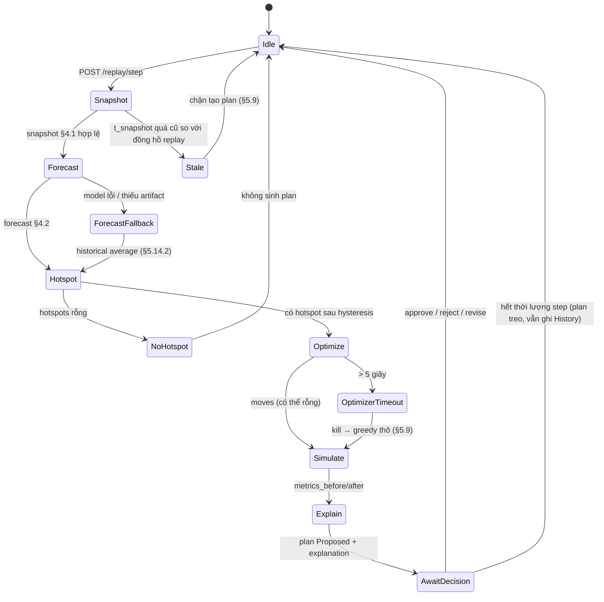
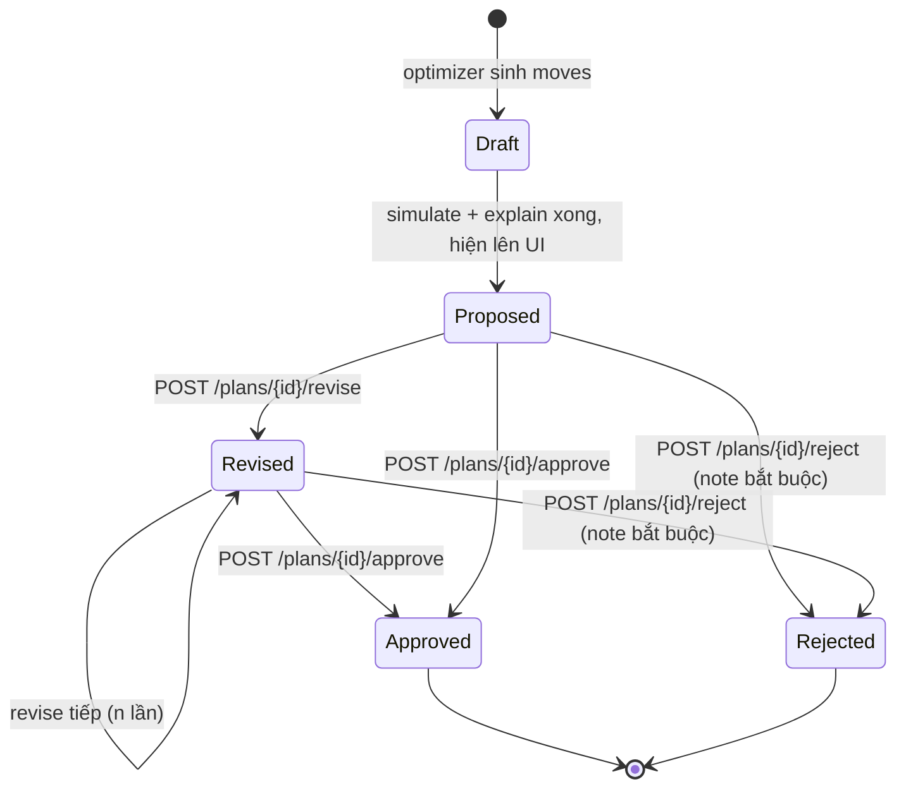
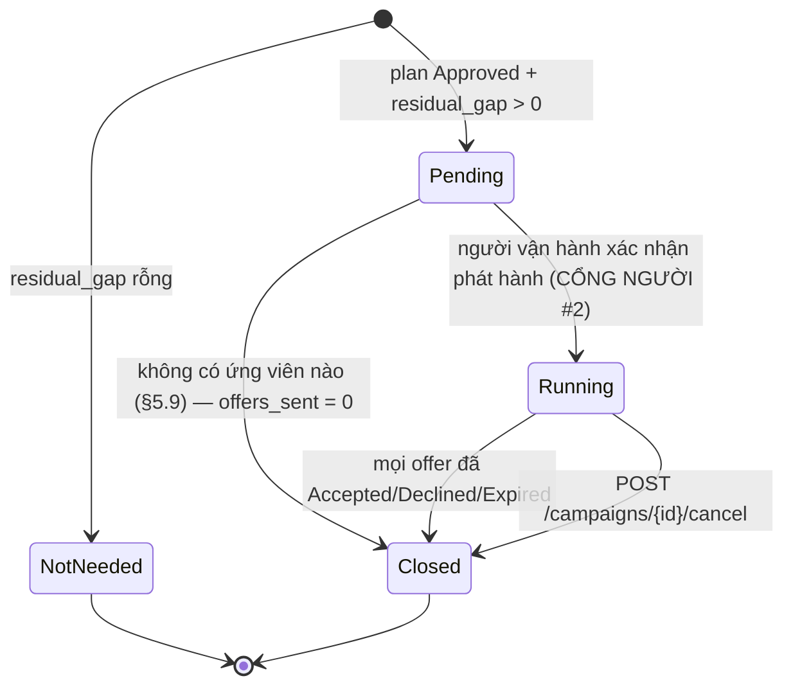
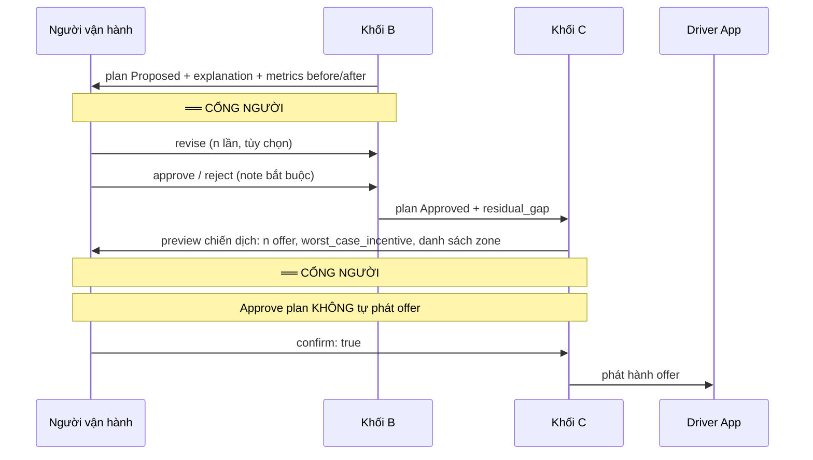

# AGENT_WORKFLOW.md — GSM-14 · NovaFour

> **Đọc mục 0 trước.** Hệ thống này **không có LLM agent trong luồng chính**. Sáu heading dưới đây là heading bắt buộc của Technical Design pack, được ánh xạ vào **pipeline deterministic** — thuật ngữ giữ nguyên, ngữ nghĩa được định nghĩa lại cho đúng hệ thống thật (quyết định A-07).
> Neo spec: [SPEC §5.1–5.14](../SPEC-GSM14-NovaFour-Unified.md) · §3.2 nguyên tắc · §5.9 fallback · §6 NFR.

**Mục lục:** [§0 Ánh xạ thuật ngữ](#0-ánh-xạ-thuật-ngữ) · [§1 Agent state](#1-agent-state) · [§2 Tool selection](#2-tool-selection) · [§3 Stop conditions](#3-stop-conditions) · [§4 Retry & timeout](#4-retry--timeout) · [§5 Human approval](#5-human-approval) · [§6 Error handling](#6-error-handling) · [Phụ lục A: LLM Lớp 2](#phụ-lục-a--explanation-lớp-2-llm-ngoài-mvp-cờ-tắt-mặc-định)

---

## 0. Ánh xạ thuật ngữ

| Heading yêu cầu | Trong hệ thống này |
|---|---|
| Agent state | **Ba state machine tường minh**: `PipelineState` (một step replay), `PlanState` (§5.7), `CampaignState` (§4.4). Không có "agent scratchpad", không có bộ nhớ hội thoại |
| Tool selection | **Bảng router deterministic**: điều kiện đầu vào → module gọi → module fallback. Không có LLM chọn tool; §5.9 viết lại thành dạng thực thi được |
| Stop conditions | Điều kiện dừng của **vòng lặp greedy**, của **chiến dịch huy động**, và của **một step replay** |
| Retry & timeout | Timeout theo NFR §6; retry ở tầng gọi module. **Cấm retry** với thao tác đã ghi History |
| Human approval | **Hai cổng người bắt buộc, không gộp**: duyệt plan; xác nhận phát hành offer |
| Error handling | 12 dòng §5.9 + ánh xạ sang mã lỗi API |

**Vì sao không phải LLM agent:** §6 NFR và quyết định PM đã loại LangGraph khỏi luồng chính. Mọi bước đều là hàm thuần với đầu vào/đầu ra là contract §4.1–4.9. Đây là điều kiện để §3.2 #6 (deterministic — cùng seed, cùng kịch bản, cùng kết quả) và §5.14 (so sánh baseline có ý nghĩa) đứng vững. Một LLM router sẽ phá cả hai.

---

## 1. Agent state

### 1.1. `PipelineState` — một step replay 5 phút



**Bất biến:** `PipelineState` **không được lưu bền** — nó là trạng thái trong một lần gọi `POST /replay/step` + `POST /plans`. Trạng thái bền duy nhất là History Store (§3.2 #7). Restart tiến trình mất `PipelineState` là chấp nhận được; mất `PlanState` hay `CampaignState` thì không.

### 1.2. `PlanState` (§5.7)



| Quy tắc | Chi tiết |
|---|---|
| Chuyển ngoài đồ thị | → `PLAN_STATE_INVALID` (HTTP 409). Ví dụ: approve một plan đã `Rejected` |
| `Approved` / `Rejected` là **trạng thái cuối** | Không có `un-approve`. Muốn đổi → tạo plan mới từ snapshot mới |
| Mỗi lần `revise` | Chạy lại **Simulator + Explanation** trên `revised_moves`, ghi đè `metrics_after` và `explanation_data`. **Không** chạy lại forecast/hotspot — người vận hành đang sửa plan trên cùng một dự báo |
| Mỗi chuyển trạng thái | Ghi **một** `history_record` (§4.6). Kể cả `revise` — nếu không, chuỗi sửa của người vận hành biến mất khỏi audit trail (§3.2 #7) |
| Ràng buộc revise | `revised_moves` vẫn phải qua **toàn bộ** validator §5.4 (`budget_cap`, `max_distance`, `min_supply_per_zone`, `max_supply_move_pct`, cooldown). Người vận hành sửa được **số xe và cặp zone**, không sửa được **chính sách** → vi phạm trả `POLICY_VIOLATION` (422) |

### 1.3. `CampaignState` (§4.4)



| Quy tắc | Chi tiết |
|---|---|
| **Vòng đời riêng** | `CampaignState` **không nhập vào** `PlanState` (§4.4). Plan `Approved` + campaign `Pending` là trạng thái hợp lệ và phổ biến — đó chính là khoảnh khắc chờ cổng người #2 |
| `Pending → Running` | **Chỉ** bằng hành động người. Không có đường tự động (C-09) |
| `Cancelled` offer | Offer đang `Sent` khi campaign bị hủy → `Cancelled`. Offer đã `Accepted` **giữ nguyên và vẫn trả thưởng** — C-08, không rút lời hứa đã đưa ra |
| Đóng campaign | Khi đóng: tính `accept_rate`, ghi `accept_rate_source`, chạy lại Simulator kịch bản 3, điền `metrics_after_activation`, ghi `history_record` |

### 1.4. Ba state machine giao nhau ở đâu

```
PipelineState.AwaitDecision ──approve──> PlanState.Approved
                                              │
                                     residual_gap > 0
                                              v
                                     CampaignState.Pending
                                              │
                              CỔNG NGƯỜI #2 ──┤
                                              v
                                     CampaignState.Running ──accept──> enroute_arrivals
                                              │                              │
                                              v                              v
                                     CampaignState.Closed <──── re-simulate (kịch bản 3)
```

Đây là chỗ Khối B và Khối C giao nhau (FR-13). Không có module riêng cho vòng lặp này — logic nằm ở `src/activation/engine.py` + `src/simulation/simulator.py` + `src/replay/engine.py`.

---

## 2. Tool selection

"Tool" ở đây = **module Python được gọi**. Việc chọn là bảng tra deterministic trong `src/replay/engine.py`, không phải suy luận.

### 2.1. Bảng router chính

| # | Điều kiện đầu vào | Module chính | Module fallback | Neo |
|---|---|---|---|---|
| R1 | Bắt đầu step | `replay.engine.next_snapshot()` | — | §5.1 |
| R2 | `t_snapshot` lệch đồng hồ replay > 1 step | — | **Chặn**, trả `STALE_DATA` | §5.9 |
| R3 | Snapshot hợp lệ, có artifact model | `forecasting.lgbm_quantile.predict()` | `forecasting.baseline_hist_avg` | §5.2, §5.14.2 |
| R4 | Chưa có artifact model (W2–W3) | `forecasting.mock.predict()` (= hist-avg) | — | C-06, §5.14.2 |
| R5 | `forecast` hợp lệ, `regime != rain_peak` | `hotspot.detector` với `gap = predicted_demand − predicted_supply` | — | §4.3 |
| R6 | `regime == rain_peak`, `conservative_gap_mode == "p90_p50"` | `hotspot.detector` với `gap = demand_p90 − predicted_supply` | — | §4.3 |
| R7 | `regime == rain_peak`, `conservative_gap_mode == "p90_p10"` | `hotspot.detector` với `gap = demand_p90 − supply_p10` | — | A-03 |
| R8 | `hotspots` rỗng | **Dừng step**, không sinh plan | — | §5.3 |
| R9 | Có hotspot, có `surplus_zones` | `optimizer.greedy.solve()` | — | §5.4 |
| R10 | Có hotspot, `surplus_zones` rỗng | Plan rỗng, `residual_gap` = toàn bộ gap | — | §5.9 no-solution |
| R11 | Optimizer > 5 giây | Kill → `optimizer.greedy.solve(mode="fast")` | — | §5.9, §6 |
| R12 | Có `plan.moves` | `simulation.simulator.run()` 2 kịch bản | — | §5.5 |
| R13 | Campaign `Closed` | `simulation.simulator.run()` kịch bản 3 | — | FR-13, §5.5 |
| R14 | Có metrics | `explanation.templates.render()` **Lớp 1** | — | §5.6 |
| R15 | Cờ `llm_layer2_enabled == true` **và** Lớp 1 xong | `explanation.llm_layer2` | **Lớp 1** (đã có sẵn) | §5.6, [Phụ lục A](#phụ-lục-a--explanation-lớp-2-llm-ngoài-mvp-cờ-tắt-mặc-định) |
| R16 | Plan `Approved`, `residual_gap` rỗng | Campaign → `NotNeeded` | — | §4.4 |
| R17 | Plan `Approved`, `residual_gap > 0` | `activation.engine.build_campaign()` → `Pending` | — | §5.11 |
| R18 | Campaign `Pending` + xác nhận người | `activation.engine.issue_offers()` | — | §5.11, C-09 |
| R19 | Không ứng viên nào thỏa 4 điều kiện | Campaign → `Closed`, `offers_sent = 0`, `metrics_after_activation = metrics_after` | — | §5.9 |
| R20 | Campaign `Running`, `mode == "human"` | Chờ `POST /offers/{id}/respond` | Hết TTL → `Expired` | §5.11 |
| R21 | Campaign `Running`, `mode == "simulated"` | `activation.driver_sim.decide()` seed=7 | — | §5.11, §5.9 |
| R22 | Campaign `Running`, `mode == "mixed"` | Tài khoản đánh dấu human → chờ; còn lại → `driver_sim` | — | §5.11 |

### 2.2. Xếp hạng ứng viên (R18 chi tiết, §5.11)

```
với mỗi zone trong residual_gap, sắp xếp theo gap_remaining GIẢM DẦN:
    n_offers = ceil(gap_remaining × overbooking_factor)
    ứng viên = tài xế thỏa TẤT CẢ 4 điều kiện:
        (a) status ∈ {online_idle, offline}                       -- bỏ online_busy
        (b) haversine(zone tài xế, target_zone) ≤ activation_radius_km
        (c) số offer trong 1h < max_offers_per_driver_per_hour
        (d) nếu online_idle: rút đi KHÔNG làm zone nguồn < min_idle_before_activation
    xếp hạng: offline TRƯỚC online_idle, sau đó khoảng cách TĂNG DẦN
    lấy n_offers ứng viên đầu; tính incentive_amount
    ghi driver_status_at_offer = status TẠI THỜI ĐIỂM NÀY (đóng băng)
    DỪNG khi tổng cam kết chạm incentive_budget_cap
```

> **`offline` trước `online_idle` là có chủ đích** (§5.11): kéo tài xế offline về làm **tăng tổng cung** — thứ relocation không làm được. Rút `online_idle` chỉ là relocation tự nguyện, dễ tạo hotspot mới ở zone nguồn. Đảo thứ tự này sẽ làm Khối C trùng chức năng với Khối B và triệt tiêu lý do tồn tại của nó.

### 2.3. Ba quy tắc router không được vi phạm

| # | Quy tắc | Vì sao |
|---|---|---|
| 1 | **Mọi module đều có fallback** (C-06) | Module chưa xong phải trả **đúng contract**, không trả `None`, không ném lên trên |
| 2 | Fallback **không được** gọi fallback | Chuỗi fallback sâu 1 tầng. Fallback lỗi → `500` có `error_code` rõ ràng, không im lặng |
| 3 | Router **không đọc `policy.yaml` trực tiếp** | Chỉ `src/common/policy.py` đọc file. R6/R7 nhận `conservative_gap_mode` như tham số truyền vào |

---

## 3. Stop conditions

### 3.1. Vòng lặp greedy của Optimizer (§5.4)

| Điều kiện dừng | Hành vi |
|---|---|
| `total_cost + chi phí move tiếp theo > budget_cap` | Dừng, phần còn lại vào `residual_gap` |
| Không còn `surplus_zones` hợp lệ | Dừng |
| Không còn hotspot chưa được phủ | Dừng — **thành công** |
| Mọi ứng viên còn lại có `distance > max_distance` | Dừng |
| Zone nguồn chạm `min_supply_per_zone` | Loại zone đó, tiếp tục |
| Zone nguồn chạm `max_supply_move_pct × idle_supply_current` | Loại zone đó, tiếp tục |
| Zone nguồn còn `cooldown_until_ts > t` | Loại zone đó **trước khi vào vòng lặp** |
| **Quá 5 giây** | Kill → chế độ `fast`, cảnh báo `OPTIMIZER_TIMEOUT` |

### 3.2. Chiến dịch huy động (§5.11)

| Điều kiện dừng | Hành vi |
|---|---|
| `Σ incentive_amount (cam kết xấu nhất) ≥ incentive_budget_cap` | Dừng phát hành, cảnh báo "chỉ phủ được {x}/{y} xe do trần thưởng" — **không tự nới ngân sách** (§5.9) |
| Hết ứng viên thỏa 4 điều kiện §2.2 | Campaign → `Closed`, `offers_sent = 0` nếu chưa gửi gì |
| Đã phát đủ `n_offers` cho mọi zone | Chuyển sang chờ phản hồi |
| Mọi offer đã `Accepted`/`Declined`/`Expired` | Campaign → `Closed`, chạy re-simulate |
| `expires_at < now` | Offer → `Expired`, **im lặng** (C-08), tính vào `accept_rate` như một lần không nhận |
| Người vận hành hủy | Campaign → `Closed`; offer `Sent` → `Cancelled`; offer `Accepted` **giữ nguyên + vẫn trả thưởng** |

> **Không có điều kiện dừng nào là "gap đã bù đủ".** §5.9 quy định rõ: tài xế bấm Nhận sau khi gap đã đủ **vẫn được ghi `Accepted` và vẫn trả thưởng**; phần dư ghi vào cảnh báo `OVERBOOKING_SURPLUS` để đánh giá `overbooking_factor`. Hủy ngược offer đã gửi là rút lời hứa — vi phạm C-08.

### 3.3. Hysteresis — chống nhấp nháy hotspot (§5.3)

| Tham số | Giá trị |
|---|---|
| Vào trạng thái hotspot | Cần **2 step liên tiếp** thỏa điều kiện |
| Ra khỏi trạng thái hotspot | Cần **3 step liên tiếp** không thỏa |

Bất đối xứng có chủ đích: vào nhanh (2) để không bỏ lỡ thiếu hụt thật, ra chậm (3) để không rút xe khỏi zone vừa mới hết căng. Trạng thái hysteresis lưu trong `replay.engine`, **reset khi `POST /replay/reset`**.

### 3.4. Một step replay

| Điều kiện dừng | Hành vi |
|---|---|
| `hotspots` rỗng | Kết thúc step, không sinh plan (R8) |
| Người vận hành approve/reject | Kết thúc step |
| Người vận hành không quyết trong step | Plan treo ở `Proposed`; step sau **vẫn chạy**. Plan cũ **không tự hủy** nhưng snapshot của nó thành stale → approve sẽ bị chặn bởi R2 |
| Hết 288 step (1 ngày replay) | Kết thúc session |

---

## 4. Retry & timeout

### 4.1. Bảng timeout (theo NFR §6)

| Thao tác | Timeout | Khi vượt | Neo |
|---|---|---|---|
| Forecast 30 zone × 2 horizon | **1 s** | Fallback historical average | §6, §5.2 |
| Hotspot detection | 200 ms | Không fallback — thuần số học, vượt là bug | §5.3 |
| Optimizer | **5 s** | Kill → greedy `fast`, cảnh báo | §6, §5.9 |
| Simulator (1 kịch bản) | 2 s | Không fallback — vượt là bug | §5.5 |
| Re-simulate sau accept | **2 s** | Không fallback | FR-13, §6 |
| Explanation Lớp 1 | 100 ms | Không fallback — render template | §5.6 |
| Explanation Lớp 2 (LLM) | 3 s | **Fallback Lớp 1** | Phụ lục A |
| Sinh chiến dịch 30 zone | **2 s** | Cảnh báo, không kill | §5.11 |
| Ghi History (SQLite) | 500 ms | **Không retry** — xem §4.3 | §5.8 |
| Toàn bộ `POST /plans` (p95) | **5 s** | Trả plan kèm `warnings[]` | §6 |
| Offer hiện trên Driver App | **2 s** kể từ khi phát hành | Polling 2 s là cơ chế, không phải timeout | §6, §5.13 |
| Replay 288 step không HITL | **5 phút** | Cảnh báo hiệu năng | §6 |

### 4.2. Chính sách retry

| Loại thao tác | Retry | Backoff | Idempotency key |
|---|---|---|---|
| Đọc snapshot Parquet | 2 lần | 100 ms cố định | — |
| Load model artifact lúc boot | 1 lần | — | — |
| Forecast | **0** — fallback ngay | — | — |
| Optimizer | **0** — kill → `fast` | — | — |
| Simulator | **0** | — | — |
| Ghi `history_record` | **0** | — | `plan_id` + `decision` |
| Ghi `driver_response` | **0** | — | `offer_id` |
| Phát hành offer | **0** | — | `campaign_id` |
| Gọi LLM Lớp 2 (nếu bật) | 1 lần | 500 ms | — |

### 4.3. Vì sao **cấm retry** với thao tác đã ghi History

`history_record` và `driver_response` là **append-only** ép ở tầng DB bằng trigger ([DATA_CONTRACT.md §4.2](DATA_CONTRACT.md#42-sqlite--datahistorydb-wal--append-only-ép-ở-tầng-db)). Retry một lần ghi đã thành công-nhưng-timeout sẽ tạo **bản ghi trùng**, và vì không được UPDATE/DELETE nên bản trùng đó **không xóa được** — nó làm sai vĩnh viễn `accept_rate` và mọi số liệu dẫn xuất.

Cách xử lý đúng: mỗi thao tác mang idempotency key; tầng ghi kiểm tồn tại **trước** khi chèn; timeout → trả lỗi cho client, client hỏi lại trạng thái bằng `GET`, **không** gửi lại lệnh ghi.

---

## 5. Human approval

**Hai cổng người bắt buộc. Không được gộp. Không được có đường tự động vòng qua.** (C-03, C-09, §5.7)



### 5.1. Cổng #1 — duyệt plan

| Hạng mục | Chốt |
|---|---|
| Endpoint | `POST /plans/{id}/approve` · `/revise` · `/reject` |
| Người quyết | Header `X-Operator-Id`, mặc định `operator_demo_01` → điền `decided_by` §4.6 |
| Thông tin bắt buộc hiện trước khi quyết | `moves`, `plan_totals`, `metrics_before`, `metrics_after`, `explanation_text`, `warnings[]` |
| `reject` | **`note` bắt buộc** (§4.5) — lý do từ chối là dữ liệu học được, không phải thủ tục |
| Không quyết | Plan treo ở `Proposed`; hệ thống **không tự approve sau timeout** |
| Ghi nhận | Một `history_record` cho **mỗi** hành động, kể cả `revise` |

### 5.2. Cổng #2 — xác nhận phát hành offer

| Hạng mục | Chốt |
|---|---|
| Endpoint | `POST /plans/{id}/campaign` với **`confirm: true` bắt buộc** trong body |
| Vì sao tách rời | Cổng #1 duyệt việc **điều xe của hãng**. Cổng #2 duyệt việc **cam kết tiền thưởng với người ngoài** — hai loại rủi ro khác nhau, hai ngân sách độc lập không bù trừ (C-09) |
| Thông tin bắt buộc hiện trước khi quyết | Số offer dự kiến, **`worst_case_incentive`** (giả định 100% nhận), danh sách zone đích, `assumed_accept_rate` kèm nhãn **"giả định mô phỏng"** |
| Không thể vòng qua | `activation.engine.issue_offers()` **chỉ** được gọi từ route đã kiểm `confirm == true`. Có test tĩnh chặn mọi lời gọi khác |
| Hủy | `POST /campaigns/{id}/cancel` — offer đã `Accepted` **vẫn trả thưởng** |

### 5.3. Cái **không** cần người duyệt

| Hành động | Vì sao |
|---|---|
| Sinh plan `Proposed` | Chưa có tác động — chỉ là đề xuất trên màn hình |
| Chạy Simulator | Thuần tính toán |
| Tài xế bấm **Nhận/Từ chối** | Đây là **quyền của tài xế**, không phải việc cần người vận hành duyệt (C-08). Từ chối 1 chạm, lý do không bắt buộc, không chấm điểm, không xếp hạng, không chế tài |
| Offer hết hạn | Tự hủy **im lặng** |

### 5.4. Không có lệnh nào tác động ra ngoài hệ thống

C-03: MVP **không** gửi lệnh điều xe thật, **không** push thật (FCM/APNs/SMS/Zalo), **không** thanh toán thưởng thật. Mọi "phát hành offer" chỉ ghi vào bảng `offer` để Driver App demo polling đọc. Toàn bộ tài khoản có `is_demo_account == true` — validator từ chối `false`.

---

## 6. Error handling

### 6.1. Bảng §5.9 (FR-8 — Cảnh báo & Fallback) → hành vi thực thi → mã lỗi API

| # | Tình huống (§5.9) | Hành vi | Mã API | HTTP |
|---|---|---|---|---|
| 1 | Optimizer không tìm được nghiệm | Cảnh báo UI + plan **rỗng** với `residual_gap` = toàn bộ gap | `NO_SOLUTION` | 200 ⚠️ |
| 2 | Optimizer vượt 5 giây | Kill → fallback greedy `fast` | `OPTIMIZER_TIMEOUT` | 200 ⚠️ |
| 3 | Forecast lỗi | Fallback historical average baseline | `FORECAST_FALLBACK` | 200 ⚠️ |
| 4 | LLM explanation lỗi / bịa số | Fallback template Lớp 1 | `EXPLANATION_FALLBACK` | 200 ⚠️ |
| 5 | Dữ liệu stale | Badge cảnh báo + **chặn tạo plan mới** | `STALE_DATA` | **409** |
| 6 | Dependency chưa xong | Mock **đúng contract** (C-06) | `MOCK_IN_USE` | 200 ⚠️ |
| 7 | Không tìm được tài xế ứng viên | Campaign `Closed` ngay, `offers_sent = 0`; UI: "Không có tài xế khả dụng trong bán kính {r}km"; `metrics_after_activation = metrics_after` | `NO_CANDIDATE_DRIVER` | 200 ⚠️ |
| 8 | Hết `incentive_budget_cap` trước khi phủ đủ gap | Gửi tối đa trong ngân sách theo thứ tự severity; cảnh báo "chỉ phủ được {x}/{y} xe do trần thưởng"; **không tự nới** | `INCENTIVE_BUDGET_EXCEEDED` | 200 ⚠️ |
| 9 | Driver App mất kết nối / tài xế không phản hồi | Hết `offer_ttl_minutes` → `Expired`; tính vào `accept_rate` như một lần không nhận; **luồng demo không treo** | `OFFER_EXPIRED` | **409** khi respond muộn |
| 10 | Không có người thật bấm khi demo | Bật driver response simulator (seed 7); ghi `accept_rate_source = simulated_model`; UI hiện nhãn **"mô phỏng"** | `SIMULATED_RESPONSE` | 200 ⚠️ |
| 11 | Tài xế bấm Nhận sau khi gap đã bù đủ | Vẫn `Accepted`, **vẫn trả thưởng**; phần dư → cảnh báo "huy động vượt nhu cầu {n} xe" | `OVERBOOKING_SURPLUS` | 200 ⚠️ |
| 12 | Nhiều tài xế nhận cùng lúc vượt số cần | Nhận theo thứ tự `responded_at`; **không hủy ngược** offer đã gửi (C-08) | `OVERBOOKING_SURPLUS` | 200 ⚠️ |

**Chín trong mười hai dòng trả HTTP 200 kèm `warnings[]`, không phải mã lỗi.** Đây là chủ đích: đó là **kết quả suy giảm nhưng dùng được**, và §5.9 quy định "luồng demo vẫn chạy tiếp, không treo". Trả 4xx/5xx sẽ khiến UI hiện màn hình lỗi ở đúng những tình huống mà spec đòi hiển thị kết quả kèm cảnh báo. Chỉ hai tình huống trả lỗi thật (`STALE_DATA`, `OFFER_EXPIRED`) — cả hai đều là **chặn hành động sắp xảy ra**, không phải báo cáo kết quả.

### 6.2. Lỗi validation contract

| Tình huống | Mã | HTTP |
|---|---|---|
| Sai schema §4.1–4.9 | `VALIDATION_ERROR` | 422 |
| Chuyển trạng thái ngoài đồ thị §1.2/§1.3 | `PLAN_STATE_INVALID` | 409 |
| `revised_moves` vi phạm policy | `POLICY_VIOLATION` | 422 |
| `total_cost > budget_cap` | `BUDGET_EXCEEDED` | 422 |
| Offer đã có phản hồi | `OFFER_ALREADY_RESPONDED` | 409 |
| Không tìm thấy `plan_id`/`offer_id`/`campaign_id` | `NOT_FOUND` | 404 |
| `enroute_supply != Σ enroute_arrivals[].units` | **Crash** — bất biến INV-3 vỡ | 500 |
| Thiếu key `policy.yaml` | **Crash lúc boot** | — |

Ba lỗi cuối **cố ý không có fallback**: chúng là dấu hiệu hệ thống đang tính sai chứ không phải môi trường xấu. Che chúng bằng fallback sẽ cho ra số KPI trông hợp lệ nhưng sai — nguy hiểm hơn nhiều so với một lần crash.

### 6.3. Nguyên tắc chung

| # | Nguyên tắc |
|---|---|
| 1 | **Không nuốt lỗi im lặng.** Mọi fallback đều thêm một mã vào `warnings[]` và ghi log |
| 2 | **Fallback trả đúng contract**, không trả `None`, không trả dict rỗng (C-06) |
| 3 | **Lỗi Khối C không làm hỏng kết quả Khối B.** Campaign lỗi → `metrics_after` vẫn hợp lệ, chỉ `metrics_after_activation = null` |
| 4 | **Mọi lỗi ảnh hưởng số liệu đều vào History.** Plan chạy bằng forecast fallback phải ghi rõ, nếu không sẽ bị so sánh nhầm với plan chạy bằng model thật |
| 5 | **Bất biến vỡ thì crash**, không tự sửa |

---

## Phụ lục A — Explanation Lớp 2 (LLM), **ngoài MVP**, cờ tắt mặc định

Chỉ làm nếu W5 dư thời gian (§7.1 #2). Lớp 1 template **đã thỏa acceptance** §5.6. Ghi ở đây để nếu có làm thì làm đúng, **không phải** để khuyến khích làm.

| Hạng mục | Chốt |
|---|---|
| Cờ bật | `llm_layer2_enabled`, mặc định `false`. **Không** đặt trong `policy.yaml` (không phải ngưỡng vận hành) |
| Đầu vào | **Chỉ** `explanation_data` + văn bản Lớp 1 đã render. **Không** truyền snapshot thô, không truyền toàn bộ plan |
| Ràng buộc prompt | **Cấm sinh số mới.** LLM chỉ được diễn đạt lại. Mọi con số phải xuất hiện nguyên văn trong `explanation_data` |
| Kiểm sau sinh | `explanation.validator` trích mọi số trong output, đối chiếu `explanation_data`. Lệch một số → **bỏ output, dùng Lớp 1** |
| Timeout | 3 s → Lớp 1 |
| Retry | 1 lần → Lớp 1 |
| **Cấm tuyệt đối** | LLM **không** được sinh `reason_text` của offer (§4.8) — văn bản đó đi kèm cam kết tiền thưởng với tài xế. Luôn Lớp 1 |
| Deterministic | LLM phá §3.2 #6. Khi bật, **mọi run đánh giá KPI vẫn phải dùng Lớp 1** — Lớp 2 chỉ để trình diễn |
| Ghi nhận | `explanation_layer ∈ {1, 2}` vào History |

> Đây là lý do Lớp 2 nằm ở phụ lục chứ không nằm trong luồng: nó không cải thiện một KPI nào ở §1.7, nhưng đưa nguồn phi-deterministic vào một hệ thống mà toàn bộ tính hợp lệ của kết quả dựa trên tính deterministic.
