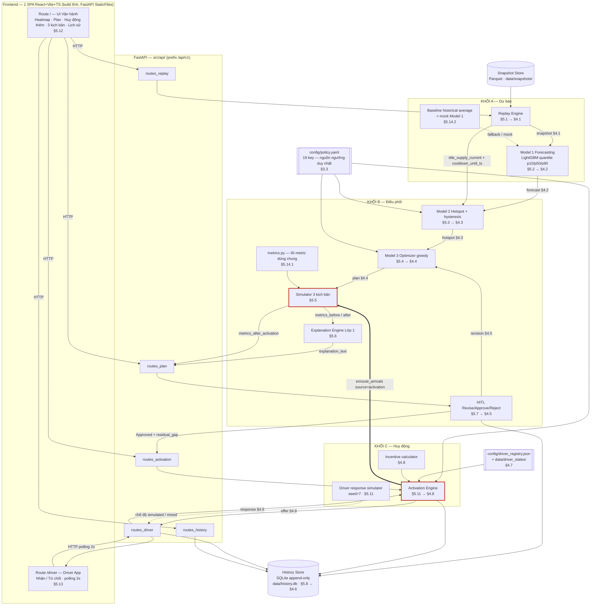
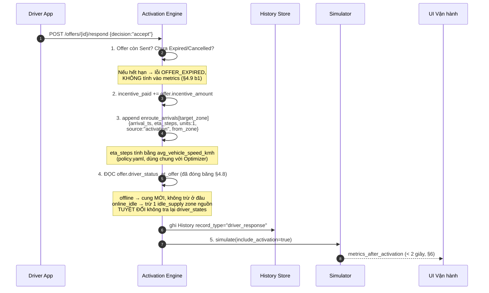
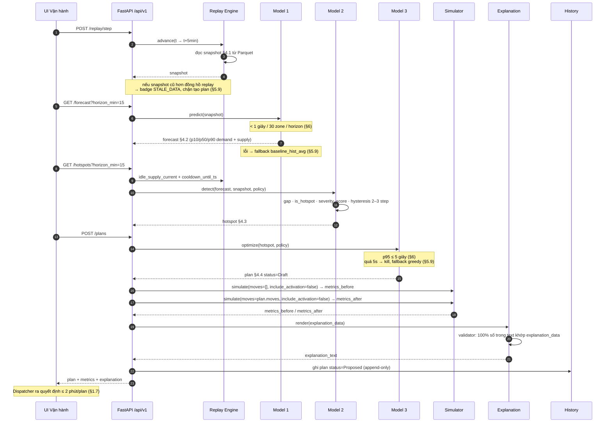
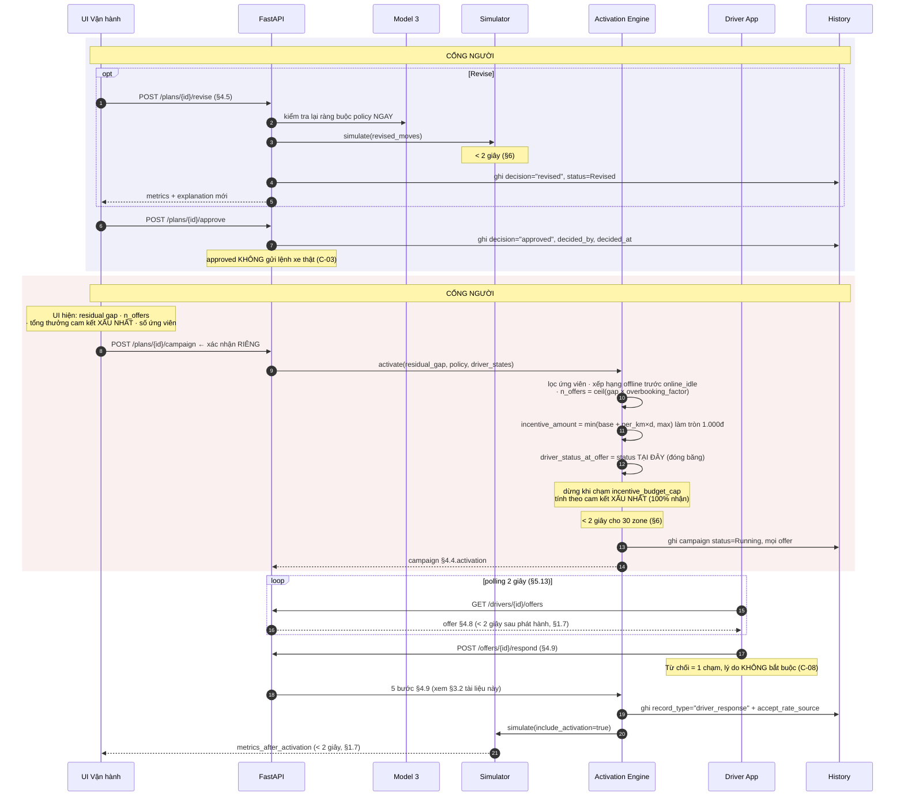
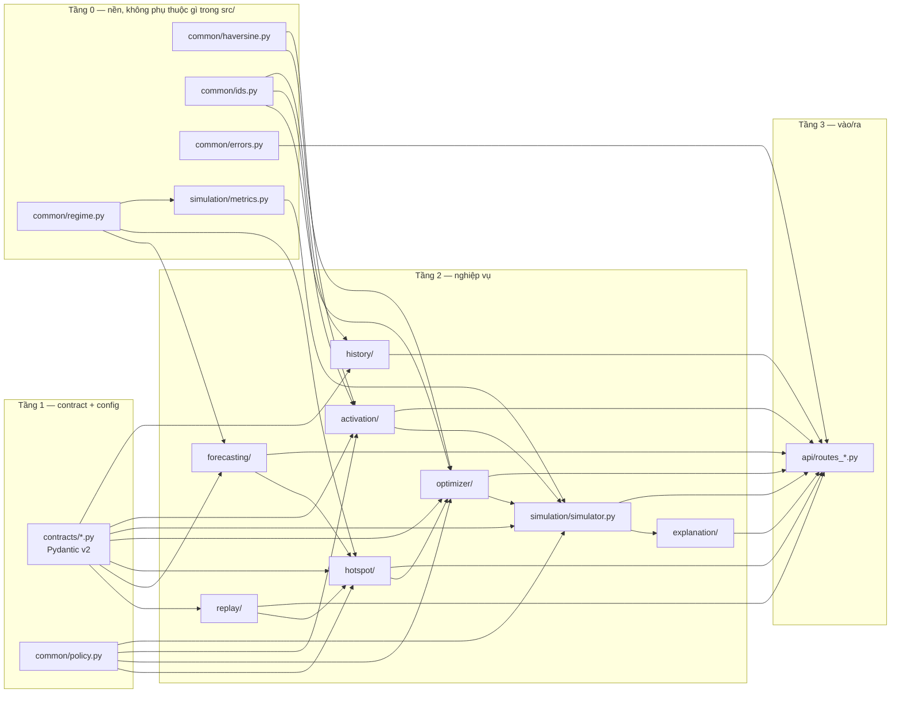

# ARCHITECTURE.md — GSM-14 · NovaFour

> [!WARNING]
> Đây là **tài liệu thiết kế lịch sử**, có thể chứa topology, route và giả định
> không còn khớp runtime hiện tại. Nguồn kiến trúc hiện hành là
> [`../../ARCHITECTURE.md`](../../ARCHITECTURE.md).

> **Nguồn sự thật:** [docs/SPEC-GSM14-NovaFour-Unified.md](../SPEC-GSM14-NovaFour-Unified.md) v1.3 (06/08/2026).
> Tài liệu này **không thêm chức năng nào ngoài spec**. Mọi mục đều neo về một mục spec (`§x.y`) hoặc một mã `[ASSUMPTION-nn]` (định nghĩa đầy đủ ở [DATA_CONTRACT.md](DATA_CONTRACT.md#8-assumption-register)).
> Ngày lập: 08/08/2026 (cuối W2 — trùng mốc I-08 khóa contract/KPI/baseline).

**Bộ tài liệu thiết kế kỹ thuật:** ARCHITECTURE (file này) · [API_CONTRACT.md](API_CONTRACT.md) · [DATA_CONTRACT.md](DATA_CONTRACT.md) · [AGENT_WORKFLOW.md](AGENT_WORKFLOW.md) · [IMPLEMENTATION_PLAN.md](IMPLEMENTATION_PLAN.md) · [EVALUATION_PLAN.md](EVALUATION_PLAN.md)

---

## 1. Hệ thống này là gì (và không là gì)

**Là:** một **pipeline mô phỏng deterministic 3 khối** chạy trên timeline replay bước 5 phút. Mỗi step, hệ thống dự báo cung–cầu 30 zone cho t+15/t+30, phát hiện zone sắp thiếu xe, sinh kế hoạch điều chuyển, mô phỏng tác động, giải thích bằng tiếng Việt, chờ người vận hành duyệt, rồi (nếu vẫn còn thiếu) phát hành offer có thưởng tới tài xế demo và đo lại kết quả.

**Không là:** một chat agent, không có LLM trong luồng chính, **không dùng LangGraph** (§6 — quyết định PM 2026-08-04), không vector DB, không WebSocket (§7.1 #3 — polling 2 giây).

`src/` khởi đầu là boilerplate template (LangGraph chat demo). Kiến trúc dưới đây **thay thế hoàn toàn** phần đó; việc xóa đã hoàn tất ở T0.5 — xem [§8](#8-vòng-đời-mã-nguồn-template).

---

## 2. Nguyên tắc kiến trúc bắt buộc (§3.2)

| # | Nguyên tắc | Hệ quả kiến trúc cụ thể trong tài liệu này |
|---|---|---|
| 1 | **Contract-first** | 9 message contract §4.1–4.9 → 9 module Pydantic v2 trong `src/contracts/`. Sau W2 chỉ thêm field **optional** |
| 2 | **Mock-first (C-06)** | Mỗi module có một `mock` trả **đúng contract**; bảng fallback ở [§6.3](#63-bảng-fallback-cứng-59-c-06) |
| 3 | **Baseline-first (C-05)** | `baseline_hist_avg.py` là **mock của Model 1**; greedy là phương án chốt của Model 3, không có nhánh OR-Tools |
| 4 | **4 regime** | Một hàm duy nhất `src/common/regime.py` gán `normal/peak/rain/rain_peak`; mọi metric đi qua nó |
| 5 | **Không state ẩn** | Mọi chuyển trạng thái ghi `src/history/store.py` (SQLite append-only, trigger chặn UPDATE/DELETE) |
| 6 | **Deterministic** | 3 seed độc lập: synthetic train=42 / test=2026 (`config/generator.yaml`), driver response=7, nowcast=13 |

---

## 3. Component diagram

### 3.1. Sơ đồ tổng thể



Cạnh in đậm `ACT ==> SIM` là **vòng phản hồi đóng FR-13** — xem [§3.2](#32-vòng-phản-hồi-đóng-fr-13).

### 3.2. Vòng phản hồi đóng (FR-13)

Đây là điểm Khối B và Khối C giao nhau. **Không có module riêng cho nó** — logic nằm rải ở §5.5 + §5.11 + contract §4.9 bước 1–5. Vẽ tách ra vì đây là chỗ dễ cài sai nhất:



**Vì sao bước 4 phải đọc field đã đóng băng:** offer sống `offer_ttl_minutes` = 10 phút = **2 step replay**. Trạng thái tài xế trong `driver_states` đổi được trong khoảng đó; tra lại lúc accept sẽ cho kết quả khác lúc phát hành và **phá tính deterministic** (§3.2 #6, §4.8).

**Vì sao `source` là field bắt buộc:** không có nó thì không tách được đóng góp Khối B khỏi Khối C ở bảng 3 kịch bản, và test bất biến *"tổng cung `plan_only` == `no_action`"* (§5.5) không chạy được.

### 3.3. Ba kịch bản chạy song song (§3.1)

| Kịch bản | Gọi | KPI |
|---|---|---|
| `no_action` | `simulate(moves=[], include_activation=False)` | Baseline khóa cuối W2 — **phải khớp 100%** `data/baseline/no_action_summary.json` (§5.5, §5.14.1) |
| `plan_only` | `simulate(moves=approved, include_activation=False)` | Giảm unmet demand **≥20%** vs `no_action` (§1.7) |
| `plan_activation` | `simulate(moves=approved, include_activation=True)` | Giảm residual gap **≥30%** vs `plan_only` (§1.7) |

Một hàm `simulate()` duy nhất với tham số `include_activation: bool` — **không code riêng cho từng kịch bản** (§5.5).

---

## 4. Trách nhiệm từng component

### 4.1. Khối A — Dự báo

| Module | File | Đầu vào | Đầu ra | Spec | Tuần |
|---|---|---|---|---|---|
| **Replay Engine** | `src/replay/engine.py` | `data/snapshots/*.parquet` | Snapshot §4.1 | §5.1 | W1 (làm lại W2 do nợ D1–D5) |
| — Scenario loader | `src/replay/scenario.py` | tên kịch bản (`normal`/`rain_peak_1700`/`holiday`) | reset timeline + **xóa hàng đợi offer + reset driver_registry** | §5.10 | W5 |
| — Snapshot store | `src/replay/store.py` | Parquet | random-access theo index thời gian | §5.1 | W1 |
| **Model 1 Forecasting** | `src/forecasting/lgbm_quantile.py` | A2 feature + A3 label | Forecast §4.2 (p10/p50/p90 **cả demand và supply**) | §5.2 | W2–W3 |
| — Feature builder | `src/forecasting/features.py` | A1 → A2 | 36 feature theo `docs/feature_dictionary.md` | §5.2 | W2 |
| — Baseline hist-avg | `src/forecasting/baseline_hist_avg.py` | phần **train** của A3 | bảng tra `zone × hour × dow` | §5.14.2 | W1 |
| — Mock forecast | `src/forecasting/mock.py` | snapshot | Forecast §4.2 hợp lệ | §5.14.2, C-06 | W1 |

> **Ràng buộc riêng của Replay Engine (§4.3):** hai field `idle_supply_current` và `cooldown_until_ts` **do Replay Engine điền, không phải Model 2 tính**. Replay Engine là nơi duy nhất vừa có snapshot tại `t` vừa tra được History để biết `from_zone` của các plan gần nhất. Cố ý **không** đưa `cooldown_until_ts` vào snapshot §4.1 — snapshot là deliverable A1 do generator sinh, mà generator không được biết gì về plan (tránh phụ thuộc ngược Data ← AI).

### 4.2. Khối B — Điều phối

| Module | File | Đầu vào | Đầu ra | Spec | Tuần |
|---|---|---|---|---|---|
| **Model 2 Hotspot** | `src/hotspot/detector.py` | Forecast §4.2 + snapshot | Hotspot §4.3 | §5.3 | W2 |
| — Hysteresis | `src/hotspot/hysteresis.py` | chuỗi hotspot 2–3 step | trạng thái vào/ra ổn định | §4.3, §5.3 | W2 |
| **Model 3 Optimizer** | `src/optimizer/greedy.py` | Hotspot §4.3 + policy | Plan §4.4 `status=Draft` | §5.4 | W3 |
| — Ràng buộc | `src/optimizer/constraints.py` | plan ứng viên | pass/fail + lý do | §5.4 | W3 |
| **Simulator** | `src/simulation/simulator.py` | Plan §4.4 + `include_activation` | `metrics_before/after/after_activation` | §5.5 | W3 |
| **Lõi metric** | `src/simulation/metrics.py` | `demand`, `supply` theo zone×step | 4 công thức §5.5 | **§5.14.1** | **W2 — chặn baseline** |
| **Explanation** | `src/explanation/templates.py` | `explanation_data` | text tiếng Việt Lớp 1 | §5.6 | W4 |
| — Validator | `src/explanation/validator.py` | text + `explanation_data` | 100% số khớp | §5.6 | W4 |
| **HITL** | `src/api/routes_plan.py` | Revision §4.5 | Plan mới + History | §5.7 | W4 |

### 4.3. Khối C — Huy động

| Module | File | Đầu vào | Đầu ra | Spec | Tuần |
|---|---|---|---|---|---|
| **Activation Engine** | `src/activation/engine.py` | `residual_gap` của plan **Approved** | Offer §4.8 | §5.11 | W3 |
| — Incentive | `src/activation/incentive.py` | `distance_km` + policy | `incentive_amount` làm tròn 1.000đ | §4.8 | W3 |
| — Driver sim | `src/activation/driver_sim.py` | offer + seed=7 | Response §4.9 deterministic | §5.11 | W3 |

### 4.4. Nền tảng dùng chung

| Module | File | Trách nhiệm | Spec |
|---|---|---|---|
| Regime tagging | `src/common/regime.py` | **Một nơi duy nhất** gán `normal/peak/rain/rain_peak`; ngưỡng `rain_mm_h ≥ 0.5` `[ASSUMPTION-18]` | §3.2 #4, §5.2 |
| Haversine | `src/common/haversine.py` | Khoảng cách on-the-fly từ `zone_registry.json`. **Không precompute ma trận 30×30** — quyết định Data/BA 2026-08-04 | §5.4 |
| Policy loader | `src/common/policy.py` | Đọc 19 key, validate kiểu, **fail-fast nếu thiếu key**. Module khác **cấm** hard-code ngưỡng | §3.3 |
| ID generator | `src/common/ids.py` | `plan_id` UUID4, `campaign_id` `ACT-YYYYMMDD-HHMM-nn`, `offer_id` `OF-nnnnnn`, `record_id` `H-nnnnnn` | §4.4, §4.6, §4.8 |
| Lỗi | `src/common/errors.py` | 8 mã lỗi nghiệp vụ → HTTP status | §5.9 |
| History Store | `src/history/store.py` | SQLite WAL, **trigger chặn UPDATE/DELETE** | §5.8 |

### 4.5. Frontend

| Route | Màn hình | Spec |
|---|---|---|
| `/` | Bảng điều khiển (heatmap 30 zone, badge stale, điều khiển tua) | §5.12 |
| `/plan/:planId` | Chi tiết plan: move, deadhead, chi phí vs `budget_cap`, before/after, cảnh báo, explanation, nút Revise/Approve/Reject | §5.12 |
| `/plan/:planId/activation` | Khối "Huy động thêm": residual gap, số offer dự kiến, tổng thưởng cam kết xấu nhất, **nút Phát hành offer (xác nhận riêng)**, bảng Nhận/Từ chối/Hết hạn, nút Hủy chiến dịch | §5.7, §5.12 |
| `/plan/:planId/scenarios` | Bảng 3 kịch bản cạnh nhau, có nhãn "mô phỏng"/"người thật" | §5.12, C-07 |
| `/history` | Tra cứu theo `plan_id`/khoảng thời gian, hiện cả phản hồi tài xế | §5.12 |
| `/driver` | Driver App — thẻ offer, Nhận/Từ chối, đếm ngược, polling 2s | §5.13 |

---

## 5. Luồng request end-to-end

### 5.1. Một step replay 5 phút (luồng chính, chưa có activation)

Mốc thời gian trên từng chặng lấy từ NFR §6.



### 5.2. HITL → chiến dịch huy động → vòng phản hồi đóng



### 5.3. Ngân sách thời gian tổng (§6)

| Chặng | Ngưỡng | Nguồn |
|---|---|---|
| Inference forecast 30 zone/horizon | < 1s | §6, §5.2 |
| Tạo plan (p95) | ≤ 5s | §6, §1.7 |
| Re-simulate khi revise | < 2s | §6, §5.5 |
| Sinh chiến dịch offer 30 zone | < 2s | §6, §5.11 |
| Offer → hiển thị trên Driver App | < 2s | §1.7 |
| Phản hồi tài xế → metrics cập nhật | < 2s | §1.7 |
| Replay 1 ngày (288 step) toàn pipeline | < 5 phút | §5.1 |
| Dispatcher ra quyết định | ≤ 2 phút/plan | §1.7 |
| Tài xế ra quyết định | ≤ 20 giây/offer | §1.7 |

---

## 6. Dependency giữa các module

### 6.1. Đồ thị phụ thuộc (chiều mũi tên = "import / phụ thuộc vào")



### 6.2. Hai luật cứng — có test tĩnh trong CI

**Luật 1 — `simulator.py` PHẢI import `metrics.py`, CẤM cài lại công thức (§5.14.1).**

Baseline no-action phải khóa **cuối W2** (I-08) nhưng Simulator đầy đủ mới có ở **W3**. Gỡ bằng cách tách lõi metric ra trước. Nếu W3 viết lại 4 công thức lần thứ hai trong `simulator.py`, hai bản sẽ trôi khỏi nhau và **mọi so sánh KPI mất hiệu lực** mà không ai phát hiện.

```python
# tests/test_architecture.py — chạy trong CI từ W3
def test_simulator_imports_metrics():
    src = Path("src/simulation/simulator.py").read_text(encoding="utf-8")
    assert "from src.simulation.metrics import" in src or "from .metrics import" in src

def test_simulator_khong_cai_lai_cong_thuc():
    src = Path("src/simulation/simulator.py").read_text(encoding="utf-8")
    for dau_van_tay in ["3.0 *", "** 1.5", "-0.4 *", "8.0)"]:
        assert dau_van_tay not in src, f"Công thức metric bị cài lại trong simulator.py: {dau_van_tay}"
```

**Luật 2 — `metrics.py` KHÔNG được import `policy.yaml`, KHÔNG được import module forecast (§5.14.1 acceptance).**

Nếu import được tức là baseline đã bị nhiễm tham số điều chỉnh được — mốc so sánh không còn là mốc.

```python
def test_metrics_khong_nhiem_tham_so():
    src = Path("src/simulation/metrics.py").read_text(encoding="utf-8")
    for cam in ["policy", "yaml", "forecasting", "lgbm"]:
        assert cam not in src.lower(), f"metrics.py bị nhiễm: {cam}"
```

**Ba bất biến chạy trong CI (§5.5 acceptance)** — chi tiết ở [EVALUATION_PLAN.md](EVALUATION_PLAN.md):

| # | Bất biến | Bắt được lỗi gì |
|---|---|---|
| INV-1 | `simulate(moves=[], include_activation=False)` khớp **100%** baseline đã khóa | Hai đường code trôi khỏi nhau |
| INV-2 | Tổng cung kịch bản `plan_only` **==** `no_action` | Relocation đang tự sinh xe |
| INV-3 | `enroute_supply == Σ enroute_arrivals[].units` **mỗi step** | Cộng thẳng vào số vô hướng, mất `source` |

### 6.3. Bảng fallback cứng (§5.9, C-06)

| Module | Khi lỗi/chưa xong | Rơi về | Ai giữ |
|---|---|---|---|
| Model 1 | lỗi inference | `baseline_hist_avg` (§5.14.2) | Khối A |
| Model 3 | quá 5 giây | kill → greedy (đã là mặc định) | Khối B |
| Model 3 | không tìm được nghiệm | plan rỗng, `residual_gap` = toàn bộ gap | Khối B |
| Explanation Lớp 2 | LLM lỗi / bịa số | Lớp 1 template | Khối B |
| Activation | không có ứng viên | campaign `Closed` ngay, `offers_sent=0`, `metrics_after_activation = metrics_after` | Khối C |
| Driver App | không ai bấm | driver response simulator (seed=7), `accept_rate_source="simulated_model"` | Khối C |
| Bất kỳ module chưa xong | — | mock trả **đúng contract** | mọi khối |

### 6.4. Thứ tự khởi tạo (fail-fast lúc boot)

```
1. load policy.yaml  → thiếu 1 trong 19 key ⇒ crash ngay, không chạy tiếp
2. load zone_registry.json (30 zone, lat/lng)
3. load driver_registry.json (600 tài xế, is_demo_account == true toàn bộ)
4. mở data/history.db (WAL, tạo trigger chặn UPDATE/DELETE nếu chưa có)
5. mount snapshot store (Parquet)
6. mount StaticFiles frontend/dist
```

Fail-fast là có chủ đích: một ngưỡng thiếu mà chạy bằng giá trị mặc định ẩn sẽ làm sai toàn bộ KPI mà không ai biết (§3.3 — policy.yaml là nguồn ngưỡng **duy nhất**).

---

## 7. Cây thư mục mục tiêu

```
src/
  main.py                     FastAPI app, mount StaticFiles, startup fail-fast
  common/
    regime.py                 gán 4 regime — MỘT nơi duy nhất  §3.2 #4
    haversine.py              khoảng cách on-the-fly            §5.4
    policy.py                 loader 19 key, fail-fast          §3.3
    ids.py                    plan_id / campaign_id / offer_id / record_id
    errors.py                 8 mã lỗi nghiệp vụ                §5.9
  contracts/                  Pydantic v2 — §4.1–4.9
    snapshot.py forecast.py hotspot.py plan.py revision.py
    history.py driver.py offer.py response.py
  replay/
    engine.py                 §5.1 · điền idle_supply_current + cooldown_until_ts §4.3
    scenario.py               §5.10 · reset gồm xóa offer queue + driver_registry
    store.py                  Parquet random-access
  forecasting/
    features.py               A1 → A2, 36 feature
    baseline_hist_avg.py      §5.14.2 · mock Model 1 · chỉ đọc split train
    lgbm_quantile.py          §5.2 · p10/p50/p90 demand + supply
    mock.py                   C-06
  hotspot/
    detector.py               §5.3 · gap/severity/is_hotspot
    hysteresis.py             §4.3 · 2–3 step
  optimizer/
    greedy.py                 §5.4 · greedy theo severity
    constraints.py            §5.4 · budget/distance/max_move_pct/min_supply/cooldown
  simulation/
    metrics.py                §5.14.1 · W2 · ~40 dòng · KHÔNG import policy/forecast
    simulator.py              §5.5  · W3 · import metrics.py
  explanation/
    templates.py              §5.6 Lớp 1 · template vận hành + template tài xế
    validator.py              §5.6 · 100% số khớp explanation_data
    llm_layer2.py             §7.1 #2 · OPTIONAL, cờ mặc định TẮT
  activation/
    engine.py                 §5.11 · chọn ứng viên, phát hành offer
    incentive.py              §4.8 · min(base + per_km×d, max), làm tròn 1.000đ
    driver_sim.py             §5.11 · seed=7, chế độ human/simulated/mixed
  history/
    store.py                  §5.8 · SQLite append-only
    queries.py                tra theo plan_id / khoảng thời gian
  api/
    routes_replay.py routes_plan.py routes_activation.py
    routes_driver.py routes_history.py
    errors.py                 map mã lỗi → HTTP status

frontend/                     Vite + React + TS → frontend/dist → StaticFiles
config/
  policy.yaml                 19 key                          ✅ T0.1
  generator.yaml              ✅ đã có (cập nhật ở T0.4)
  zone_registry.json          ✅ đã có
  driver_registry.json        600 tài xế                      ✅ T0.6
  driver_response.yaml        7 tham số Phần 8B, seed=7       ✅ T0.6
data/
  snapshots/                  A1 Parquet                      ✅ T0.4
  features/ labels/ ground_truth/   A2–A4 Parquet
  driver_states/              A6                              ✅ T0.6
  baseline/                   no_action_metrics.parquet · no_action_summary.json · BASELINE_FREEZE.md   ✅ T0.4, khóa 2026-08-08
  history.db                  SQLite WAL append-only
tests/
  test_architecture.py        luật cứng §6.2 + C-08           ✅ T0.3, mở rộng ở T0.7
  test_generator.py           A1 · 4 regime · nowcast · mưa theo zone   ✅ T0.4
  test_driver_registry.py     A6 · ràng buộc khớp 100% idle_supply      ✅ T0.6
  test_common/                policy loader 19 key · regime tagging     ✅ T0.1, T0.2
  test_contracts/             9 entity §4.1–4.9 · ví dụ SPEC · parity mock/thật   ✅ T0.7
  test_simulation/ test_optimizer/ test_activation/ test_api/
```

Cột bên phải ghi task đã tạo ra thư mục đó. Mục chưa có nhãn là phần các task T1–T11 sẽ dựng — cây này là **đích**, không phải ảnh chụp hiện trạng.

---

## 8. Vòng đời mã nguồn template

`src/` khởi đầu là boilerplate AI20K Agent, **không phải** kiến trúc mục tiêu. **Đã xóa xong ở task T0.5** ([IMPLEMENTATION_PLAN.md](IMPLEMENTATION_PLAN.md)):

| Đã xóa | Lý do | Trạng thái |
|---|---|---|
| `src/agents/**` (`state.py`, `graph.py`, `nodes/example_node.py`, `tools/example_tool.py`) | LangGraph — §6 cấm | ✅ |
| `src/services/llm.py` | Luồng chính không gọi LLM; Lớp 2 nếu làm sẽ tự khởi tạo client trong `explanation/llm_layer2.py` | ✅ |
| `ChatRequest` / `ChatResponse` trong `src/models/schemas.py` | Thay bằng `src/contracts/` — cả gói `src/models/` đã bỏ | ✅ |
| `tests/test_agents/` | Test của module bị xóa | ✅ |
| `docs/architecture_diagram.md` | Placeholder template mâu thuẫn với tài liệu này | ✅ |
| `langgraph`, `langchain`, `langchain-openai` trong `requirements.txt` | §6 cấm LangGraph | ✅ |

Giữ lại: `src/main.py` (đã viết lại, hiện chỉ còn `GET /health` fail-fast), `tests/conftest.py` (fixture `client`; **đã bỏ `mock_llm`** vì không còn LLM trong luồng chính). `src/api/routes.py` bị bỏ luôn thay vì tách — các `routes_*.py` ở [§7](#7-cây-thư-mục-mục-tiêu) sẽ viết mới từ [API_CONTRACT.md](API_CONTRACT.md), không kế thừa dòng nào của template.

Lưu ý: `tests/test_architecture.py` canh các luật kiến trúc ở [§6.2](#62-hai-luật-cứng--có-test-tĩnh-trong-ci) (ai được đọc `yaml`, ai được gán regime, `metrics.py` không nhiễm tham số, `common/` không import ngược tầng) — **không** canh việc `langgraph` bị thêm lại. Ràng buộc đó nằm ở [CLAUDE.md §6 #3](../../CLAUDE.md#6-dependency-management) và phải bắt bằng review `requirements.txt`.

---

## 9. Quyết định kiến trúc (spec để trống → chốt ở đây)

Spec chốt **cái gì** phải làm nhưng để mở một số lựa chọn kỹ thuật. Dưới đây là phần chốt, kèm lý do:

| # | Spec để mở | Chốt | Lý do |
|---|---|---|---|
| A-01 | §5.13 "cùng codebase/stack với UI vận hành" | **1 SPA React + Vite + TS**, route `/` và `/driver`, build tĩnh → FastAPI `StaticFiles` | Một container, không CORS, một lệnh build. Driver App chỉ cần 5 màn hình đơn giản |
| A-02 | §5.1 "Parquet **hoặc** SQLite"; §5.8 "JSON append-only **hoặc** SQLite" | **Parquet** cho snapshot/feature/label/ground-truth; **SQLite** (`data/history.db`, WAL, trigger chặn UPDATE/DELETE) cho history/campaign/offer/driver_response | Parquet hợp với đọc theo cột, khối lượng lớn, bất biến. SQLite cho phép ép append-only ở tầng DB thay vì tin vào kỷ luật code — §3.2 #5 đòi 100% audit trail |
| A-03 | §4.3 "⬜ CẦN CHỐT trước 09/08: chế độ thận trọng có nên dùng `gap = demand_p90 − supply_p10`" | Thêm key `conservative_gap_mode: p90_p50 \| p90_p10`, **mặc định `p90_p50`** (giữ nguyên v1.3); **đo cả hai ở W4** rồi chốt bằng số | Đổi công thức làm đổi tập hotspot → đổi recall đo được, mà lịch tune ngưỡng W3–W4 đã chốt theo công thức cũ. Cờ policy cho phép đo mà không phá lịch. → policy.yaml thành **19 key** |
| A-04 | §5.11 tham số incentive; §4.4 ví dụ ghi `incentive_budget_cap: 200000` nhưng cam kết xấu nhất của kịch bản demo vượt xa | **`incentive_budget_cap = 1.000.000đ/plan`**, độc lập `budget_cap = 500.000đ` (C-09, không bù trừ) | Ngân sách chốt theo **cam kết xấu nhất** (100% nhận). Với `incentive_max_per_offer = 50.000đ` và kịch bản mưa cần ~20 offer, 200.000đ chỉ đủ 4 offer — chiến dịch luôn cụt trước khi phủ được gap |
| A-05 | Spec không định nghĩa ngưỡng mưa cho regime tagging | **`rain ⇔ rain_mm_h ≥ 0.5`**; mưa to `≥ 5.0`. Một hàm `src/common/regime.py`. **Tính lại baseline trước khi khóa** | `compute_baseline_no_action.py` đang dùng `> 0` → mọi giọt mưa 0.01mm/h cũng thành regime `rain`, làm regime `normal` chỉ còn 14.400/60.480 step và `rain_peak` bão hòa ở hotspot rate 0.99986. §5.14.3 #2 cho phép sửa quy ước **trước** khi khóa |
| A-06 | §4.1 `rain_forecast_15/30` hiện là dự báo hoàn hảo (đọc thẳng `rain_series[i+3]`) | Thêm sai số nowcast **cả nhân lẫn cộng, có sàn 0**, seed=13 — công thức đầy đủ ở [DATA_CONTRACT.md](DATA_CONTRACT.md) | Dự báo hoàn hảo làm Model 1 học được luật "`forecast > 0` ⟺ chắc chắn sắp mưa" → MAPE ở `rain_peak` đẹp giả tạo, và KPI "thắng baseline ≥20%" mất ý nghĩa. Số hạng **cộng** là bắt buộc: chỉ nhiễu nhân thì `rain_true = 0 ⇒ forecast = 0`, vẫn là dự báo hoàn hảo trá hình |
| A-07 | Spec không có REST API surface (chỉ có message contract) | ~19 endpoint dưới `/api/v1`, xem [API_CONTRACT.md](API_CONTRACT.md) | Message contract §4.1–4.9 mô tả *cái gì đi qua dây*, không mô tả *ai gọi ai*. Không có phần này thì frontend và backend không thể phát triển song song |
| A-08 | §5.13 "không làm auth thật" | **Không có authentication.** Dispatcher gửi header `X-Operator-Id` (mặc định `operator_demo_01`) để điền `decided_by` §4.6; Driver App chọn `driver_id` từ dropdown | Đây là **ràng buộc phạm vi có chủ đích** (C-03, §7.1 #4), không phải nợ kỹ thuật bị bỏ quên |

---

## 10. Ngoài phạm vi kiến trúc — không implement, không đề xuất

Đã cắt khỏi MVP tại §7.1 để hấp thụ Khối C, hoặc ngoài phạm vi theo §1.5/C-05:

| Hạng mục | Trạng thái | Nguồn |
|---|---|---|
| Min-cost flow / OR-Tools | **Bỏ hẳn** — greedy theo severity là phương án chốt | §7.1 #1 |
| Explanation Lớp 2 (LLM) | Chỉ làm **nếu W5 dư thời gian**; cờ mặc định TẮT | §7.1 #2 |
| WebSocket cho Driver App | Không làm — polling 2 giây | §7.1 #3 |
| Auth thật cho Driver App | Không làm — dropdown `driver_id` | §7.1 #4, C-03 |
| LangGraph | Cấm — orchestration Khối B và C code thuần | §6 |
| Vector DB / RAG | Cấm | §6 |
| RL / MARL, ST-GNN (DCRNN, Graph WaveNet, ST-MGCN, PDFormer, WGNN), fine-tuning | Ngoài phạm vi | §1.5, C-05 |
| Nowcasting model riêng, radar khí tượng thật | Ngoài phạm vi | §1.5 |
| Push thật (FCM/APNs/SMS/Zalo), thanh toán thưởng thật, GPS thật, auth danh tính tài xế | Ngoài phạm vi | §1.5, C-03 |
| Surge pricing, matching cuốc khách, điều hướng turn-by-turn, sạc EV | Ngoài phạm vi | §1.5 |
| Xếp hạng/chấm điểm tài xế, chế tài khi từ chối, đấu giá mức thưởng | **Cấm bởi C-08** | §1.5, C-08 |
