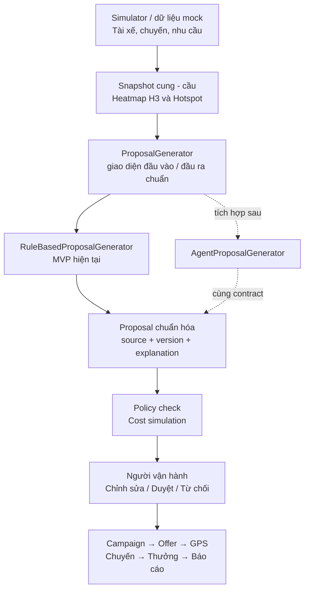
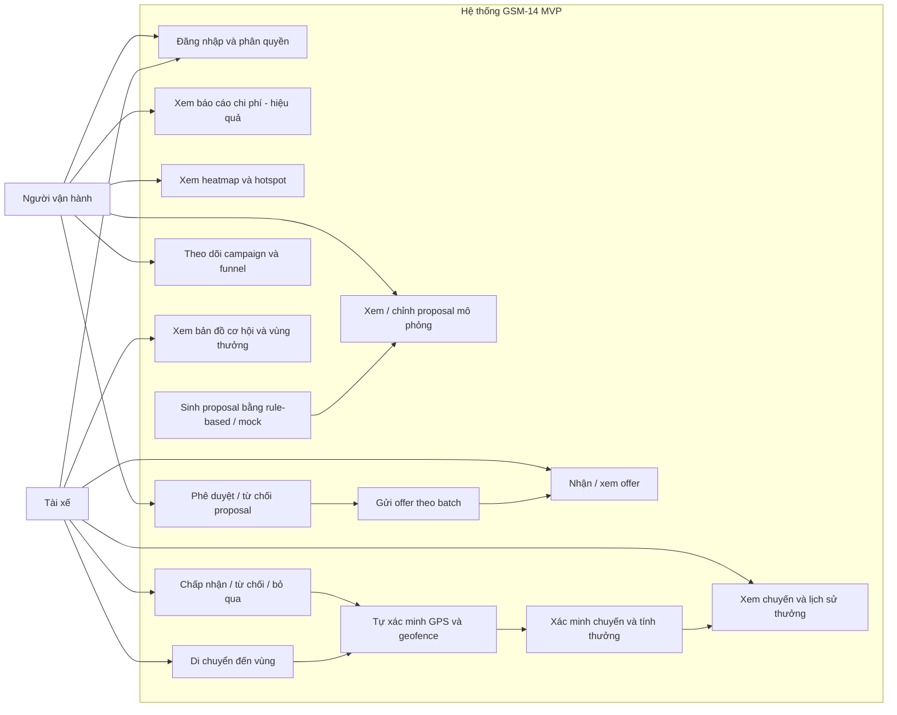

# GSM-14 — Actor, chức năng và workflow MVP

> **Mục đích sử dụng với Codex:** Đọc file này trước khi triển khai use case, màn hình, API nghiệp vụ, state machine hoặc business rule của Người vận hành và Tài xế.
>
> Nội dung nghiệp vụ và quyết định kỹ thuật trong file này được giữ theo tài liệu nguồn. Khi triển khai, Codex không được tự thêm chức năng ngoài phạm vi hoặc tự sửa các quyết định đã chốt.

Hệ thống cân bằng cung - cầu xe theo khu vực

| **Actor chính**        | Người vận hành và Tài xế                                                           |
|------------------------|------------------------------------------------------------------------------------|
| **Cơ chế quyết định**  | Rule-based mô phỏng đề xuất hiện tại; Agent thay thế sau; Người vận hành phê duyệt |
| **Trọng tâm sản phẩm** | Heatmap cung - cầu, huy động tài xế, GPS xác minh và tối ưu chi phí                |
| **Quyền lợi tài xế**   | Tách thưởng điều chuyển và thưởng theo chuyến trong vùng                           |
| **Giá khách hàng**     | Chỉ mô phỏng hệ số giá để so sánh chi phí; chưa tích hợp tính cước thật            |
| **Nguồn đề xuất**      | MOCK / RULE_BASED trong MVP; chuẩn hóa để tích hợp AGENT sau                       |
| **Mức độ hoàn thiện**  | Bản MVP chốt nghiệp vụ trước khi thiết kế database                                 |

Phiên bản chốt cuối - sẵn sàng thiết kế database và tích hợp Agent sau

*Sản phẩm chạy end-to-end bằng dữ liệu mô phỏng / rule-based, không phụ thuộc Agent thật*

# NỘI DUNG CHÍNH

- 1. Tổng quan hệ thống và phạm vi MVP

- 2. Chức năng dùng chung

- 3. Chức năng của Người vận hành

- 4. Chức năng của Tài xế

- 5. Mô phỏng giá khách hàng và tối ưu chi phí

- 6. Luồng phối hợp chính giữa hai actor

- 7. State machine và xử lý ngoại lệ

- 8. Quy tắc nghiệp vụ được chốt

- 9. Danh sách thực thể chuẩn bị thiết kế database

- 10. Đối chiếu thực tế Việt Nam và thế giới

- 11. Kết luận khóa phạm vi MVP

| **Nguyên tắc phạm vi:** MVP tập trung chứng minh ba giá trị: nhìn thấy vùng thiếu xe trên heatmap, huy động đúng tài xế bằng offer, và tự xác minh tài xế đến vùng bằng GPS. Những chức năng không có dữ liệu đầu vào thực tế hoặc chỉ cần cho production đã được loại bỏ. |
|----------------------------------------------------------------------------------------------------------------------------------------------------------------------------------------------------------------------------------------------------------------------------|

# 1. Tổng quan hệ thống và phạm vi MVP

Hệ thống có hai actor chính:

1. Người vận hành / Điều phối viên vận hành.

2. Tài xế.

Agent không phải actor người dùng và không phải điều kiện bắt buộc để MVP hoạt động. Trong phiên bản hiện tại, backend sử dụng dữ liệu mock / simulator và rule-based engine để tạo proposal theo cùng một cấu trúc mà Agent thật sẽ sử dụng sau này.

- Simulator tạo dữ liệu tài xế, chuyến và nhu cầu theo thời gian / khu vực.

- Backend tổng hợp snapshot cung - cầu, heatmap H3 và hotspot.

- RuleBasedProposalGenerator tạo vùng nguồn, vùng đích, target, thưởng và hệ số giá mô phỏng.

- Proposal được chuẩn hóa, chạy policy check và cost simulation trước khi hiển thị.

- Sau này AgentProposalGenerator chỉ thay bộ sinh proposal; campaign, offer, GPS, thưởng và báo cáo giữ nguyên.

| **Human-in-the-loop:** Bộ sinh đề xuất chỉ tạo proposal. Người vận hành luôn là người chỉnh sửa, phê duyệt hoặc từ chối trước khi hệ thống tạo campaign và gửi offer. |
|-----------------------------------------------------------------------------------------------------------------------------------------------------------------------|

## 1.1. Mục tiêu nghiệp vụ

- Giảm thiếu hụt xe tại khu vực có nhu cầu cao.

- Giảm thời gian chờ dự kiến của khách hàng.

- Hạn chế lấy quá nhiều tài xế từ vùng nguồn.

- Huy động tài xế bằng quyền lợi rõ ràng và tự nguyện.

- Kiểm soát tổng chi phí thưởng thông qua ngân sách campaign.

- Mô phỏng một phần tăng giá khách hàng để đánh giá chi phí ròng.

## 1.2. Phạm vi MVP đã chốt

| **Hạng mục**       | **Mức triển khai trong MVP**                              | **Không làm trong MVP**              |
|--------------------|-----------------------------------------------------------|--------------------------------------|
| Dữ liệu cung - cầu | Dữ liệu giả lập hoặc rule-based theo thời gian và khu vực | Kết nối dữ liệu nội bộ Green SM      |
| Heatmap            | H3 đầy đủ, drill-down và cập nhật theo snapshot           | Hệ thống streaming quy mô production |
| Hotspot / Proposal | Tạo tự động bằng rule-based hoặc mock Agent               | Mô hình tối ưu hóa phức tạp          |
| Giá khách hàng     | Mô phỏng hệ số 1.0x-1.2x để so sánh chi phí               | Áp giá thật, báo giá và thanh toán   |
| GPS / Geofence     | H3 để phân tích, PostGIS để xác minh chính xác            | Chống giả mạo GPS nâng cao           |
| Thưởng             | Ghi nhận SIMULATED_PAID                                   | Đối soát và chi trả tiền thật        |
| Báo cáo            | Funnel, KPI trước-sau và chi phí campaign                 | Data warehouse / BI dài hạn          |

## 1.3. Những phần đã loại bỏ

- Pin xe, quãng đường còn lại, lịch sạc, trạm sạc và depot.

- Phân loại tài xế theo hợp đồng hoặc mô hình vận hành.

- Expected supply theo xác suất và trọng số tài xế đang di chuyển.

- Nhiều chế độ reward policy tổng quát không cần cho MVP.

- Ngân sách nhiều tầng, module pháp lý dữ liệu và chống gian lận GPS production.

## 1.4. Cách vận hành MVP khi chưa có Agent thật

| **Thành phần**    | **MVP hiện tại**                      | **Khi có Agent thật**                       |
|-------------------|---------------------------------------|---------------------------------------------|
| Nguồn dữ liệu     | Simulator / dữ liệu mock              | Dữ liệu thật hoặc dữ liệu được đồng bộ      |
| Phát hiện hotspot | Ngưỡng rule-based trên snapshot       | Có thể giữ rule hoặc thay bằng model dự báo |
| Sinh proposal     | RuleBasedProposalGenerator            | AgentProposalGenerator                      |
| Đầu ra            | Proposal schema chuẩn                 | Cùng Proposal schema chuẩn                  |
| Kiểm soát         | Policy check + Người vận hành duyệt   | Giữ nguyên                                  |
| Luồng sau duyệt   | Campaign, offer, GPS, thưởng, báo cáo | Giữ nguyên                                  |

| **Nguyên tắc tích hợp:** Không để frontend gọi trực tiếp model. Frontend chỉ đọc proposal đã chuẩn hóa từ backend. Nhờ đó việc bổ sung Agent sau này không làm thay đổi giao diện, campaign, GPS hoặc logic thưởng. |
|---------------------------------------------------------------------------------------------------------------------------------------------------------------------------------------------------------------------|


## Sơ đồ kiến trúc MVP



*Hình 1 được chuyển thành Mermaid để Codex có thể đọc và cập nhật trực tiếp.*

## 1.5. Hợp đồng đầu vào / đầu ra của bộ sinh proposal

| **Nhóm**         | **Trường tối thiểu**                                                                        |
|------------------|---------------------------------------------------------------------------------------------|
| Đầu vào          | snapshot_id, hotspot_id, candidate_source_zones, campaign_time, budget_limit, policy_config |
| Đầu ra nghiệp vụ | target_zone_id, source_zones, target_driver_count, rewards, fare_multiplier, duration       |
| Đầu ra đánh giá  | estimated_reward_cost, estimated_additional_revenue, estimated_net_cost, explanation        |
| Nguồn sinh       | generator_type: MOCK / RULE_BASED / AGENT / MANUAL; generator_version                       |
| Trạng thái       | GENERATED → UNDER_REVIEW → APPROVED / REJECTED / STALE                                      |

- Policy check và simulation do backend thực hiện độc lập, không tin trực tiếp kết quả từ Agent.

- Proposal phải lưu snapshot đầu vào để có thể giải thích và audit.

- Khi Agent trả dữ liệu không đúng schema, proposal không được tạo hoặc chuyển sang FAILED_GENERATION.

- Campaign chỉ được tạo từ proposal đã APPROVED, không tạo trực tiếp từ output của model.

## 1.6. Use case tổng quát của MVP

Use case chỉ có hai actor người dùng. Các chức năng màu vàng là xử lý tự động nội bộ của hệ thống; rule-based/Agent không được coi là actor.


## Sơ đồ use case tổng quát



*Hình 2 được chuyển thành Mermaid để Codex có thể đọc và cập nhật trực tiếp.*

# 2. Chức năng dùng chung

## 2.1. Đăng nhập và phân quyền

### Mục đích

Xác thực người dùng và chuyển họ đến đúng giao diện theo vai trò.


```text
Người dùng nhập thông tin đăng nhập
→ Hệ thống xác thực tài khoản
→ Xác định vai trò
→ Người vận hành vào Dashboard / Tài xế vào bản đồ cơ hội
```


- Người vận hành có quyền xem số liệu nội bộ, proposal, campaign và báo cáo.

- Tài xế chỉ xem offer, vùng cơ hội, quyền lợi và lịch sử cá nhân.

## 2.2. Thông báo

| **Người nhận** | **Sự kiện thông báo**                                                                                        |
|----------------|--------------------------------------------------------------------------------------------------------------|
| Người vận hành | Có hotspot mới; proposal mới; campaign đạt target; gần hết thời gian hoặc ngân sách; phát sinh lỗi.          |
| Tài xế         | Có offer mới; offer sắp hết hạn; đã được GPS xác minh; suất bị hủy; chuyến được hoặc không được tính thưởng. |

## 2.3. Cấu hình nghiệp vụ tối thiểu

- Thời hạn phản hồi offer và arrival deadline.

- Batch size và thời gian chờ giữa các batch.

- Ngưỡng dữ liệu GPS còn mới, độ chính xác, số điểm liên tiếp và dwell time.

- Ngưỡng thiếu xe để tạo hotspot.

- Giới hạn hệ số giá khách hàng và ngân sách campaign.

| **Giới hạn MVP:** Các giá trị này được lưu trong bảng cấu hình đơn giản hoặc environment; chưa cần xây dựng module quản trị rule riêng. |
|-----------------------------------------------------------------------------------------------------------------------------------------|

## 2.4. Dữ liệu vị trí ở mức MVP

- Ứng dụng chỉ gửi vị trí khi tài xế online hoặc đang tham gia campaign.

- Mỗi bản ghi gồm driver_id, campaign_id, latitude, longitude, accuracy_meters và recorded_at.

- Chỉ lưu các điểm cần cho xác minh và demo; không xây hệ thống theo dõi lịch sử dài hạn.

# 3. Chức năng của Người vận hành

## 3.1. Xem heatmap cung - cầu

### Mục đích

Giúp Người vận hành quan sát tình trạng cung - cầu trên toàn Hà Nội và drill-down đến từng H3 cell.


```text
Simulator tạo snapshot cung - cầu
→ Backend tổng hợp theo H3 cell
→ Dashboard tô màu heatmap
→ Người vận hành chọn quận hoặc cell để xem chi tiết
```


### Thông tin mỗi H3 cell

| **Trường**        | **Ý nghĩa**                                                          |
|-------------------|----------------------------------------------------------------------|
| current_demand    | Số yêu cầu chuyến hiện tại trong khoảng thời gian đang xét.          |
| predicted_demand  | Nhu cầu dự báo 15-30 phút tiếp theo từ rule-based hoặc dữ liệu mock. |
| available_supply  | Số tài xế online, rảnh và có thể nhận chuyến.                        |
| demand_supply_gap | Mức thiếu hoặc dư xe của cell.                                       |
| severity_level    | Xanh, vàng, cam hoặc đỏ.                                             |
| updated_at        | Thời điểm snapshot được cập nhật.                                    |
| active_campaign   | Campaign đang hoạt động tại cell nếu có.                             |

- Xanh: đủ xe.

- Vàng: cần theo dõi.

- Cam: thiếu xe.

- Đỏ: thiếu nghiêm trọng.

## 3.2. Xem cảnh báo hotspot

Hotspot được tạo khi demand_supply_gap vượt ngưỡng cấu hình hoặc nhu cầu dự báo cho thấy vùng sắp thiếu xe.

- Khu vực và danh sách H3 cell bị ảnh hưởng.

- Số tài xế dự kiến thiếu.

- Mức độ nghiêm trọng và thời gian dự kiến.

- Nguyên nhân mô phỏng: giờ cao điểm, mưa hoặc sự kiện.

- Thời điểm dữ liệu cập nhật gần nhất.

## 3.3. Xem proposal từ bộ sinh đề xuất

Proposal là phương án xử lý một hotspot. Trong MVP, proposal được sinh bởi RuleBasedProposalGenerator; khi có Agent thật, nguồn sinh thay đổi nhưng nội dung và luồng duyệt giữ nguyên.

- Vùng đích cần bổ sung xe và các vùng nguồn có thể lấy tài xế.

- Số tài xế mục tiêu và số offer dự kiến gửi.

- Khoảng cách trung bình, ETA và thời gian campaign.

- Thưởng hoàn thành điều chuyển và thưởng thêm trên mỗi chuyến hợp lệ.

- Hệ số giá khách hàng ở mức mô phỏng.

- Chi phí thưởng, doanh thu tăng thêm và chi phí ròng dự kiến.

- Giải thích vì sao phương án được đề xuất.

- Nguồn sinh proposal và phiên bản: MOCK, RULE_BASED, AGENT hoặc MANUAL.

## 3.4. Policy check và simulation

### Policy check

- Vùng nguồn vẫn còn đủ xe sau khi lấy tài xế.

- Khoảng cách và ETA không vượt giới hạn.

- Campaign không chồng lấn với campaign khác trên cùng nhóm tài xế/vùng.

- Hệ số giá mô phỏng và tổng thưởng không vượt ngưỡng.

- Dữ liệu snapshot còn mới.

### Simulation

- Mức thiếu xe trước và sau điều chuyển.

- Tỷ lệ đáp ứng chuyến và thời gian chờ dự kiến.

- Số chuyến hoàn thành dự kiến.

- Chi phí thưởng, doanh thu tăng thêm và chi phí ròng.

| **Giới hạn kết quả:** Simulation là phép so sánh kịch bản từ dữ liệu giả lập, không phải cam kết kết quả thật. |
|----------------------------------------------------------------------------------------------------------------|

## 3.5. Chỉnh sửa, phê duyệt hoặc từ chối proposal

- Người vận hành có thể sửa vùng nguồn, số tài xế, thời gian, hệ số giá, mức thưởng và ngân sách.

- Sau khi sửa, hệ thống chạy lại policy check và simulation.

- Phê duyệt tạo campaign; từ chối phải chọn lý do.

- Không gửi offer nếu proposal chưa được phê duyệt.


```text
Proposal GENERATED
→ Người vận hành REVIEW
→ EDIT nếu cần
→ APPROVED hoặc REJECTED
→ APPROVED mới tạo Campaign
```


## 3.6. Theo dõi campaign và funnel tài xế

Người vận hành theo dõi funnel theo thời gian thực hoặc polling:


```text
Đủ điều kiện
→ Đã gửi offer
→ Đã xem
→ Đã chấp nhận
→ Đang di chuyển
→ Đã GPS xác minh
→ Đã sẵn sàng nhận chuyến
```


- Số offer đã gửi, đã xem, đã chấp nhận, từ chối và hết hạn.

- Số tài xế đang di chuyển, đã đến, bị hủy hoặc không đến.

- Số slot còn thiếu và số offer cần gửi bổ sung.

- Số chuyến hợp lệ, tổng thưởng và ngân sách còn lại.

| **Quy tắc tuyển đủ:** Khi số slot đang được giữ đạt target, hệ thống tạm dừng gửi offer. Nếu tài xế hủy hoặc quá arrival deadline, slot được giải phóng và hệ thống gửi bổ sung. |
|----------------------------------------------------------------------------------------------------------------------------------------------------------------------------------|

## 3.7. Báo cáo campaign

- Cung - cầu trước và sau campaign.

- Target và số tài xế thực tế được GPS xác minh.

- Tỷ lệ xem, chấp nhận, đến vùng và no-show.

- Số chuyến hợp lệ và tổng thưởng mô phỏng.

- Doanh thu tăng thêm ước tính và chi phí ròng.

- Lịch sử phê duyệt, từ chối và thay đổi trạng thái chính.

# 4. Chức năng của Tài xế

## 4.1. Xem bản đồ cơ hội và vùng thưởng

- Hiển thị các vùng nhu cầu cao gần vị trí tài xế.

- Hiển thị ranh giới vùng thưởng, khoảng cách, ETA, thời gian và mức thưởng.

- Không hiển thị chính xác số khách hoặc số tài xế nội bộ để tránh đổ dồn nguồn cung.

- Bản đồ ưu tiên thao tác ít, map-first và có nút dẫn đường.

## 4.2. Nhận offer cá nhân hóa

Backend lựa chọn tài xế theo các điều kiện MVP:

- Đang online.

- Đang rảnh hoặc không có chuyến hoạt động.

- Nằm trong bán kính gửi offer.

- Không tham gia campaign xung đột.

- Campaign vẫn còn slot và còn thời gian.

### Offer hiển thị

- Khu vực đích và ranh giới vùng.

- Khoảng cách, ETA và deadline phải đến.

- Thưởng hoàn thành điều chuyển.

- Thưởng thêm trên mỗi chuyến hợp lệ.

- Thời gian campaign và điều kiện nhận thưởng.

## 4.3. Chấp nhận, từ chối hoặc bỏ qua

| **Hành động** | **Kết quả**                                                                                                     |
|---------------|-----------------------------------------------------------------------------------------------------------------|
| Chấp nhận     | Hệ thống tạo participation, giữ một slot đến arrival_deadline và đánh dấu tài xế đủ điều kiện nhận thưởng vùng. |
| Từ chối       | Offer chuyển DECLINED; hệ thống có thể gửi cho tài xế khác.                                                     |
| Bỏ qua        | Khi hết thời hạn, offer chuyển EXPIRED; không giữ slot.                                                         |

| **Nguyên tắc công bằng:** Offer mang tính tự nguyện trong MVP. Tài xế không bị phạt vì từ chối hoặc bỏ qua. |
|-------------------------------------------------------------------------------------------------------------|

## 4.4. Di chuyển và GPS tự xác minh đã đến


```text
ACCEPTED
→ EN_ROUTE
→ Ứng dụng gửi vị trí định kỳ
→ Backend lọc theo H3
→ PostGIS kiểm tra geofence chính xác
→ Đủ freshness + accuracy + dwell time
→ ARRIVED_VERIFIED
→ Online và rảnh
→ ACTIVATED
```


### Điều kiện GPS đề xuất cho MVP

- Vị trí không cũ quá 30 giây.

- Độ chính xác không vượt quá 50 mét.

- Có 2-3 điểm hợp lệ liên tiếp nằm trong geofence.

- Tài xế ở trong vùng tối thiểu 30-60 giây.

- Chưa quá arrival deadline và participation chưa bị hủy.

| **Kiến trúc không gian:** H3 phục vụ heatmap và lọc nhanh. PostGIS polygon/multipolygon là kiểm tra cuối cùng cho việc tài xế đến vùng và điểm đón chuyến. |
|------------------------------------------------------------------------------------------------------------------------------------------------------------|

## 4.5. Xử lý mất GPS, tắt ứng dụng hoặc không đến đúng hạn

| **Tình huống**            | **Xử lý suất điều chuyển**            | **Quyền lợi còn lại**                                         |
|---------------------------|---------------------------------------|---------------------------------------------------------------|
| Mất GPS tạm thời          | Chờ trong grace period; chưa hủy ngay | Chưa kết luận thưởng điều chuyển                              |
| Mất GPS quá lâu / tắt app | LOCATION_LOST, giải phóng slot        | Vẫn có thể nhận thưởng vùng nếu có chuyến hợp lệ              |
| Quá arrival deadline      | NO_SHOW, giải phóng slot              | Không nhận thưởng điều chuyển; vẫn giữ quyền nhận thưởng vùng |
| Chủ động hủy              | CANCELLED, giải phóng slot            | Không nhận thưởng điều chuyển; thưởng vùng xét độc lập        |

## 4.6. Nhận chuyến và thưởng trong vùng

Một chuyến được tính thưởng vùng khi:

1. Tài xế đã từng chấp nhận offer của campaign, nên đã được đánh dấu campaign_eligible.

2. Điểm đón nằm trong polygon/geofence của campaign.

3. Thời điểm nhận chuyến nằm trong thời gian campaign và trước reward_cutoff_at nếu có.

4. Chuyến hoàn thành thành công và không bị hủy.

| **Quyết định đã chốt:** Việc suất điều chuyển bị hủy không xóa campaign_eligible. Vì vậy tài xế vẫn nhận thưởng theo chuyến hợp lệ; chỉ khoản thưởng hoàn thành điều chuyển không phát sinh. |
|----------------------------------------------------------------------------------------------------------------------------------------------------------------------------------------------|

## 4.7. Xem lịch sử quyền lợi

- Mã chuyến, điểm đón, thời gian và trạng thái xác minh.

- Cước chuyến cơ bản.

- Thưởng hoàn thành điều chuyển nếu có.

- Thưởng vùng theo từng chuyến.

- Lý do NOT_QUALIFIED nếu chuyến không đủ điều kiện.

# 5. Mô phỏng giá khách hàng và tối ưu chi phí

Sản phẩm vẫn giữ một phần tăng giá khách hàng để thể hiện bài toán tối ưu chi phí. Tuy nhiên, đây chỉ là mô phỏng trong proposal và không thay đổi giá thật trên ứng dụng khách hàng.

## 5.1. Các biến mô phỏng

| **Biến**                 | **Ý nghĩa**                                                       |
|--------------------------|-------------------------------------------------------------------|
| fare_multiplier          | Hệ số giá khách hàng mô phỏng, ví dụ 1.0x, 1.1x hoặc 1.2x.        |
| relocation_bonus         | Thưởng một lần khi tài xế đến vùng đúng hạn và được GPS xác minh. |
| zone_trip_bonus          | Thưởng thêm cho mỗi chuyến hợp lệ có điểm đón trong vùng.         |
| expected_completed_trips | Số chuyến hoàn thành dự kiến trong thời gian campaign.            |
| average_base_fare        | Cước trung bình giả lập của một chuyến.                           |
| budget_limit             | Ngân sách tối đa của campaign.                                    |
| budget_used              | Tổng thưởng đã được ghi nhận trong MVP.                           |

## 5.2. Công thức mô phỏng đơn giản


```text
Chi phí thưởng dự kiến
= target_driver_count × relocation_bonus
+ expected_completed_trips × zone_trip_bonus
Doanh thu tăng thêm dự kiến
= expected_completed_trips × average_base_fare × (fare_multiplier - 1)
Chi phí ròng dự kiến
= Chi phí thưởng dự kiến - Doanh thu tăng thêm dự kiến
```


| **Giới hạn mô phỏng:** Công thức cố ý đơn giản để phục vụ demo. Nó không mô hình hóa đầy đủ độ co giãn nhu cầu, tỷ lệ hủy hoặc hành vi khách hàng. |
|----------------------------------------------------------------------------------------------------------------------------------------------------|

## 5.3. Ba phương án để Người vận hành so sánh

| **Phương án**       | **Hệ số giá** | **Thưởng tài xế** | **Mục tiêu**                                         |
|---------------------|---------------|-------------------|------------------------------------------------------|
| Ưu tiên khách hàng  | 1.0x          | Cao               | Không tăng giá; dùng thưởng để huy động nhanh.       |
| Cân bằng            | 1.1x          | Trung bình        | Cân bằng trải nghiệm khách, tài xế và chi phí.       |
| Tiết kiệm ngân sách | 1.2x          | Thấp hơn          | Bù một phần chi phí thưởng bằng doanh thu tăng thêm. |

Người vận hành có thể chọn một phương án hoặc chỉnh sửa các biến trước khi phê duyệt.

## 5.4. Kiểm soát ngân sách đơn giản

- MVP chỉ sử dụng budget_limit và budget_used.

- Khi ngân sách còn lại nhỏ hơn mức thưởng tối đa của một chuyến mới, campaign đặt reward_cutoff_at.

- Ngừng gửi offer mới và không áp dụng thưởng cho chuyến nhận sau cutoff.

- Chuyến đã nhận trước cutoff và sau đó hoàn thành vẫn được ghi nhận thưởng.

# 6. Luồng phối hợp chính giữa hai actor


```text
Simulator tạo snapshot cung - cầu theo H3
↓
Hệ thống phát hiện hotspot
↓
Agent mock/rule-based tạo proposal
↓
Người vận hành xem policy check và simulation
↓
Người vận hành chỉnh sửa / phê duyệt / từ chối
↓
Proposal được duyệt tạo campaign
↓
Hệ thống chọn tài xế và gửi offer theo batch
↓
Tài xế chấp nhận / từ chối / bỏ qua
↓
Chấp nhận tạo participation và giữ slot
↓
Tài xế di chuyển; ứng dụng gửi GPS
↓
H3 lọc nhanh + PostGIS xác minh geofence
↓
ARRIVED_VERIFIED → ACTIVATED
↓
Đủ slot thì dừng gửi; thiếu lại thì gửi bổ sung
↓
Tài xế nhận chuyến có điểm đón trong vùng
↓
Hệ thống xác minh chuyến và ghi nhận thưởng
↓
Người vận hành xem KPI và chi phí campaign
```


| **Phân biệt quan trọng:** Đạt target chỉ dừng tuyển thêm tài xế; campaign vẫn tiếp tục để ghi nhận chuyến và thưởng đến khi hết thời gian, hết ngân sách hoặc bị kết thúc sớm. |
|--------------------------------------------------------------------------------------------------------------------------------------------------------------------------------|

# 7. State machine và xử lý ngoại lệ

## 7.1. Proposal

| GENERATED → UNDER_REVIEW → APPROVED / REJECTED / STALE |
|--------------------------------------------------------|

- STALE khi snapshot dùng để tạo proposal đã quá cũ.

- APPROVED mới được tạo campaign.

## 7.2. Campaign

| DRAFT → ACTIVE → TARGET_REACHED → COMPLETED |
|---------------------------------------------|

Nhánh ngoại lệ: CANCELLED hoặc BUDGET_EXHAUSTED.

- TARGET_REACHED không phải trạng thái kết thúc; campaign vẫn nhận chuyến hợp lệ.

- Nếu tài xế no-show làm thiếu slot, campaign có thể quay lại ACTIVE để tuyển bổ sung.

## 7.3. Offer

| CREATED → SENT → VIEWED → ACCEPTED / DECLINED / EXPIRED |
|---------------------------------------------------------|

Offer kết thúc sau khi tài xế phản hồi hoặc hết hạn; việc di chuyển được quản lý bởi participation.

## 7.4. Campaign participation

| ACCEPTED → EN_ROUTE → ARRIVED_VERIFIED → ACTIVATED |
|----------------------------------------------------|

Nhánh ngoại lệ: CANCELLED, LOCATION_LOST hoặc NO_SHOW.

- slot_expires_at được tạo khi ACCEPTED.

- Khi participation thất bại, slot được giải phóng.

- campaign_eligible vẫn được giữ đến khi campaign kết thúc để xét thưởng vùng.

## 7.5. Reward

| PENDING_VERIFICATION → QUALIFIED → SIMULATED_PAID |
|---------------------------------------------------|

Nhánh không hợp lệ: NOT_QUALIFIED kèm reason_code.

| **Reward type**       | **Điều kiện chính**                                                             |
|-----------------------|---------------------------------------------------------------------------------|
| RELOCATION_COMPLETION | ARRIVED_VERIFIED đúng hạn; chỉ ghi nhận một lần cho mỗi participation.          |
| ZONE_TRIP             | Tài xế campaign_eligible; pickup trong vùng; đúng thời gian; chuyến hoàn thành. |

## 7.6. Các tình huống biên cần xử lý

| **Tình huống**                                  | **Xử lý MVP**                                                                   |
|-------------------------------------------------|---------------------------------------------------------------------------------|
| Hai tài xế cùng nhận slot cuối                  | Dùng transaction/row lock hoặc unique constraint; chỉ một người nhận được slot. |
| Tài xế nhận offer nhưng không bắt đầu di chuyển | Hết arrival deadline → NO_SHOW, giải phóng slot.                                |
| GPS cũ hoặc độ chính xác kém                    | Không ARRIVED_VERIFIED; chờ điểm mới trong grace period.                        |
| Tài xế vào vùng rồi ra ngay                     | Chưa đủ dwell time nên không được xác minh.                                     |
| Tài xế đang di chuyển nhưng campaign đủ target  | Không hủy participation đã chấp nhận; chỉ dừng gửi offer mới.                   |
| Campaign hết ngân sách                          | Đặt reward_cutoff_at, dừng offer mới; bảo toàn chuyến đã nhận trước cutoff.     |
| Vùng thiếu xe trở lại sau khi campaign kết thúc | Tạo hotspot và proposal mới; không mở lại campaign cũ.                          |

| **Yêu cầu minh bạch:** MVP không cần xây hệ thống chống gian lận GPS nâng cao. Tuy nhiên mọi quyết định không đủ điều kiện phải có reason_code để tài xế và Người vận hành hiểu được. |
|---------------------------------------------------------------------------------------------------------------------------------------------------------------------------------------|

# 8. Quy tắc nghiệp vụ được chốt

1. Toàn Hà Nội được chia thành H3 cell để tổng hợp và hiển thị cung - cầu.

2. PostGIS polygon/multipolygon được dùng để xác minh chính xác tài xế đến vùng và điểm đón chuyến.

3. Người vận hành xem số liệu chi tiết; tài xế chỉ thấy mức cơ hội và quyền lợi cần thiết.

4. Bộ sinh proposal (rule-based hiện tại, Agent sau này) chỉ đề xuất; Người vận hành quyết định cuối cùng.

5. Proposal phải được phê duyệt trước khi tạo campaign.

6. Mọi nguồn sinh proposal phải trả cùng schema; policy check và simulation luôn chạy ở backend.

7. Giá khách hàng chỉ là biến mô phỏng trong MVP, không áp dụng giá thật.

8. Offer được gửi theo batch, không broadcast vô hạn.

9. Tài xế có quyền chấp nhận, từ chối hoặc bỏ qua offer.

10. Chấp nhận offer giữ một slot có thời hạn và tạo campaign_eligible.

11. Khi số slot đang giữ đạt target, hệ thống tạm dừng gửi offer.

12. Nếu tài xế hủy hoặc không đến đúng hạn, slot được giải phóng và hệ thống gửi bổ sung.

13. Tài xế không có nút tự xác nhận đã đến.

14. Hệ thống xác minh bằng GPS freshness, accuracy, nhiều điểm liên tiếp, dwell time và PostGIS geofence.

15. Chỉ ARRIVED_VERIFIED và đang sẵn sàng mới chuyển thành ACTIVATED.

16. Đạt target không kết thúc campaign.

17. Thưởng hoàn thành điều chuyển và thưởng vùng theo chuyến là hai khoản độc lập.

18. Mất GPS, tắt app hoặc no-show làm mất thưởng hoàn thành điều chuyển nhưng không xóa quyền nhận thưởng vùng.

19. Chuyến thưởng vùng phải có pickup trong vùng, đúng thời gian và hoàn thành thành công.

20. Điểm trả khách có thể nằm ngoài vùng.

21. Cước cơ bản của chuyến không bị ảnh hưởng bởi trạng thái slot.

22. MVP không giới hạn số chuyến thưởng trên từng tài xế; tổng chi phí vẫn bị giới hạn bởi budget_limit.

23. Khi gần hết ngân sách, hệ thống thiết lập reward_cutoff_at và dừng offer mới.

24. Mọi thay đổi trạng thái chính, phê duyệt và quyết định thưởng phải có audit log.

25. Các event chuyến và thưởng phải có idempotency key để tránh tính trùng.

# 9. Danh sách thực thể chuẩn bị thiết kế database

Danh sách sau là tập thực thể đủ cho MVP, chưa phải schema chi tiết cuối cùng:

| **Nhóm**   | **Thực thể đề xuất**                      | **Vai trò**                                           |
|------------|-------------------------------------------|-------------------------------------------------------|
| Tài khoản  | users, drivers                            | Đăng nhập, vai trò và hồ sơ tài xế.                   |
| Không gian | districts, h3_cells, campaign_zones       | Quận, cell heatmap và geofence campaign.              |
| Cung - cầu | supply_demand_snapshots, hotspots         | Lưu snapshot và vùng thiếu xe.                        |
| Quyết định | proposals, proposal_source_zones          | Lưu phương án, nguồn sinh, phiên bản và vùng nguồn.   |
| Campaign   | campaigns                                 | Thời gian, target, giá mô phỏng, thưởng và ngân sách. |
| Huy động   | driver_offers, campaign_participations    | Offer, slot, deadline và trạng thái đến vùng.         |
| Vị trí     | driver_locations, arrival_verifications   | Điểm GPS và kết quả xác minh.                         |
| Chuyến     | trips                                     | Thông tin pickup, thời gian và trạng thái chuyến.     |
| Quyền lợi  | reward_records                            | Hai loại thưởng và trạng thái xác minh.               |
| Hỗ trợ     | notifications, audit_logs, system_configs | Thông báo, lịch sử và cấu hình MVP.                   |

## 9.1. Các ràng buộc database phải chuẩn bị

- Unique constraint cho một tài xế trong một campaign participation.

- Transaction/locking khi nhận slot cuối cùng.

- Unique idempotency key cho trip event và reward record.

- Enum/check constraint cho state machine.

- Index theo campaign_id, driver_id, status, expires_at và recorded_at.

- GiST index cho campaign_zones geometry; index H3 cho snapshot và tra cứu cell.

## 9.2. Bốn điểm schema không được làm sai

1. Campaign đạt target khác campaign kết thúc.

2. Offer và participation là hai vòng đời khác nhau.

3. Slot bị hủy không được xóa campaign_eligible.

4. Hai loại thưởng phải lưu thành hai reward_type riêng.

## 9.3. Trường bắt buộc để thay rule-based bằng Agent sau này

| **Trường**          | **Mục đích**                                                                            |
|---------------------|-----------------------------------------------------------------------------------------|
| generator_type      | Xác định proposal được tạo bởi MOCK, RULE_BASED, AGENT hoặc MANUAL.                     |
| generator_version   | Theo dõi phiên bản rule/model dùng để sinh proposal.                                    |
| input_snapshot_id   | Liên kết proposal với snapshot cung - cầu được sử dụng.                                 |
| generation_metadata | Lưu tham số kỹ thuật tối thiểu dưới dạng JSONB; không dùng làm dữ liệu nghiệp vụ chính. |
| explanation         | Giải thích ngắn gọn cho Người vận hành.                                                 |
| policy_check_result | Kết quả kiểm tra backend độc lập với nguồn sinh proposal.                               |

| **Chốt cho ERD:** Không cần tạo bảng Agent riêng trong MVP. Các trường trên trong proposals là đủ để chuyển nguồn sinh từ RULE_BASED sang AGENT mà không thay đổi schema cốt lõi. |
|-----------------------------------------------------------------------------------------------------------------------------------------------------------------------------------|

# 10. Đối chiếu thực tế Việt Nam và thế giới

Kết quả research cho thấy thiết kế MVP bám đúng các pattern công khai của ngành gọi xe. Tuy nhiên, tài liệu này không khẳng định đây là quy trình nội bộ chính xác của Green SM.

| **Nguồn thực tế**                             | **Pattern công khai**                                                                                   | **Phần tương ứng trong MVP**                                            |
|-----------------------------------------------|---------------------------------------------------------------------------------------------------------|-------------------------------------------------------------------------|
| Green SM - Nhiệm vụ tiếp theo (15/04/2026)    | Gợi ý khu vực nhu cầu cao gần tài xế, kết hợp heatmap, có dẫn đường và không bắt buộc.                  | Heatmap tài xế, offer/gợi ý cá nhân hóa, khoảng cách, ETA và dẫn đường. |
| Green SM - Thưởng cuốc Điểm Vàng (04/05/2026) | Thưởng theo chuyến có pickup tại khu vực và khung giờ áp dụng; đăng ký giúp hệ thống đảm bảo đủ tài xế. | Campaign theo vùng/thời gian, pickup geofence và thưởng từng chuyến.    |
| Grab Engineering                              | Cân bằng cung - cầu là mục tiêu cốt lõi; dynamic pricing là một công cụ khi cung - cầu thay đổi.        | Snapshot, hotspot, điều chuyển và mô phỏng hệ số giá.                   |
| Uber                                          | Heatmap/surge theo khu vực; giá có thể tăng khi cầu vượt cung.                                          | Heatmap màu và ba phương án fare multiplier mô phỏng.                   |
| Uber Boost+                                   | Thưởng cho chuyến hoàn thành bắt đầu trong vùng và khung giờ cụ thể.                                    | ZONE_TRIP dựa trên pickup trong geofence, đúng thời gian và hoàn thành. |
| H3                                            | Phân vùng thế giới thành cell lục giác để lập chỉ mục và phân tích không gian.                          | H3 cho heatmap, snapshot và lọc candidate.                              |
| PostGIS ST_Covers                             | Kiểm tra một điểm nằm trong hoặc trên biên polygon.                                                     | Xác minh arrival và pickup chính xác tại ranh giới.                     |

## 10.1. Nhận xét sau đối chiếu

- Heatmap, gợi ý đi đến vùng nhu cầu cao và thưởng theo pickup là hoàn toàn sát thực tế.

- Việc bộ sinh proposal đề xuất và Người vận hành duyệt là thiết kế an toàn; MVP dùng rule-based và có thể thay bằng Agent sau này.

- GPS nhiều điểm liên tiếp và dwell time là quyết định kỹ thuật hợp lý của nhóm, không phải chính sách công khai của các nền tảng.

- Tách H3 cho analytics và PostGIS cho geofence giúp sản phẩm vừa có hình ảnh đẹp, vừa xác minh chính xác.

- Giá khách hàng nên giữ ở mức simulation để thể hiện tối ưu chi phí mà không mở rộng sang hệ thống thanh toán.

## 10.2. Nguồn tham khảo chính thức

- Green SM - Nhiệm vụ tiếp theo: https://www.greensm.com/vn-vi/news/cap-nhat-tinh-nang-nhiem-vu-tiep-theo-toi-uu-nhan-cuoc

- Green SM - Thưởng cuốc Điểm Vàng: https://www.greensm.com/vn-vi/news/chuong-trinh-thuong-cuoc-diem-vang-tai-ha-noi-tphcm

- Grab Engineering - Supply & Demand: https://engineering.grab.com/understanding-supply-demand-ride-hailing-data

- Uber - Surge pricing: https://www.uber.com/us/en/drive/driver-app/how-surge-works/

- Uber - Driver Promotions / Boost+: https://www.uber.com/us/en/drive/promotions/

- H3 Documentation: https://h3geo.org/docs/

- PostGIS ST_Covers: https://postgis.net/docs/ST_Covers.html

# 11. Kết luận khóa phạm vi MVP

Sau khi loại bỏ các thành phần production không cần thiết và đối chiếu với các hệ thống thực tế, MVP được chốt với ba trụ cột:

1. Heatmap H3 đủ sâu để quan sát, phát hiện hotspot và thể hiện rõ bài toán cung - cầu.

2. GPS + PostGIS đủ chặt để tự xác minh tài xế đến vùng và xác minh pickup của chuyến thưởng.

3. Proposal mô phỏng đồng thời điều chuyển, thưởng tài xế và một phần tăng giá khách hàng; có thể được sinh bởi rule-based hiện tại hoặc Agent sau này.

## 11.1. Checklist cuối trước khi thiết kế DB

- \[x\] Hai actor: Người vận hành và Tài xế.

- \[x\] MVP chạy hoàn chỉnh không cần Agent thật; RuleBasedProposalGenerator tạo proposal hiện tại.

- \[x\] Agent sau này chỉ thay bộ sinh proposal, không thay luồng campaign, GPS, thưởng và báo cáo.

- \[x\] Dữ liệu MVP là simulator / mock / rule-based.

- \[x\] H3 dùng cho heatmap; PostGIS dùng cho xác minh chính xác.

- \[x\] Offer theo batch và slot có arrival deadline.

- \[x\] Không dùng expected supply theo xác suất.

- \[x\] Hai reward_type độc lập.

- \[x\] Hủy slot không xóa quyền nhận thưởng vùng.

- \[x\] Giá khách hàng chỉ mô phỏng; không tích hợp thanh toán.

- \[x\] Ngân sách chỉ gồm budget_limit, budget_used và reward_cutoff_at.

- \[x\] Báo cáo có KPI vận hành và chi phí campaign.

- \[x\] Danh sách thực thể đủ để bắt đầu ERD.

| **Phạm vi đã khóa:** Bản tài liệu này là baseline nghiệp vụ cuối cùng. Khi thiết kế database, ưu tiên schema phục vụ MVP và khả năng thay RULE_BASED bằng AGENT; không bổ sung lại pin xe, mô hình tài xế, expected supply hoặc module production khác nếu chưa có yêu cầu mới. |
|---------------------------------------------------------------------------------------------------------------------------------------------------------------------------------------------------------------------------------------------------------------------------------|

## 11.2. Luồng MVP cuối cùng


```text
Simulator → Heatmap H3 → Hotspot
→ ProposalGenerator: RULE_BASED hiện tại / AGENT sau này
→ Proposal chuẩn → Policy check + Cost simulation → Người vận hành duyệt
→ Campaign → Offer theo batch → Tài xế chấp nhận
→ Giữ slot → GPS/PostGIS xác minh → ACTIVATED
→ Chuyến pickup trong vùng → Tính thưởng mô phỏng
→ Theo dõi ngân sách → Báo cáo trước/sau campaign
```


**— HẾT —**
