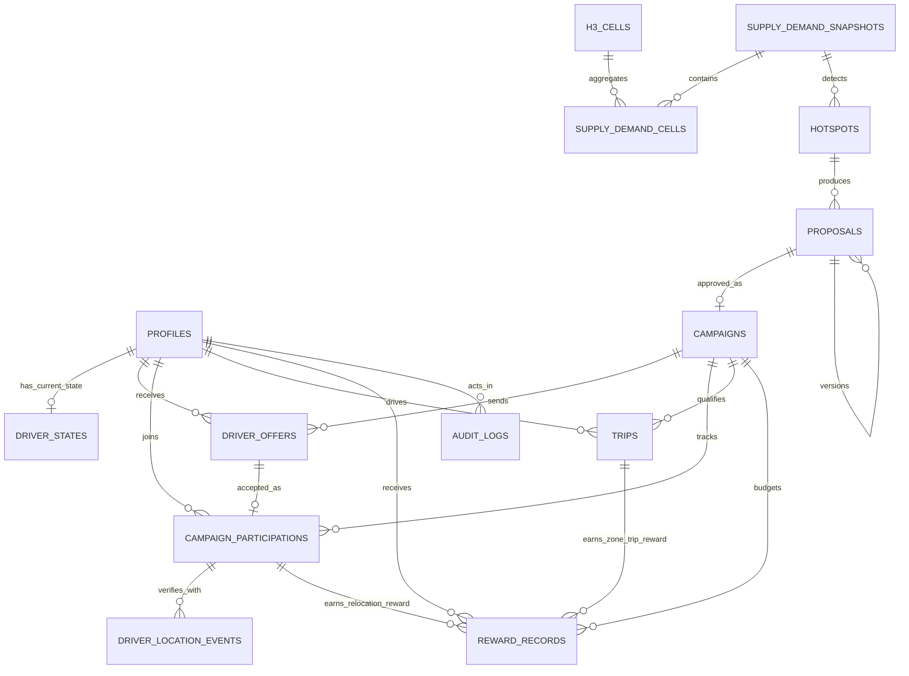

# GSM-14 — Thiết kế cơ sở dữ liệu MVP

> **Mục đích sử dụng với Codex:** Đọc file này trước khi tạo schema, entity, migration, index, RLS, transaction hoặc repository liên quan tới Supabase PostgreSQL, H3 và PostGIS.
>
> Nội dung nghiệp vụ và quyết định kỹ thuật trong file này được giữ theo tài liệu nguồn. Khi triển khai, Codex không được tự thêm chức năng ngoài phạm vi hoặc tự sửa các quyết định đã chốt.

Hệ thống cân bằng cung - cầu xe theo khu vực


| **Nền tảng dữ liệu** | Supabase PostgreSQL                     |
|----------------------|-----------------------------------------|
| **Phạm vi**          | MVP mô phỏng Agent bằng rule-based      |
| **Số bảng**          | 14 bảng cốt lõi                         |
| **Không gian**       | H3 + PostGIS                            |
| **Mục tiêu**         | Hiệu năng tốt, schema gọn và dễ mở rộng |

*Bản chốt trước khi triển khai ERD vật lý và SQL migration*

Ngày 04/08/2026

# Thông tin tài liệu

| **Hạng mục**          | **Nội dung**                                                                                              |
|-----------------------|-----------------------------------------------------------------------------------------------------------|
| **Tên tài liệu**      | Thiết kế cơ sở dữ liệu MVP GSM-14                                                                         |
| **Phạm vi**           | Database logical design, index, constraint, transaction, retention, RLS và khả năng mở rộng               |
| **Đối tượng sử dụng** | Nhóm Frontend, Backend, Product và người thiết kế ERD/SQL migration                                       |
| **Nguồn nghiệp vụ**   | Luồng MVP đã chốt: heatmap, hotspot, proposal rule-based, campaign, offer, GPS, chuyến mô phỏng và thưởng |
| **Trạng thái**        | Baseline để triển khai database trên Supabase PostgreSQL + PostGIS                                        |

# Mục lục nội dung

- 1\. Kết luận thiết kế

- 2\. Nguyên tắc kiến trúc dữ liệu

- 3\. Sơ đồ quan hệ tổng quát

- 4\. Danh mục 14 bảng

- 5\. Thiết kế chi tiết từng bảng

- 6\. Enum và state machine

- 7\. Quan hệ và cardinality

- 8\. Index tối ưu

- 9\. Constraint và tính toàn vẹn dữ liệu

- 10\. Transaction bắt buộc

- 11\. Chính sách lưu trữ và retention

- 12\. Phân quyền và RLS

- 13\. Hiệu năng và khả năng mở rộng

- 14\. Thứ tự triển khai migration

- 15\. Checklist trước khi code

# 1. Kết luận thiết kế

*Schema cuối cùng cân bằng giữa tính đúng nghiệp vụ, hiệu năng và độ gọn cho MVP.*


> **Quyết định cuối cùng**
> Sử dụng 14 bảng cốt lõi trên Supabase PostgreSQL. H3 phục vụ heatmap và lọc nhanh; PostGIS là nguồn xác minh không gian cuối cùng. Agent chưa cần tồn tại: proposals lưu generator_type để thay RuleBasedProposalGenerator bằng AgentProposalGenerator sau này.


Thiết kế này phù hợp với demo, MVP và pilot nhỏ. Các bảng ghi thường xuyên được tách khỏi dữ liệu ổn định; dữ liệu GPS và heatmap có retention; index chủ yếu là composite, partial và spatial index có mục tiêu.

| **Tiêu chí**            | **Đánh giá** | **Giải thích**                                                                                                                     |
|-------------------------|--------------|------------------------------------------------------------------------------------------------------------------------------------|
| Độ gọn                  | Tốt          | 14 bảng, không tạo các module production chưa cần như notifications, system_configs, slot_reservations hoặc proposal_source_zones. |
| Tính đúng nghiệp vụ     | Tốt          | Tách Proposal/Campaign, Offer/Participation, GPS hiện tại/lịch sử và hai loại thưởng độc lập.                                      |
| Hiệu năng MVP           | Rất tốt      | Driver state chỉ một row/tài xế; không lưu từng frame; heatmap persist theo chu kỳ.                                                |
| Khả năng mở rộng        | Tốt          | Có đường nâng cấp location streaming, partition và queue khi thực sự cần.                                                          |
| Khả năng tích hợp Agent | Sẵn sàng     | Không đổi schema nghiệp vụ; chỉ đổi generator_type và implementation backend.                                                      |

# 2. Nguyên tắc kiến trúc dữ liệu

- Dùng auth.users của Supabase cho tài khoản; profiles chỉ mở rộng thông tin nghiệp vụ.

- Tách driver_states khỏi profiles vì vị trí và trạng thái được cập nhật thường xuyên.

- Dùng H3 cell làm đơn vị heatmap; PostGIS geometry dùng cho point-in-polygon và geofence chính xác.

- Proposal là phương án có thể chỉnh sửa; Campaign là bản triển khai đã được phê duyệt và được khóa.

- Offer chỉ quản lý lời mời; Participation quản lý slot, hành trình và xác minh đến vùng.

- GPS hiện tại được update trong driver_states; lịch sử tối thiểu nằm trong driver_location_events.

- Reward là ledger riêng để bảo đảm idempotency và kiểm soát ngân sách.

- JSONB chỉ dùng cho metadata, policy details, simulation details và audit before/after.

- Không partition, Redis, TimescaleDB hoặc microservice hóa sớm.

## 2.1. Các bảng cố ý không tạo trong MVP

| **Bảng không tạo**    | **Cách xử lý thay thế**                               | **Lý do**                                             |
|-----------------------|-------------------------------------------------------|-------------------------------------------------------|
| users                 | Dùng auth.users + profiles                            | Không nhân đôi hệ thống tài khoản.                    |
| notifications         | WebSocket + trạng thái nghiệp vụ                      | MVP chưa cần hộp thư thông báo lưu vĩnh viễn.         |
| system_configs        | Environment/backend config                            | Ngưỡng GPS và thời hạn chưa cần chỉnh trên UI.        |
| slot_reservations     | Trường slot_expires_at trong campaign_participations  | Giảm một vòng đời và một bảng trung gian.             |
| proposal_source_zones | source_plan JSONB có validate                         | Nguồn được đọc theo proposal, chưa cần query độc lập. |
| arrival_verifications | Trường xác minh trong participation + location events | Không tách một thực thể chỉ có một kết quả.           |
| campaign_zones        | target_h3_indexes + geofence trong campaigns          | Campaign chỉ có một vùng đích được khóa.              |

# 3. Sơ đồ quan hệ tổng quát


## Sơ đồ quan hệ dữ liệu tổng quát



*ERD trên thể hiện quan hệ nghiệp vụ chính; cột, constraint và index chi tiết vẫn tuân theo các mục phía dưới.*


> **Cách đọc sơ đồ**
> Luồng dữ liệu chính đi từ snapshot cung - cầu đến hotspot, proposal, campaign, offer/participation, chuyến và thưởng. profiles là trung tâm định danh tài xế; audit_logs đứng ngoài luồng chính và ghi lại các quyết định quan trọng.


# 4. Danh mục 14 bảng

| **\#** | **Bảng**                | **Mục đích**                             | **Đặc tính**        | **Khóa chính**   |
|--------|-------------------------|------------------------------------------|---------------------|------------------|
| 1      | profiles                | Hồ sơ Người vận hành/Tài xế              | Ổn định             | UUID             |
| 2      | driver_states           | Trạng thái và vị trí mới nhất của tài xế | Ghi thường xuyên    | UUID (driver_id) |
| 3      | h3_cells                | Danh mục H3 cell Hà Nội                  | Tĩnh                | VARCHAR H3       |
| 4      | supply_demand_snapshots | Header mỗi lần tính cung - cầu           | Time-series         | BIGINT           |
| 5      | supply_demand_cells     | Chỉ số từng H3 cell theo snapshot        | Time-series         | Composite        |
| 6      | hotspots                | Vùng thiếu xe được phát hiện             | Nghiệp vụ           | UUID             |
| 7      | proposals               | Phương án rule-based/Agent đề xuất       | Nghiệp vụ + version | UUID             |
| 8      | campaigns               | Chiến dịch đã phê duyệt                  | Nghiệp vụ           | UUID             |
| 9      | driver_offers           | Lời mời gửi tài xế                       | Event nghiệp vụ     | UUID             |
| 10     | campaign_participations | Slot và quá trình tài xế tới vùng        | Nghiệp vụ           | UUID             |
| 11     | driver_location_events  | Các điểm GPS phục vụ xác minh            | Event ngắn hạn      | BIGINT           |
| 12     | trips                   | Chuyến mô phỏng để kiểm tra thưởng vùng  | Nghiệp vụ           | UUID             |
| 13     | reward_records          | Ledger thưởng điều chuyển và thưởng vùng | Ledger              | BIGINT           |
| 14     | audit_logs              | Lịch sử quyết định và thay đổi chính     | Audit               | BIGINT           |

# 5. Thiết kế chi tiết từng bảng

## 5.1. profiles

Mở rộng thông tin từ Supabase Auth. Không lưu GPS hoặc trạng thái online tại đây.

| **Cột**        | **Kiểu dữ liệu** | **Null** | **Ràng buộc**           | **Ý nghĩa**               |
|----------------|------------------|----------|-------------------------|---------------------------|
| **id**         | uuid             | NOT NULL | PK; FK auth.users(id)   | Định danh người dùng      |
| **role**       | user_role        | NOT NULL | OPERATOR/DRIVER         | Vai trò hệ thống          |
| **full_name**  | varchar(100)     | NOT NULL |                         | Họ tên                    |
| **phone**      | varchar(20)      | NULL     | UNIQUE tùy dữ liệu demo | Số điện thoại             |
| **avatar_url** | text             | NULL     |                         | Ảnh đại diện              |
| **is_active**  | boolean          | NOT NULL | DEFAULT true            | Cho phép sử dụng hệ thống |
| **created_at** | timestamptz      | NOT NULL | DEFAULT now()           | Thời điểm tạo             |
| **updated_at** | timestamptz      | NOT NULL | DEFAULT now()           | Thời điểm cập nhật        |

**Khóa và ràng buộc chính:** PK: id. FK: id -> auth.users.id.

Index đề xuất:

- PK (id)

- UNIQUE (phone) nếu dữ liệu bảo đảm không trùng

**Truy vấn chính:** Đăng nhập, lấy profile theo id, lọc tài xế hoạt động theo role/is_active.

## 5.2. driver_states

Lưu trạng thái và vị trí mới nhất. Mỗi tài xế chỉ có một row; bảng được update thay vì insert liên tục.

| **Cột**                 | **Kiểu dữ liệu**     | **Null** | **Ràng buộc**       | **Ý nghĩa**            |
|-------------------------|----------------------|----------|---------------------|------------------------|
| **driver_id**           | uuid                 | NOT NULL | PK; FK profiles(id) | Tài xế                 |
| **is_online**           | boolean              | NOT NULL | DEFAULT false       | Đang online            |
| **operational_status**  | driver_status        | NOT NULL | DEFAULT OFFLINE     | Trạng thái vận hành    |
| **current_location**    | geometry(Point,4326) | NULL     |                     | Vị trí mới nhất        |
| **current_h3_index**    | varchar(20)          | NULL     | FK mềm h3_cells     | Cell hiện tại          |
| **active_campaign_id**  | uuid                 | NULL     | FK campaigns(id)    | Campaign đang tham gia |
| **active_trip_id**      | uuid                 | NULL     | FK trips(id)        | Chuyến đang chạy       |
| **location_accuracy_m** | real                 | NULL     | CHECK >= 0         | Độ chính xác GPS       |
| **location_source**     | location_source      | NULL     |                     | SIMULATED/DEVICE_GPS   |
| **location_updated_at** | timestamptz          | NULL     |                     | Thời điểm GPS          |
| **updated_at**          | timestamptz          | NOT NULL | DEFAULT now()       | Thời điểm cập nhật row |

**Khóa và ràng buộc chính:** PK: driver_id. FK đến profiles; active_campaign_id và active_trip_id là denormalization có chủ đích.

Index đề xuất:

- Partial B-tree (current_h3_index, location_updated_at DESC) WHERE online + IDLE

- Partial GiST (current_location) WHERE online + IDLE

**Truy vấn chính:** Tìm tài xế online/rảnh gần vùng; hiển thị marker realtime; kiểm tra tài xế đang thuộc campaign nào.

## 5.3. h3_cells

Danh mục H3 cell cố định trong phạm vi Hà Nội. Dùng cho heatmap, lọc nhanh và render polygon lục giác.

| **Cột**           | **Kiểu dữ liệu**       | **Null** | **Ràng buộc** | **Ý nghĩa**    |
|-------------------|------------------------|----------|---------------|----------------|
| **h3_index**      | varchar(20)            | NOT NULL | PK            | Mã H3          |
| **resolution**    | smallint               | NOT NULL | CHECK 0..15   | Độ phân giải   |
| **district_code** | varchar(20)            | NOT NULL |               | Mã quận        |
| **district_name** | varchar(100)           | NOT NULL |               | Tên quận       |
| **center_point**  | geometry(Point,4326)   | NOT NULL |               | Tâm cell       |
| **boundary**      | geometry(Polygon,4326) | NOT NULL |               | Ranh giới cell |
| **is_active**     | boolean                | NOT NULL | DEFAULT true  | Cell có dùng   |
| **created_at**    | timestamptz            | NOT NULL | DEFAULT now() | Thời điểm tạo  |

**Khóa và ràng buộc chính:** PK: h3_index. Dữ liệu quận được denormalize có chủ đích để giảm join khi render heatmap.

Index đề xuất:

- B-tree (district_code)

- GiST (boundary) chỉ khi có query không gian theo cell

**Truy vấn chính:** Tải cell theo quận; chuyển h3_index thành polygon; join với supply_demand_cells.

## 5.4. supply_demand_snapshots

Header của mỗi lần persist cung - cầu. UI có thể cập nhật nhanh hơn nhưng DB chỉ lưu snapshot định kỳ.

| **Cột**           | **Kiểu dữ liệu** | **Null** | **Ràng buộc** | **Ý nghĩa**         |
|-------------------|------------------|----------|---------------|---------------------|
| **id**            | bigint identity  | NOT NULL | PK            | Snapshot            |
| **captured_at**   | timestamptz      | NOT NULL |               | Thời điểm dữ liệu   |
| **data_source**   | data_source      | NOT NULL |               | SIMULATED/MOCK/REAL |
| **scenario_code** | varchar(50)      | NULL     |               | Mã kịch bản         |
| **total_demand**  | integer          | NOT NULL | CHECK >= 0   | Tổng nhu cầu        |
| **total_supply**  | integer          | NOT NULL | CHECK >= 0   | Tổng cung           |
| **created_at**    | timestamptz      | NOT NULL | DEFAULT now() | Thời điểm insert    |

**Khóa và ràng buộc chính:** PK: id.

Index đề xuất:

- B-tree (captured_at DESC)

**Truy vấn chính:** Lấy snapshot mới nhất; liệt kê lịch sử 7 ngày; làm input cho hotspot/proposal.

## 5.5. supply_demand_cells

Lưu số liệu từng H3 cell trong mỗi snapshot. Không có id riêng vì snapshot + H3 đã duy nhất.

| **Cột**                | **Kiểu dữ liệu** | **Null** | **Ràng buộc**                      | **Ý nghĩa**           |
|------------------------|------------------|----------|------------------------------------|-----------------------|
| **snapshot_id**        | bigint           | NOT NULL | PK; FK snapshots ON DELETE CASCADE | Snapshot              |
| **h3_index**           | varchar(20)      | NOT NULL | PK; FK h3_cells                    | Cell                  |
| **current_demand**     | smallint         | NOT NULL | CHECK >= 0                        | Nhu cầu hiện tại      |
| **predicted_demand**   | smallint         | NOT NULL | CHECK >= 0                        | Nhu cầu dự báo        |
| **available_supply**   | smallint         | NOT NULL | CHECK >= 0                        | Tài xế rảnh           |
| **demand_supply_gap**  | smallint         | NOT NULL |                                    | Thiếu/dư xe           |
| **severity_level**     | severity_level   | NOT NULL |                                    | Màu heatmap           |
| **active_campaign_id** | uuid             | NULL     | FK campaigns(id)                   | Campaign đang áp dụng |

**Khóa và ràng buộc chính:** Composite PK (snapshot_id, h3_index).

Index đề xuất:

- PK (snapshot_id, h3_index)

- B-tree (h3_index, snapshot_id DESC)

- Partial (snapshot_id, severity_level) WHERE ORANGE/RED

**Truy vấn chính:** Render snapshot; xem lịch sử một cell; lấy cell nóng của snapshot.

## 5.6. hotspots

Đại diện một vùng thiếu xe được rule-based phát hiện từ snapshot.

| **Cột**                 | **Kiểu dữ liệu**            | **Null** | **Ràng buộc** | **Ý nghĩa**              |
|-------------------------|-----------------------------|----------|---------------|--------------------------|
| **id**                  | uuid                        | NOT NULL | PK            | Hotspot                  |
| **snapshot_id**         | bigint                      | NOT NULL | FK snapshots  | Snapshot phát hiện       |
| **status**              | hotspot_status              | NOT NULL |               | Vòng đời hotspot         |
| **affected_h3_indexes** | text\[\]                    | NOT NULL |               | Các cell ảnh hưởng       |
| **geofence**            | geometry(MultiPolygon,4326) | NOT NULL |               | Vùng tổng hợp            |
| **shortage_count**      | integer                     | NOT NULL | CHECK > 0    | Số tài xế thiếu          |
| **severity_level**      | severity_level              | NOT NULL |               | Mức nghiêm trọng         |
| **cause_code**          | varchar(50)                 | NULL     |               | Giờ cao điểm/mưa/sự kiện |
| **expected_start_at**   | timestamptz                 | NULL     |               | Bắt đầu dự kiến          |
| **expected_end_at**     | timestamptz                 | NULL     |               | Kết thúc dự kiến         |
| **detected_at**         | timestamptz                 | NOT NULL |               | Thời điểm phát hiện      |
| **resolved_at**         | timestamptz                 | NULL     |               | Thời điểm ổn định        |

**Khóa và ràng buộc chính:** PK: id. FK: snapshot_id.

Index đề xuất:

- Partial (status, detected_at DESC) WHERE DETECTED/MONITORING

- GIN (affected_h3_indexes) nếu lọc theo cell

**Truy vấn chính:** Danh sách hotspot đang hoạt động; drill-down vùng; lấy input tạo proposal.

## 5.7. proposals

Mỗi row là một phiên bản proposal. Rule-based và Agent thật sau này cùng ghi vào schema này.

| **Cột**                              | **Kiểu dữ liệu**            | **Null** | **Ràng buộc**           | **Ý nghĩa**                  |
|--------------------------------------|-----------------------------|----------|-------------------------|------------------------------|
| **id**                               | uuid                        | NOT NULL | PK                      | Proposal                     |
| **hotspot_id**                       | uuid                        | NOT NULL | FK hotspots             | Hotspot nguồn                |
| **input_snapshot_id**                | bigint                      | NOT NULL | FK snapshots            | Dữ liệu đầu vào              |
| **root_proposal_id**                 | uuid                        | NULL     | Self FK                 | Nhóm version                 |
| **parent_proposal_id**               | uuid                        | NULL     | Self FK                 | Version trước                |
| **version_no**                       | smallint                    | NOT NULL | CHECK >= 1             | Số phiên bản                 |
| **generator_type**                   | generator_type              | NOT NULL |                         | MOCK/RULE_BASED/AGENT/MANUAL |
| **generator_version**                | varchar(50)                 | NULL     |                         | Phiên bản rule/model         |
| **status**                           | proposal_status             | NOT NULL |                         | Trạng thái duyệt             |
| **policy_status**                    | policy_status               | NOT NULL |                         | Kết quả policy               |
| **target_h3_indexes**                | text\[\]                    | NOT NULL |                         | Cell đích                    |
| **target_geofence**                  | geometry(MultiPolygon,4326) | NOT NULL |                         | Vùng đích                    |
| **source_plan**                      | jsonb                       | NOT NULL | Backend validate schema | Kế hoạch vùng nguồn          |
| **target_driver_count**              | integer                     | NOT NULL | CHECK > 0              | Tài xế cần bổ sung           |
| **estimated_offer_count**            | integer                     | NOT NULL | CHECK >= target        | Số offer dự kiến             |
| **proposed_start_at**                | timestamptz                 | NOT NULL |                         | Thời gian bắt đầu            |
| **proposed_end_at**                  | timestamptz                 | NOT NULL | CHECK end > start      | Thời gian kết thúc           |
| **relocation_bonus_vnd**             | integer                     | NOT NULL | CHECK >= 0             | Thưởng điều chuyển           |
| **zone_trip_bonus_vnd**              | integer                     | NOT NULL | CHECK >= 0             | Thưởng/chuyến                |
| **fare_multiplier**                  | numeric(3,2)                | NOT NULL | CHECK 1.00..1.20        | Giá cước mô phỏng            |
| **estimated_reward_cost_vnd**        | bigint                      | NOT NULL | CHECK >= 0             | Chi phí thưởng               |
| **estimated_additional_revenue_vnd** | bigint                      | NOT NULL |                         | Doanh thu tăng thêm          |
| **estimated_net_cost_vnd**           | bigint                      | NOT NULL |                         | Chi phí ròng                 |
| **budget_limit_vnd**                 | bigint                      | NOT NULL | CHECK >= 0             | Ngân sách đề xuất            |
| **policy_details**                   | jsonb                       | NULL     |                         | Chi tiết kiểm tra            |
| **simulation_details**               | jsonb                       | NULL     |                         | Kết quả mô phỏng             |
| **generation_metadata**              | jsonb                       | NULL     |                         | Metadata rule/Agent          |
| **explanation**                      | text                        | NULL     |                         | Giải thích phương án         |
| **reviewed_by**                      | uuid                        | NULL     | FK profiles             | Người duyệt                  |
| **reviewed_at**                      | timestamptz                 | NULL     |                         | Thời điểm duyệt              |
| **rejection_reason**                 | text                        | NULL     |                         | Lý do từ chối                |
| **created_at**                       | timestamptz                 | NOT NULL | DEFAULT now()           | Thời điểm tạo                |
| **updated_at**                       | timestamptz                 | NOT NULL | DEFAULT now()           | Thời điểm cập nhật           |

**Khóa và ràng buộc chính:** PK: id. Self FK cho version. Proposal đã duyệt không update đè; chỉnh sửa tạo version mới.

Index đề xuất:

- (hotspot_id, created_at DESC)

- Partial (status, created_at DESC) WHERE GENERATED/UNDER_REVIEW

- (root_proposal_id, version_no) UNIQUE

**Truy vấn chính:** Danh sách proposal chờ duyệt; xem các version; tạo campaign từ proposal APPROVED.

## 5.8. campaigns

Bản triển khai được tạo từ proposal đã duyệt. Campaign lưu snapshot vùng và chính sách độc lập với proposal.

| **Cột**                      | **Kiểu dữ liệu**            | **Null** | **Ràng buộc**              | **Ý nghĩa**              |
|------------------------------|-----------------------------|----------|----------------------------|--------------------------|
| **id**                       | uuid                        | NOT NULL | PK                         | Campaign                 |
| **proposal_id**              | uuid                        | NOT NULL | UNIQUE; FK proposals       | Proposal đã duyệt        |
| **status**                   | campaign_status             | NOT NULL |                            | Vòng đời campaign        |
| **target_h3_indexes**        | text\[\]                    | NOT NULL |                            | Cell áp dụng             |
| **geofence**                 | geometry(MultiPolygon,4326) | NOT NULL |                            | Vùng xác minh            |
| **navigation_target**        | geometry(Point,4326)        | NOT NULL |                            | Điểm đích tạo route      |
| **start_at**                 | timestamptz                 | NOT NULL |                            | Bắt đầu                  |
| **end_at**                   | timestamptz                 | NOT NULL | CHECK end > start         | Kết thúc                 |
| **reward_cutoff_at**         | timestamptz                 | NULL     |                            | Dừng ghi nhận thưởng mới |
| **target_driver_count**      | integer                     | NOT NULL | CHECK > 0                 | Mục tiêu tài xế          |
| **batch_size**               | smallint                    | NOT NULL | CHECK > 0                 | Số offer mỗi batch       |
| **offer_expiry_minutes**     | smallint                    | NOT NULL | CHECK > 0                 | Hạn phản hồi offer       |
| **arrival_deadline_minutes** | smallint                    | NOT NULL | CHECK > 0                 | Hạn đến vùng             |
| **relocation_bonus_vnd**     | integer                     | NOT NULL | CHECK >= 0                | Thưởng điều chuyển       |
| **zone_trip_bonus_vnd**      | integer                     | NOT NULL | CHECK >= 0                | Thưởng/chuyến            |
| **fare_multiplier**          | numeric(3,2)                | NOT NULL | CHECK 1.00..1.20           | Giá mô phỏng             |
| **budget_limit_vnd**         | bigint                      | NOT NULL | CHECK >= 0                | Ngân sách tối đa         |
| **budget_used_vnd**          | bigint                      | NOT NULL | DEFAULT 0; CHECK <= limit | Ngân sách đã dùng        |
| **created_by**               | uuid                        | NOT NULL | FK profiles                | Người tạo                |
| **created_at**               | timestamptz                 | NOT NULL | DEFAULT now()              | Tạo lúc                  |
| **completed_at**             | timestamptz                 | NULL     |                            | Hoàn tất lúc             |

**Khóa và ràng buộc chính:** PK: id. UNIQUE proposal_id. Campaign chỉ được tạo khi proposal APPROVED + policy PASSED.

Index đề xuất:

- Partial (start_at, end_at) WHERE ACTIVE/TARGET_REACHED

- GiST (geofence)

- GIN (target_h3_indexes) nếu lọc theo H3

**Truy vấn chính:** Campaign đang chạy; kiểm tra geofence; tính funnel, ngân sách và trạng thái target.

## 5.9. driver_offers

Quản lý lời mời và phản hồi. Không chứa trạng thái di chuyển.

| **Cột**                   | **Kiểu dữ liệu** | **Null** | **Ràng buộc** | **Ý nghĩa**                      |
|---------------------------|------------------|----------|---------------|----------------------------------|
| **id**                    | uuid             | NOT NULL | PK            | Offer                            |
| **campaign_id**           | uuid             | NOT NULL | FK campaigns  | Campaign                         |
| **driver_id**             | uuid             | NOT NULL | FK profiles   | Tài xế                           |
| **batch_no**              | smallint         | NOT NULL | CHECK > 0    | Batch gửi                        |
| **status**                | offer_status     | NOT NULL |               | CREATED/SENT/VIEWED/ACCEPTED/... |
| **distance_m**            | integer          | NULL     | CHECK >= 0   | Khoảng cách route                |
| **estimated_eta_seconds** | integer          | NULL     | CHECK >= 0   | ETA                              |
| **sent_at**               | timestamptz      | NULL     |               | Gửi lúc                          |
| **viewed_at**             | timestamptz      | NULL     |               | Xem lúc                          |
| **responded_at**          | timestamptz      | NULL     |               | Phản hồi lúc                     |
| **expires_at**            | timestamptz      | NOT NULL |               | Hết hạn                          |
| **created_at**            | timestamptz      | NOT NULL | DEFAULT now() | Tạo lúc                          |

**Khóa và ràng buộc chính:** PK: id. UNIQUE (campaign_id, driver_id).

Index đề xuất:

- (campaign_id, status)

- (driver_id, created_at DESC)

- Partial (expires_at) WHERE SENT/VIEWED

**Truy vấn chính:** Offer của tài xế; funnel campaign; job expire offer; kiểm tra đã gửi trùng hay chưa.

## 5.10. campaign_participations

Được tạo khi offer được chấp nhận. Quản lý slot, route, GPS và trạng thái tham gia.

| **Cột**                    | **Kiểu dữ liệu**          | **Null** | **Ràng buộc**     | **Ý nghĩa**               |
|----------------------------|---------------------------|----------|-------------------|---------------------------|
| **id**                     | uuid                      | NOT NULL | PK                | Participation             |
| **campaign_id**            | uuid                      | NOT NULL | FK campaigns      | Campaign                  |
| **driver_id**              | uuid                      | NOT NULL | FK profiles       | Tài xế                    |
| **offer_id**               | uuid                      | NOT NULL | UNIQUE; FK offers | Offer đã nhận             |
| **status**                 | participation_status      | NOT NULL |                   | Vòng đời tham gia         |
| **campaign_eligible**      | boolean                   | NOT NULL | DEFAULT true      | Quyền xét thưởng vùng     |
| **slot_expires_at**        | timestamptz               | NOT NULL |                   | Hạn giữ slot              |
| **arrival_deadline_at**    | timestamptz               | NOT NULL |                   | Hạn đến vùng              |
| **accepted_at**            | timestamptz               | NOT NULL |                   | Chấp nhận lúc             |
| **en_route_at**            | timestamptz               | NULL     |                   | Bắt đầu đi                |
| **first_inside_at**        | timestamptz               | NULL     |                   | Lần đầu vào vùng          |
| **arrived_verified_at**    | timestamptz               | NULL     |                   | GPS xác minh              |
| **activated_at**           | timestamptz               | NULL     |                   | Sẵn sàng nhận chuyến      |
| **ended_at**               | timestamptz               | NULL     |                   | Kết thúc participation    |
| **end_reason_code**        | varchar(50)               | NULL     |                   | NO_SHOW/LOCATION_LOST/... |
| **valid_gps_points**       | smallint                  | NOT NULL | DEFAULT 0         | Số điểm hợp lệ            |
| **dwell_seconds**          | smallint                  | NOT NULL | DEFAULT 0         | Thời gian trong vùng      |
| **route_geometry**         | geometry(LineString,4326) | NULL     |                   | Route từ Mapbox           |
| **route_distance_m**       | integer                   | NULL     | CHECK >= 0       | Khoảng cách               |
| **route_duration_seconds** | integer                   | NULL     | CHECK >= 0       | Thời lượng                |
| **created_at**             | timestamptz               | NOT NULL | DEFAULT now()     | Tạo lúc                   |
| **updated_at**             | timestamptz               | NOT NULL | DEFAULT now()     | Cập nhật lúc              |

**Khóa và ràng buộc chính:** UNIQUE (campaign_id, driver_id) và UNIQUE (offer_id). campaign_eligible không tự chuyển false khi slot bị hủy.

Index đề xuất:

- (campaign_id, status)

- (driver_id, status)

- Partial (arrival_deadline_at) WHERE ACCEPTED/EN_ROUTE

**Truy vấn chính:** Đếm slot; funnel đến vùng; job no-show; xác minh arrival; lịch sử campaign của tài xế.

## 5.11. driver_location_events

Chỉ lưu các điểm GPS phục vụ kiểm chứng và demo; không lưu mọi frame animation.

| **Cột**                  | **Kiểu dữ liệu**     | **Null** | **Ràng buộc**     | **Ý nghĩa**                       |
|--------------------------|----------------------|----------|-------------------|-----------------------------------|
| **id**                   | bigint identity      | NOT NULL | PK                | Event                             |
| **driver_id**            | uuid                 | NOT NULL | FK profiles       | Tài xế                            |
| **participation_id**     | uuid                 | NULL     | FK participations | Participation                     |
| **location**             | geometry(Point,4326) | NOT NULL |                   | Tọa độ                            |
| **h3_index**             | varchar(20)          | NOT NULL |                   | Cell tại thời điểm                |
| **accuracy_m**           | real                 | NOT NULL | CHECK >= 0       | Độ chính xác                      |
| **source**               | location_source      | NOT NULL |                   | SIMULATED/DEVICE_GPS              |
| **recorded_at**          | timestamptz          | NOT NULL |                   | Thời điểm thiết bị                |
| **is_inside_geofence**   | boolean              | NOT NULL |                   | Kết quả ST_Covers                 |
| **is_valid_for_arrival** | boolean              | NOT NULL |                   | Điểm đủ freshness/accuracy        |
| **event_type**           | location_event_type  | NOT NULL |                   | STARTED/PERIODIC/ENTERED_ZONE/... |

**Khóa và ràng buộc chính:** PK: id. Retention ngắn hạn 3-7 ngày.

Index đề xuất:

- (participation_id, recorded_at DESC)

- (driver_id, recorded_at DESC)

**Truy vấn chính:** Kiểm tra chuỗi điểm GPS; xem lịch sử ngắn hạn; audit arrival. Không tạo GiST toàn bảng trong MVP.

## 5.12. trips

Lưu chuyến mô phỏng để kiểm tra pickup trong vùng và ghi nhận thưởng ZONE_TRIP.

| **Cột**              | **Kiểu dữ liệu**     | **Null** | **Ràng buộc**     | **Ý nghĩa**                          |
|----------------------|----------------------|----------|-------------------|--------------------------------------|
| **id**               | uuid                 | NOT NULL | PK                | Trip                                 |
| **idempotency_key**  | varchar(100)         | NOT NULL | UNIQUE            | Chống tạo trùng                      |
| **driver_id**        | uuid                 | NOT NULL | FK profiles       | Tài xế                               |
| **campaign_id**      | uuid                 | NULL     | FK campaigns      | Campaign liên quan                   |
| **participation_id** | uuid                 | NULL     | FK participations | Participation                        |
| **pickup_location**  | geometry(Point,4326) | NOT NULL |                   | Điểm đón                             |
| **dropoff_location** | geometry(Point,4326) | NULL     |                   | Điểm trả                             |
| **accepted_at**      | timestamptz          | NOT NULL |                   | Nhận chuyến                          |
| **completed_at**     | timestamptz          | NULL     |                   | Hoàn thành                           |
| **status**           | trip_status          | NOT NULL |                   | CREATED/ACCEPTED/COMPLETED/CANCELLED |
| **base_fare_vnd**    | integer              | NOT NULL | CHECK >= 0       | Cước cơ bản mô phỏng                 |
| **source**           | data_source          | NOT NULL |                   | SIMULATED/REAL                       |
| **created_at**       | timestamptz          | NOT NULL | DEFAULT now()     | Tạo lúc                              |

**Khóa và ràng buộc chính:** PK: id. UNIQUE idempotency_key.

Index đề xuất:

- (campaign_id, status)

- (driver_id, accepted_at DESC)

**Truy vấn chính:** Xác minh chuyến hợp lệ; lịch sử tài xế; KPI số chuyến trong campaign.

## 5.13. reward_records

Ledger duy nhất cho thưởng điều chuyển và thưởng theo chuyến. Tách khỏi trip/participation để giữ lịch sử và kiểm soát ngân sách.

| **Cột**              | **Kiểu dữ liệu** | **Null** | **Ràng buộc**     | **Ý nghĩa**              |
|----------------------|------------------|----------|-------------------|--------------------------|
| **id**               | bigint identity  | NOT NULL | PK                | Reward                   |
| **idempotency_key**  | varchar(120)     | NOT NULL | UNIQUE            | Chống ghi trùng          |
| **campaign_id**      | uuid             | NOT NULL | FK campaigns      | Campaign                 |
| **driver_id**        | uuid             | NOT NULL | FK profiles       | Tài xế                   |
| **participation_id** | uuid             | NULL     | FK participations | Cho RELOCATION           |
| **trip_id**          | uuid             | NULL     | FK trips          | Cho ZONE_TRIP            |
| **reward_type**      | reward_type      | NOT NULL |                   | RELOCATION/ZONE_TRIP     |
| **amount_vnd**       | integer          | NOT NULL | CHECK >= 0       | Số tiền                  |
| **status**           | reward_status    | NOT NULL |                   | PENDING/QUALIFIED/...    |
| **reason_code**      | varchar(50)      | NULL     |                   | Lý do không đủ điều kiện |
| **qualified_at**     | timestamptz      | NULL     |                   | Đủ điều kiện lúc         |
| **paid_at**          | timestamptz      | NULL     |                   | SIMULATED_PAID lúc       |
| **created_at**       | timestamptz      | NOT NULL | DEFAULT now()     | Tạo lúc                  |

**Khóa và ràng buộc chính:** Partial unique: một relocation reward/participation; một zone-trip reward/trip.

Index đề xuất:

- UNIQUE idempotency_key

- Partial UNIQUE participation_id WHERE RELOCATION

- Partial UNIQUE trip_id WHERE ZONE_TRIP

- (campaign_id,status)

- (driver_id,created_at DESC)

**Truy vấn chính:** Tổng thưởng campaign/tài xế; kiểm soát duplicate; lịch sử quyền lợi; atomic budget update.

## 5.14. audit_logs

Ghi các quyết định và thay đổi quan trọng. Không audit từng lần update vị trí thường xuyên.

| **Cột**         | **Kiểu dữ liệu** | **Null** | **Ràng buộc** | **Ý nghĩa**                      |
|-----------------|------------------|----------|---------------|----------------------------------|
| **id**          | bigint identity  | NOT NULL | PK            | Audit                            |
| **actor_id**    | uuid             | NULL     | FK profiles   | Người thao tác                   |
| **actor_type**  | varchar(30)      | NOT NULL |               | OPERATOR/SYSTEM/RULE_BASED/AGENT |
| **entity_type** | varchar(50)      | NOT NULL |               | PROPOSAL/CAMPAIGN/...            |
| **entity_id**   | uuid             | NOT NULL |               | ID thực thể                      |
| **action**      | varchar(50)      | NOT NULL |               | CREATE/APPROVE/REJECT/...        |
| **before_data** | jsonb            | NULL     |               | Trước thay đổi                   |
| **after_data**  | jsonb            | NULL     |               | Sau thay đổi                     |
| **metadata**    | jsonb            | NULL     |               | IP/reason/version                |
| **created_at**  | timestamptz      | NOT NULL | DEFAULT now() | Thời điểm                        |

**Khóa và ràng buộc chính:** PK: id. entity_id không dùng FK đa hình.

Index đề xuất:

- (entity_type, entity_id, created_at DESC)

- (actor_id, created_at DESC)

**Truy vấn chính:** Xem ai đã làm gì; truy vết proposal/campaign/reward; phục vụ demo audit.

# 6. Enum và state machine

| **Enum**                 | **Giá trị**                                                                        |
|--------------------------|------------------------------------------------------------------------------------|
| **user_role**            | OPERATOR, DRIVER                                                                   |
| **driver_status**        | OFFLINE, IDLE, EN_ROUTE, ACTIVATED, ON_TRIP                                        |
| **severity_level**       | GREEN, YELLOW, ORANGE, RED                                                         |
| **hotspot_status**       | DETECTED, MONITORING, STABILIZED, CLOSED                                           |
| **proposal_status**      | GENERATED, UNDER_REVIEW, APPROVED, REJECTED, STALE, FAILED_GENERATION              |
| **generator_type**       | MOCK, RULE_BASED, AGENT, MANUAL                                                    |
| **policy_status**        | PENDING, PASSED, FAILED                                                            |
| **campaign_status**      | DRAFT, ACTIVE, TARGET_REACHED, COMPLETED, CANCELLED, BUDGET_EXHAUSTED              |
| **offer_status**         | CREATED, SENT, VIEWED, ACCEPTED, DECLINED, EXPIRED                                 |
| **participation_status** | ACCEPTED, EN_ROUTE, ARRIVED_VERIFIED, ACTIVATED, CANCELLED, LOCATION_LOST, NO_SHOW |
| **trip_status**          | CREATED, ACCEPTED, COMPLETED, CANCELLED                                            |
| **reward_type**          | RELOCATION, ZONE_TRIP                                                              |
| **reward_status**        | PENDING, QUALIFIED, NOT_QUALIFIED, SIMULATED_PAID                                  |
| **location_source**      | SIMULATED, DEVICE_GPS                                                              |
| **location_event_type**  | STARTED, PERIODIC, ENTERED_ZONE, EXITED_ZONE, GPS_INVALID, ARRIVAL_VERIFIED        |
| **data_source**          | SIMULATED, MOCK, REAL                                                              |

## 6.1. State machine quan trọng


```text
State transitions
Proposal
GENERATED -> UNDER_REVIEW -> APPROVED | REJECTED | STALE
Campaign
DRAFT -> ACTIVE -> TARGET_REACHED -> COMPLETED
\-> CANCELLED | BUDGET_EXHAUSTED
Offer
CREATED -> SENT -> VIEWED -> ACCEPTED | DECLINED | EXPIRED
Participation
ACCEPTED -> EN_ROUTE -> ARRIVED_VERIFIED -> ACTIVATED
\-> CANCELLED | LOCATION_LOST | NO_SHOW
Reward
PENDING -> QUALIFIED -> SIMULATED_PAID
\-> NOT_QUALIFIED
```


> **Quy tắc cần khóa**
> TARGET_REACHED không đồng nghĩa COMPLETED. campaign_eligible của Participation vẫn giữ true khi tài xế NO_SHOW/LOCATION_LOST/CANCELLED để họ còn có thể nhận thưởng vùng nếu sau đó hoàn thành một chuyến hợp lệ trong thời gian campaign.


# 7. Quan hệ và cardinality

| **Bảng cha**   | **Bảng con**            | **Cardinality** | **Quy tắc**                            |
|----------------|-------------------------|-----------------|----------------------------------------|
| auth.users     | profiles                | 1 - 0..1        | Một tài khoản có một profile nghiệp vụ |
| profiles       | driver_states           | 1 - 0..1        | Chỉ DRIVER có state                    |
| snapshots      | supply_demand_cells     | 1 - N           | Một snapshot có nhiều cell             |
| h3_cells       | supply_demand_cells     | 1 - N           | Một cell xuất hiện qua nhiều snapshot  |
| snapshots      | hotspots                | 1 - N           | Một snapshot có thể sinh nhiều hotspot |
| hotspots       | proposals               | 1 - N           | Có thể có nhiều phương án/version      |
| proposals      | campaigns               | 1 - 0..1        | Chỉ proposal approved tạo campaign     |
| campaigns      | driver_offers           | 1 - N           | Gửi nhiều offer                        |
| driver_offers  | campaign_participations | 1 - 0..1        | Chỉ offer accepted tạo participation   |
| campaigns      | campaign_participations | 1 - N           | Nhiều tài xế tham gia                  |
| participations | driver_location_events  | 1 - N           | Chuỗi điểm GPS                         |
| campaigns      | trips                   | 1 - N           | Nhiều chuyến hợp lệ/mô phỏng           |
| participations | reward_records          | 1 - 0..1        | Tối đa một thưởng điều chuyển          |
| trips          | reward_records          | 1 - 0..1        | Tối đa một thưởng vùng                 |

# 8. Index tối ưu

Nguyên tắc: chỉ index theo truy vấn thật. Index giúp đọc nhanh nhưng làm insert/update chậm hơn, đặc biệt với driver_states và driver_location_events.

| **Bảng**            | **Loại**       | **Cột/điều kiện**                                                | **Mục đích**            |
|---------------------|----------------|------------------------------------------------------------------|-------------------------|
| driver_states       | Partial B-tree | (current_h3_index, location_updated_at DESC) WHERE online + IDLE | Tìm tài xế rảnh theo H3 |
| driver_states       | Partial GiST   | current_location WHERE online + IDLE                             | Tìm tài xế gần vùng     |
| h3_cells            | B-tree         | district_code                                                    | Tải heatmap theo quận   |
| snapshots           | B-tree         | captured_at DESC                                                 | Lấy snapshot mới nhất   |
| supply_demand_cells | PK             | snapshot_id, h3_index                                            | Render snapshot         |
| supply_demand_cells | B-tree         | h3_index, snapshot_id DESC                                       | Lịch sử cell            |
| supply_demand_cells | Partial        | snapshot_id, severity_level WHERE ORANGE/RED                     | Lấy cell nóng           |
| hotspots            | Partial        | status, detected_at DESC WHERE active                            | Hotspot đang hoạt động  |
| proposals           | Partial        | status, created_at DESC WHERE chờ duyệt                          | Dashboard proposal      |
| campaigns           | Partial        | start_at, end_at WHERE active/target_reached                     | Campaign đang chạy      |
| campaigns           | GiST           | geofence                                                         | Point-in-polygon        |
| driver_offers       | Composite      | campaign_id, status                                              | Funnel offer            |
| driver_offers       | Partial        | expires_at WHERE SENT/VIEWED                                     | Expire job              |
| participations      | Composite      | campaign_id, status                                              | Funnel arrival          |
| participations      | Partial        | arrival_deadline_at WHERE ACCEPTED/EN_ROUTE                      | No-show job             |
| location_events     | Composite      | participation_id, recorded_at DESC                               | Chuỗi GPS               |
| trips               | Composite      | campaign_id, status                                              | Chuyến campaign         |
| rewards             | Partial UNIQUE | participation_id WHERE RELOCATION                                | Chống thưởng trùng      |
| rewards             | Partial UNIQUE | trip_id WHERE ZONE_TRIP                                          | Chống thưởng trùng      |
| audit_logs          | Composite      | entity_type, entity_id, created_at DESC                          | Lịch sử thực thể        |

## 8.1. Index chưa nên tạo

- GiST trên toàn bộ driver_location_events trong MVP.

- GIN cho mọi cột JSONB.

- Index riêng cho từng enum hoặc từng timestamp.

- Index riêng cho mọi foreign key nếu không có query lọc/join từ phía đó.

- Nhiều index trên driver_states vì bảng này được update thường xuyên.

# 9. Constraint và tính toàn vẹn dữ liệu


```text
Constraint cốt lõi
-- Campaign
CHECK (end_at > start_at)
CHECK (target_driver_count > 0)
CHECK (batch_size > 0)
CHECK (budget_limit_vnd >= 0)
CHECK (budget_used_vnd BETWEEN 0 AND budget_limit_vnd)
CHECK (fare_multiplier BETWEEN 1.00 AND 1.20)
-- Offer / Participation
UNIQUE (campaign_id, driver_id) -- mỗi tài xế một offer/campaign
UNIQUE (offer_id) -- một offer tạo tối đa một participation
UNIQUE (campaign_id, driver_id) -- một participation/campaign
-- Trip / Reward
UNIQUE (trips.idempotency_key)
UNIQUE (reward_records.idempotency_key)
CHECK (amount_vnd >= 0)
CHECK (
(reward_type='RELOCATION' AND participation_id IS NOT NULL)
OR
(reward_type='ZONE_TRIP' AND trip_id IS NOT NULL)
)
```


## 9.1. Quy tắc integrity ở application layer

- Campaign chỉ được tạo từ proposal APPROVED và policy PASSED.

- Proposal đã APPROVED không update đè; chỉnh sửa tạo version mới.

- Participation chỉ được tạo từ offer ACCEPTED còn hiệu lực.

- ARRIVED_VERIFIED chỉ được chuyển khi đủ freshness, accuracy, geofence, số điểm và dwell time.

- ZONE_TRIP chỉ QUALIFIED khi pickup nằm trong campaign geofence, đúng thời gian và trip COMPLETED.

- Budget update và insert reward phải nằm trong cùng transaction.

# 10. Transaction bắt buộc

## 10.1. Tài xế chấp nhận offer và giữ slot


```sql
Transaction nhận slot
BEGIN;
SELECT * FROM campaigns WHERE id = :campaign_id FOR UPDATE;
SELECT * FROM driver_offers WHERE id = :offer_id FOR UPDATE;
-- Kiểm tra campaign ACTIVE, offer chưa hết hạn và chưa đủ slot.
-- Update offer = ACCEPTED.
-- Insert campaign_participations.
-- Update driver_states.active_campaign_id.
COMMIT;
```


Mục tiêu: tránh race condition khi nhiều tài xế cùng chấp nhận slot cuối. Frontend không được tự đếm slot và quyết định.

## 10.2. Xác minh tài xế đã đến vùng


```text
Luồng GPS
1. Upsert driver_states với GPS mới nhất.
2. Kiểm tra recorded_at còn mới và accuracy đạt ngưỡng.
3. Lọc nhanh bằng current_h3_index IN campaign.target_h3_indexes.
4. ST_Covers(campaign.geofence, gps_point).
5. Cập nhật valid_gps_points, first_inside_at và dwell_seconds.
6. Đủ điều kiện -> ARRIVED_VERIFIED -> ACTIVATED.
7. Tạo reward RELOCATION (idempotent).
```


## 10.3. Ghi nhận thưởng và ngân sách


```sql
Atomic budget update
UPDATE campaigns
SET budget_used_vnd = budget_used_vnd + :amount
WHERE id = :campaign_id
AND budget_used_vnd + :amount <= budget_limit_vnd
AND (reward_cutoff_at IS NULL OR now() <= reward_cutoff_at)
RETURNING budget_used_vnd;
-- Nếu có row trả về: insert reward_records trong cùng transaction.
-- Nếu không có row: không đủ ngân sách, không tạo thưởng mới.
```


# 11. Chính sách lưu trữ và retention

| **Bảng**                        | **Retention**                  | **Lý do**                       |
|---------------------------------|--------------------------------|---------------------------------|
| driver_states                   | Không xóa theo thời gian       | Một row/tài xế; update liên tục |
| driver_location_events          | 3-7 ngày                       | Chỉ phục vụ xác minh và demo    |
| supply_demand_snapshots + cells | 7 ngày MVP                     | Persist mỗi 5 phút; xóa cascade |
| driver_offers                   | Giữ trong thời gian demo/pilot | Dùng funnel và lịch sử          |
| campaign_participations         | Giữ lâu dài                    | Lịch sử campaign của tài xế     |
| trips                           | Giữ lâu dài trong MVP          | KPI và thưởng                   |
| reward_records                  | Giữ lâu dài                    | Ledger tài chính mô phỏng       |
| audit_logs                      | Giữ lâu dài                    | Truy vết quyết định             |


```sql
Tối ưu quan trọng
Realtime không đồng nghĩa với lưu mọi frame. Marker có thể cập nhật qua WebSocket mỗi 1 giây; driver_states update mỗi 3-5 giây; location_events insert mỗi 10-15 giây hoặc khi có event quan trọng.
```


```sql
Retention jobs
-- Xóa snapshot cũ; cell tự xóa theo ON DELETE CASCADE
DELETE FROM supply_demand_snapshots
WHERE captured_at < now() - interval '7 days';
-- Xóa GPS theo batch để tránh transaction quá lớn
DELETE FROM driver_location_events
WHERE id IN (
SELECT id FROM driver_location_events
WHERE recorded_at < now() - interval '7 days'
ORDER BY id
LIMIT 10000
);
```


# 12. Phân quyền và Row Level Security

| **Bảng/nhóm**                | **Chính sách**                                                                 |
|------------------------------|--------------------------------------------------------------------------------|
| profiles                     | DRIVER đọc/sửa profile của mình; OPERATOR đọc profile tài xế cần thiết         |
| driver_states                | DRIVER update vị trí của mình; OPERATOR đọc để điều phối                       |
| hotspots/proposals/campaigns | OPERATOR đọc/ghi; DRIVER chỉ đọc campaign/offer liên quan                      |
| driver_offers                | DRIVER chỉ đọc và phản hồi offer của mình                                      |
| campaign_participations      | DRIVER đọc participation của mình; backend service role cập nhật state machine |
| driver_location_events       | DRIVER insert GPS của mình; không đọc lịch sử tài xế khác                      |
| trips/reward_records         | DRIVER chỉ đọc bản ghi của mình; backend tạo và xác minh                       |
| audit_logs                   | Chỉ OPERATOR hoặc service role đọc; service role ghi                           |


> **Khuyến nghị backend**
> Frontend không được dùng service_role key. Các nghiệp vụ nhạy cảm như phê duyệt proposal, nhận slot, xác minh GPS, cộng ngân sách và ghi reward phải đi qua NestJS backend.


# 13. Hiệu năng và khả năng mở rộng

| **Quy mô**                 | **Đánh giá**       | **Điều kiện**                                                 |
|----------------------------|--------------------|---------------------------------------------------------------|
| 10-100 tài xế mô phỏng     | Rất tốt            | Một backend + Supabase Free đủ cho demo                       |
| 100-1.000 tài xế pilot     | Tốt                | Giới hạn tần suất update, connection pool và retention        |
| Vài nghìn tài xế đồng thời | Có thể             | Nâng DB/backend, tối ưu WebSocket và batch writes             |
| Hàng chục nghìn tài xế     | Cần nâng kiến trúc | Tách location streaming/Redis/Kafka; PostgreSQL giữ nghiệp vụ |

## 13.1. Bottleneck dự kiến và cách kiểm soát

| **Nguy cơ**                       | **Giải pháp**                                                                      |
|-----------------------------------|------------------------------------------------------------------------------------|
| driver_states update              | Update DB mỗi 3-5 giây, WebSocket có thể nhanh hơn; chỉ update khi vị trí thay đổi |
| driver_location_events tăng nhanh | Chỉ EN_ROUTE ghi; 10-15 giây/event; retention 3-7 ngày                             |
| supply_demand_cells tăng nhanh    | Persist 5 phút; UI realtime qua WebSocket; retention 7 ngày                        |
| PostGIS check                     | Biết trước campaign_id; lọc H3 trước; ST_Covers với đúng một geofence              |
| Nhiều index                       | Chỉ giữ index phục vụ query; tránh GiST/GIN không cần thiết                        |
| Connection exhaustion             | NestJS dùng pool 5-10 connection MVP; không mở connection/request                  |

## 13.2. Đường nâng cấp khi scale lớn


```text
Scale path
MVP
Driver App -> NestJS WebSocket -> PostgreSQL/PostGIS
Scale lớn
Driver App -> Location Service / Redis Streams / Kafka
-> WebSocket fan-out
-> Chỉ ghi event quan trọng vào PostgreSQL
PostgreSQL tiếp tục giữ:
profiles, proposal, campaign, offer, participation, trip, reward, audit
```


# 14. Thứ tự triển khai migration

1.  Bật extension PostGIS và tạo enum.

2.  Tạo profiles và trigger tạo profile từ auth.users nếu cần.

3.  Tạo h3_cells và seed phạm vi Hà Nội.

4.  Tạo supply_demand_snapshots và supply_demand_cells.

5.  Tạo hotspots và proposals.

6.  Tạo campaigns.

7.  Tạo driver_offers và campaign_participations.

8.  Tạo driver_states sau khi campaigns/trips đã sẵn sàng FK hoặc dùng FK nullable bổ sung sau.

9.  Tạo driver_location_events và trips.

10. Tạo reward_records và audit_logs.

11. Tạo index, partial unique index và RLS policy.

12. Seed dữ liệu demo; chạy EXPLAIN ANALYZE cho các query chính.

## 14.1. Thứ tự triển khai module backend


```text
Implementation sequence
auth -> h3/heatmap -> simulator -> hotspot -> proposal
-> campaign -> offer -> participation -> route simulation
-> GPS verification -> trip simulation -> reward -> report/audit
```


# 15. Checklist trước khi code

| **Trạng thái** | **Hạng mục**                                                           |
|----------------|------------------------------------------------------------------------|
| \[ \]          | Chốt H3 resolution dùng cho toàn MVP                                   |
| \[ \]          | Chốt polygon/geofence và navigation_target của campaign                |
| \[ \]          | Chốt ngưỡng GPS freshness, accuracy, số điểm và dwell time             |
| \[ \]          | Chốt offer expiry và arrival deadline                                  |
| \[ \]          | Chốt state transition hợp lệ của Proposal/Campaign/Offer/Participation |
| \[ \]          | Chốt công thức simulation chi phí và fare_multiplier                   |
| \[ \]          | Chốt idempotency key cho trip và reward                                |
| \[ \]          | Chốt transaction nhận slot và atomic budget update                     |
| \[ \]          | Chốt retention snapshot/GPS                                            |
| \[ \]          | Viết RLS policy và không lộ service_role key                           |
| \[ \]          | Viết query chọn tài xế và chạy EXPLAIN ANALYZE                         |
| \[ \]          | Tạo seed scenario để demo end-to-end                                   |


> **Kết luận triển khai**
> Có thể chuyển từ tài liệu này sang ERD vật lý và SQL migration. Không nên giảm thêm số bảng vì sẽ làm trộn các vòng đời quan trọng; cũng không nên thêm các bảng production trước khi có nhu cầu thật.


**PHỤ LỤC. Các truy vấn tham chiếu**

*Mẫu query để thống nhất cách khai thác schema.*

## A.1. Lấy heatmap snapshot mới nhất


```sql
WITH latest AS (
SELECT id FROM supply_demand_snapshots
ORDER BY captured_at DESC
LIMIT 1
)
SELECT c.*, h.boundary, h.district_name
FROM supply_demand_cells c
JOIN latest l ON l.id = c.snapshot_id
JOIN h3_cells h ON h.h3_index = c.h3_index;
```


## A.2. Lấy funnel campaign


```sql
SELECT status, count(*)
FROM campaign_participations
WHERE campaign_id = :campaign_id
GROUP BY status;
```


## A.3. Lấy tổng thưởng của tài xế


```sql
SELECT reward_type, sum(amount_vnd) AS total_vnd
FROM reward_records
WHERE driver_id = :driver_id
AND status IN ('QUALIFIED','SIMULATED_PAID')
GROUP BY reward_type;
```


## A.4. Tìm tài xế rảnh gần vùng


```sql
SELECT driver_id,
ST_Distance(current_location::geography, :target_point::geography) AS distance_m
FROM driver_states
WHERE is_online = true
AND operational_status = 'IDLE'
AND current_h3_index = ANY(:candidate_h3_indexes)
ORDER BY current_location <-> :target_point
LIMIT :limit;
```
